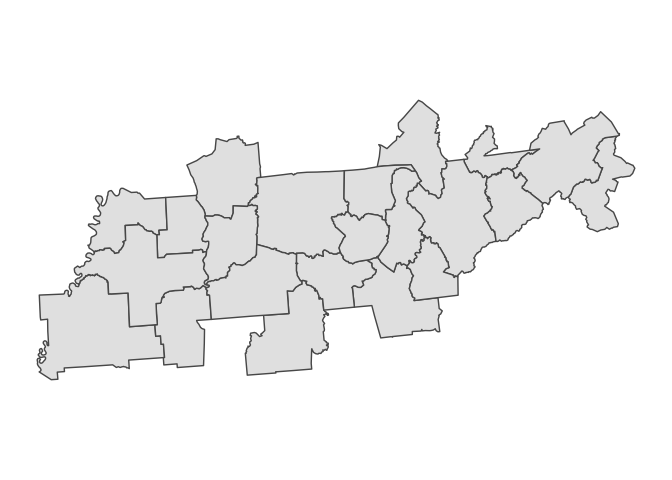

construct-commuting-zone-data.R
================
gravesj
Mon Jan 28 09:30:58 2019

``` r
# The basis of the COUNTY to COMMUTING ZONE conversion is the crosswalk file downloaded from
# https://www.ers.usda.gov/data-products/commuting-zones-and-labor-market-areas/ on 2019-01-24.

suppressWarnings(suppressMessages(source(here::here("/R/manifest.R"))))
source(here("R/move-ak-hi.R"))
source(here("R/get-geographic-info.R"))
source(here("R/map-theme.R"))


# Source: https://sites.psu.edu/psucz/data/
county_to_cz <- data.table::fread(here("public-data/shape-files/commuting-zones/counties10-zqvz0r.csv")) %>% 
  janitor::clean_names() %>% 
  rename(fips_code = fips) %>% 
  group_by(out10) %>% 
  mutate(commuting_zone_population_2010 = sum(pop10, na.rm=TRUE)) %>% 
  mutate(fips_code = str_pad(paste0(fips_code),width = 5, pad="0")) %>% 
  select(fips_code,
         commuting_zone_id_2010 = out10,
         commuting_zone_population_2010 )

         

# county_to_cz <- readxl::read_xls(here("public-data/shape-files/commuting-zones/cz00_eqv_v1.xls")) %>% 
#   janitor::clean_names()  %>% 
#   rename(fips_code = fips) 

county_map_shape <- readOGR(dsn=here("public-data/shape-files/county-2017/cb_2017_us_county_5m/cb_2017_us_county_5m.shp"),
                      layer = "cb_2017_us_county_5m",verbose = FALSE) 
# Project to albers
county_map <- spTransform(county_map_shape,CRS("+proj=aea +lat_1=29.5 +lat_2=45.5 +lat_0=37.5 +lon_0=-96"))
# Simplify polygons
suppressWarnings({
  county_map <- gBuffer(county_map, byid=TRUE, width=0)
})

# Assign the FIPS code as the polygon identifier. 
county_map_a <- 
  spChFIDs(county_map,paste0(county_map@data$GEOID))

# Extract the polygon objects
county_map_pl <- slot(county_map_a,"polygons")

# Check the polygons for completeness (note: this step takes a while).
county_map_pl_a <- lapply(county_map_pl,checkPolygonsHoles)

# Get the coordinate system
county_map_crs <- CRS(proj4string(county_map_a))

# Get the spatial polygons
countySP <- SpatialPolygons(county_map_pl_a, proj4string = county_map_crs ) 

# Create the final ZCTA map object
county_map_final <- SpatialPolygonsDataFrame(countySP, data = as(county_map_a, "data.frame")) 

# These are the ZCTAs in the map object.
county_in_map <- row.names(county_map_final)

# HRR Data Frame (contains information on HRR ID, City, State, etc.)
df_cz <- county_to_cz %>% 
  select(GEOID = fips_code, commuting_zone_id_2010,commuting_zone_population_2010) %>% 
  data.frame() 
# Must have ZCTAs as row names to merge onto map objects
rownames(df_cz) <- df_cz$GEOID
df_cz<- df_cz %>% data.frame() %>% select(-GEOID) 


counties_in_map_but_not_cz <- setdiff(row.names(county_map_final),row.names(df_cz))

county_map_final2 <- 
  subset(county_map_final, !(GEOID %in% setdiff(row.names(county_map_final),row.names(df_cz)) )) 

#########################
# Construct HRR Map Data
#########################

# Edit down the HRR Data to only include matched ZCTAs
df_cz <- df_cz[match(row.names(county_map_final),row.names(df_cz)),] %>% data.frame()
df_cz2 <- df_cz[-which(row.names(df_cz) %in% setdiff(row.names(df_cz),row.names(county_map_final2))),]

# Spatial merge the ZCTA Map with the HRR Data
# Note: this takes a few minutes. 
county_map_with_cz <- spCbind(county_map_final2, df_cz2)
cz_map_merged <- unionSpatialPolygons(county_map_with_cz,county_map_with_cz$commuting_zone_id_2010) 

# Construct a data frame object that will get appended onto the map (needed to get contiguous HRR data, 
# and to merge in other HRR attributes later). 
cz_map_merged_df <- 
  slot(cz_map_merged, "polygons") %>% 
  map_chr(~(slot(.x,"ID"))) %>% 
  as.data.frame() %>% 
  set_names("commuting_zone_id_2010") %>% 
  tbl_df() %>% 
  mutate(commuting_zone_id_2010= paste0(commuting_zone_id_2010)) %>% 
  data.frame() %>% 
  left_join(df_cz %>% select(commuting_zone_id_2010,everything()) %>% unique() %>% mutate(commuting_zone_id_2010 = paste0(commuting_zone_id_2010)),"commuting_zone_id_2010")
rownames(cz_map_merged_df) <- cz_map_merged_df$commuting_zone_id_2010

cz_map <- SpatialPolygonsDataFrame(cz_map_merged, data = cz_map_merged_df)
cz_map <- move_ak_hi(cz_map,type="cz")
cz_map <- gBuffer(cz_map, byid=TRUE, width=0)

# Save as shape file

df_cz_info <- 
  cz_map %>% 
  get_geograhic_info(commuting_zone_id_2010, get_contiguous = TRUE) 

# Save as a shapefile
tmp <- df_cz_info %>% data.frame()
rownames(tmp) <- tmp$polygon_id
tmp <- tmp %>% select(-polygon_id) 
SpatialPolygonsDataFrame(cz_map, data = tmp) %>% 
  sf::st_as_sf() %>% 
  sf::write_sf(here("output/tidy-mapping-files/commuting-zone/01_commuting-zone-shape-file.shp"))
```

    ## Warning in abbreviate_shapefile_names(obj): Field names abbreviated for
    ## ESRI Shapefile driver

    ## Warning in CPL_write_ogr(obj, dsn, layer, driver,
    ## as.character(dataset_options), : GDAL Message 6: Normalized/laundered field
    ## name: 'cmmtng_zn_d_2010' to 'cmmtng_zn_'

    ## Warning in CPL_write_ogr(obj, dsn, layer, driver,
    ## as.character(dataset_options), : GDAL Message 6: Normalized/laundered field
    ## name: 'cmmtng_zn_p_2010' to 'cmmtng_z_1'

``` r
cz_map_simple <- gSimplify(cz_map, tol = 1)

df_cz_map = fortify(cz_map_simple,region = "commuting_zone_id_2010") %>%
  rename(commuting_zone_id_2010 = id) %>%
  dplyr::select(commuting_zone_id_2010,everything()) %>% 
  tbl_df()
dim(df_cz_map)
```

    ## [1] 118771      7

``` r
tn_czs <- 
  county_to_cz %>% ungroup %>% mutate(commuting_zone_id_2010 = paste0(commuting_zone_id_2010)) %>% filter(str_sub(fips_code,1,2) %in% c("47")) %>% pull(commuting_zone_id_2010)

df_cz_map %>%
  left_join(df_cz_info, "commuting_zone_id_2010") %>% 
  filter(commuting_zone_id_2010 %in% tn_czs) %>% 
  tbl_df() %>%
  mutate(test = factor(sample(1:10,nrow(.),replace=TRUE))) %>%
  ggplot() +
  aes(long,lat,group=group) +
  geom_polygon(aes(fill = test)) +
  geom_path(color="black") +
  coord_equal() +
  ggthemes::theme_tufte() +
  theme(legend.position = "none") +
  remove_all_axes +
  ggtitle("tol = 1")
```

<!-- -->

``` r
# Write the final output.
if (!dir.exists(here("output/tidy-mapping-files/commuting-zone"))) dir.create(here("output/tidy-mapping-files/commuting-zone"))
write_rds(df_cz_info,here("output/tidy-mapping-files/commuting-zone/","df_cz_info.rds"))
write_rds(df_cz_map %>% left_join(df_cz_info, "commuting_zone_id_2010"),here("output/tidy-mapping-files/commuting-zone/","df_cz.rds"))
```
