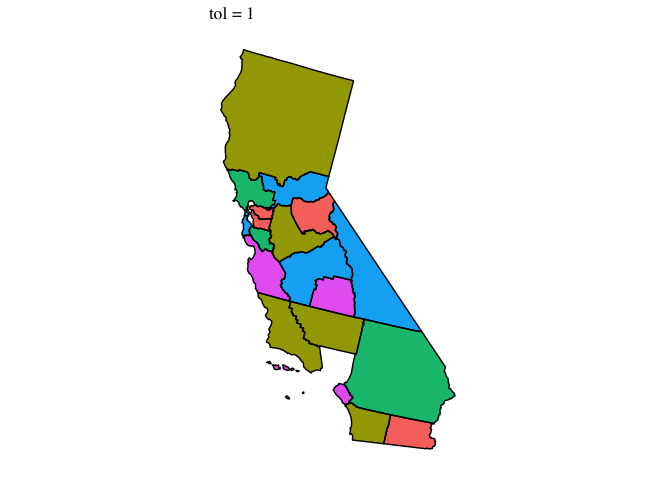
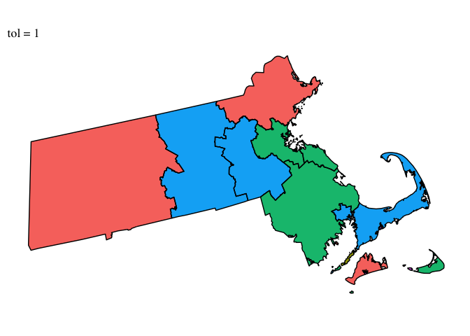
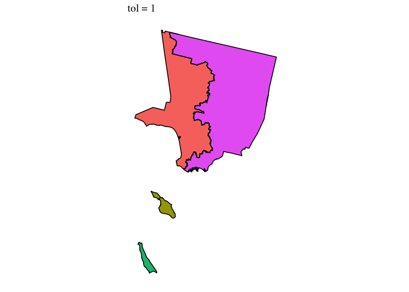
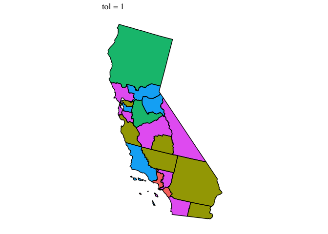

construct-rating-area-data.R
================
gravesj
Thu Jan 24 16:52:17 2019

``` r
# Note that this file was adapted from code sent to me from the New York Times 
# on 2017-07-03.

# The default geographic rating areas for each state will be the Metropolitan Statistical Areas 
# (MSAs) plus the remainder of the State that is not included in a MSA.States may seek approval 
# from HHS for a number of geographic rating areas that is greater than the number of MSAs in the 
# state plus one (MSAs+1), provided the rating areas are based on counties, three-digit zip codes, 
# or MSAs/non-MSAs. If a state requests geographic rating areas in excess of MSAs+1, then the state 
# must provide actuarial justification, and must demonstrate how they will reflect significant 
# differences in health care unit costs by rating area, lead to stability in rates over time, 
# apply uniformly to all health insurance issuers in a market, are based on one or more geographic 
# boundaries described previously, and will not be unfairly discriminatory.

# Source: https://www.cms.gov/CCIIO/Programs-and-Initiatives/Health-Insurance-Market-Reforms/STATE-gra.html


suppressWarnings(suppressMessages(source(here::here("/R/manifest.R"))))
source(here("R/move-ak-hi.R"))
source(here("R/get-geographic-info.R"))
source(here("R/map-theme.R"))
source(here("R/shared-objects.R"))

# The first step is to scrape the county names and 3-Digit ZIP codes associated with 
  # each rating area in each state. This is done from the CCIIO website. It only
  # needs to be done once, and does not appear to change year-on-year (though technically)
if (!file.exists(here("output/geographic-crosswalks/01_rating-areas_counties_2019.rds")) | 
    !file.exists(here("output/geographic-crosswalks/01_rating-areas_zip3_2019.rds"))) {
      source(here("R/construct-rating-area-file-from-cciio-website.R"))
}

# df_rating_areas_zip3 <- read_rds(here("output/geographic-crosswalks/01_rating-areas_zip3_2019.rds"))

# Load in the county map
county_map_shape <- readOGR(dsn=here("public-data/shape-files/county-2017/cb_2017_us_county_5m/cb_2017_us_county_5m.shp"),
                      layer = "cb_2017_us_county_5m",verbose = FALSE) 

# Project to albers
county_map <- spTransform(county_map_shape,CRS("+proj=aea +lat_1=29.5 +lat_2=45.5 +lat_0=37.5 +lon_0=-96"))

# Simplify polygons
suppressWarnings({
  county_map <- gBuffer(county_map, byid=TRUE, width=0)
})

# Assign the FIPS code as the polygon identifier. 
county_map_a <- 
  spChFIDs(county_map,paste0(county_map@data$GEOID))

# Extract the polygon objects
county_map_pl <- slot(county_map_a,"polygons")

# Check the polygons for completeness (note: this step takes a while).
county_map_pl_a <- lapply(county_map_pl,checkPolygonsHoles)

# Get the coordinate system
county_map_crs <- CRS(proj4string(county_map_a))

# Get the spatial polygons
countySP <- SpatialPolygons(county_map_pl_a, proj4string = county_map_crs ) 

# Create the final ZCTA map object
county_map_final <- SpatialPolygonsDataFrame(countySP, data = as(county_map_a, "data.frame")) 

# These are the ZCTAs in the map object.
counties_in_map <- row.names(county_map_final)

df_rating_areas_counties <- 
  read_rds(here("output/geographic-crosswalks/01_rating-areas_counties_2019.rds")) %>% 
  mutate(GEOID = fips_code) %>% 
  data.frame() %>% 
  unique() 
rownames(df_rating_areas_counties) <- df_rating_areas_counties$GEOID
df_rating_areas_counties <- 
  df_rating_areas_counties %>% data.frame() %>% select(-GEOID)

counties_in_map_but_not_rating_areas <- setdiff(row.names(county_map_final),row.names(df_rating_areas_counties)) 

county_to_fips <- here("output/geographic-crosswalks/01_xw_county-to-fips.rds")

rating_areas_not_represented_as_counties <- 
  data.frame(fips_code = counties_in_map_but_not_rating_areas) %>% 
  left_join(read_rds(here("output/geographic-crosswalks/01_xw_county-to-fips.rds")),"fips_code") %>% 
  filter(!(state %in% c("PR","<NA>","VI","GU","MP","AS")) & !is.na(state))
```

    ## Warning: Column `fips_code` joining factor and character vector, coercing
    ## into character vector

``` r
county_map_final2 <- 
  subset(county_map_final, !(GEOID %in% setdiff(row.names(county_map_final),row.names(df_rating_areas_counties)) )) 

#########################
# Construct COUTNY RATING AREA Map Data
#########################

# Edit down the HRR Data to only include matched ZCTAs
df_rating_areas_counties <- df_rating_areas_counties[match(row.names(county_map_final),row.names(df_rating_areas_counties)),] %>% data.frame()
df_rating_areas_counties2 <- df_rating_areas_counties[-which(row.names(df_rating_areas_counties) %in% setdiff(row.names(df_rating_areas_counties),row.names(county_map_final2))),]

# Spatial merge the ZCTA Map with the HRR Data
# Note: this takes a few minutes. 
county_map_with_rating_areas_counties <- spCbind(county_map_final2, df_rating_areas_counties2)
rating_areas_counties_map_merged <- unionSpatialPolygons(county_map_with_rating_areas_counties,county_map_with_rating_areas_counties$rating_area) 

# Construct a data frame object that will get appended onto the map (needed to get contiguous HRR data, 
# and to merge in other HRR attributes later). 
rating_areas_counties_map_merged_df <- 
  slot(rating_areas_counties_map_merged, "polygons") %>% 
  map_chr(~(slot(.x,"ID"))) %>% 
  as.data.frame() %>% 
  set_names("rating_area") %>% 
  tbl_df() %>% 
  mutate(rating_area= paste0(rating_area)) %>% 
  data.frame() %>% 
  inner_join(df_rating_areas_counties %>% select(rating_area,state) %>% unique() %>% mutate(rating_area = paste0(rating_area)),"rating_area")
rownames(rating_areas_counties_map_merged_df) <- rating_areas_counties_map_merged_df$rating_area

rating_areas_counties_map <- SpatialPolygonsDataFrame(rating_areas_counties_map_merged, data = rating_areas_counties_map_merged_df)

# MAYBE FINISH STARTING HERE????
#rating_areas_counties_map <- move_ak_hi(cz_map,type="cz")
rating_areas_counties_map <- gBuffer(rating_areas_counties_map, byid=TRUE, width=0)

df_rating_areas_counties_info <- 
  rating_areas_counties_map %>% 
  get_geograhic_info(rating_area, get_contiguous = TRUE) 

rating_areas_counties_map_simple <- gSimplify(rating_areas_counties_map, tol = 1)

df_rating_areas_counties_map = fortify(rating_areas_counties_map_simple,region = "rating_area") %>%
  rename(rating_area = id) %>%
  dplyr::select(rating_area,everything()) %>% 
  tbl_df()
dim(df_rating_areas_counties_map)
```

    ## [1] 109450      7

``` r
df_rating_areas_counties_map %>%
  left_join(df_rating_areas_counties_info, "rating_area") %>% 
  filter(grepl("CA",rating_area)) %>% 
  tbl_df() %>%
  mutate(test = factor(sample(1:5,nrow(.),replace=TRUE))) %>%
  ggplot() +
  aes(long,lat,group=group) +
  geom_polygon(aes(fill = test)) +
  geom_path(color="black") +
  coord_equal() +
  ggthemes::theme_tufte() +
  theme(legend.position = "none") +
  remove_all_axes +
  ggtitle("tol = 1")
```

<!-- -->

``` r
#### 3-DIGIT ZIPS

df_rating_areas_zip3 <- 
  read_rds(here("output/geographic-crosswalks/01_rating-areas_zip3_2019.rds")) %>% 
  mutate(GEOID = zip_code) %>% 
  data.frame() %>% 
  unique() 
rownames(df_rating_areas_zip3) <- df_rating_areas_zip3$GEOID
df_rating_areas_zip3 <- 
  df_rating_areas_zip3 %>% data.frame() %>% select(-GEOID)


# NOTE: THIS NEEDS TO BE DONE SEPARATELY FOR LA COUNTY BECAUSE *ONLY* LA COUNTY GETS SPLIT UP BY 3-DIGIT ZIP

# Load the 3-Digit ZIP map
# Note this map was downloaded from https://www.baruch.cuny.edu/confluence/display/geoportal/ESRI+USA+Data
zip3_map_shape <- readOGR(dsn = here("public-data/shape-files/zip3-2013/zip3/zip3.shp"), 
                    layer = "zip3", verbose = FALSE) %>% 
  # Subset only to the ZIPs needed
  subset(ZIP3 %in% rownames(df_rating_areas_zip3)) %>% 
  subset(!(ZIP3 %in% c("900", "902","903" ,"904", "905","906" ,"907" ,"908", "910", "911" ,"912" ,"913", "914" ,"915" ,"916", "917" ,"918" ,"923", "928", "932", "935")))


# Project to albers
zip3_map <- spTransform(zip3_map_shape,CRS("+proj=aea +lat_1=29.5 +lat_2=45.5 +lat_0=37.5 +lon_0=-96"))

# Simplify polygons
suppressWarnings({
  zip3_map <- gBuffer(zip3_map, byid=TRUE, width=0)
})

# Assign the FIPS code as the polygon identifier. 
zip3_map_a <- 
  spChFIDs(zip3_map,paste0(zip3_map@data$ZIP3))

# Extract the polygon objects
zip3_map_pl <- slot(zip3_map_a,"polygons")

# Check the polygons for completeness (note: this step takes a while).
zip3_map_pl_a <- lapply(zip3_map_pl,checkPolygonsHoles)

# Get the coordinate system
zip3_map_crs <- CRS(proj4string(zip3_map_a))

# Get the spatial polygons
zip3SP <- SpatialPolygons(zip3_map_pl_a, proj4string = zip3_map_crs ) 

# Create the final ZCTA map object
zip3_map_final <- SpatialPolygonsDataFrame(zip3SP, data = as(zip3_map_a, "data.frame")) 

# These are the ZCTAs in the map object.
zip3_in_map <- row.names(zip3_map_final)

zip3_in_map_but_not_rating_areas <- setdiff(row.names(zip3_map_final),row.names(df_rating_areas_zip3)) 

zip3_map_final2 <- 
  subset(zip3_map_final, !(ZIP3 %in% setdiff(row.names(zip3_map_final),row.names(df_rating_areas_zip3)) )) 

# Edit down the HRR Data to only include matched ZCTAs
df_rating_areas_zip3 <- df_rating_areas_zip3[match(row.names(zip3_map_final),row.names(df_rating_areas_zip3)),] %>% data.frame()
df_rating_areas_zip32 <- df_rating_areas_zip3#[-which(row.names(df_rating_areas_zip3) %in% setdiff(row.names(df_rating_areas_zip3),row.names(zip3_map_final2))),]

# Spatial merge the ZCTA Map with the HRR Data
# Note: this takes a few minutes. 
zip3_map_with_rating_areas_zip3<- spCbind(zip3_map_final2, df_rating_areas_zip32)
rating_areas_zip3_map_merged <- unionSpatialPolygons(zip3_map_with_rating_areas_zip3,zip3_map_with_rating_areas_zip3$rating_area) 

# Construct a data frame object that will get appended onto the map (needed to get contiguous HRR data, 
# and to merge in other HRR attributes later). 
rating_areas_zip3_map_merged_df <- 
  slot(rating_areas_zip3_map_merged, "polygons") %>% 
  map_chr(~(slot(.x,"ID"))) %>% 
  as.data.frame() %>% 
  set_names("rating_area") %>% 
  tbl_df() %>% 
  mutate(rating_area= paste0(rating_area)) %>% 
  data.frame() %>% 
  inner_join(df_rating_areas_zip3 %>% select(rating_area,state) %>% unique() %>% mutate(rating_area = paste0(rating_area)),"rating_area")
rownames(rating_areas_zip3_map_merged_df) <- rating_areas_zip3_map_merged_df$rating_area

rating_areas_zip3_map <- SpatialPolygonsDataFrame(rating_areas_zip3_map_merged, data = rating_areas_zip3_map_merged_df)


# Check the map
rating_areas_zip3_map <- gBuffer(rating_areas_zip3_map, byid=TRUE, width=0)

df_rating_areas_zip3_info <- 
  rating_areas_zip3_map %>% 
  get_geograhic_info(rating_area, get_contiguous = TRUE) 

# TK NEED TO DO THIS ON THE FULL MAP SO WE GET ACROSS-STATE CONTIGUOUS AREAS!!!!
rating_areas_zip3_map_simple <- gSimplify(rating_areas_zip3_map, tol = 100)

df_rating_areas_zip3_map = fortify(rating_areas_zip3_map_simple,region = "rating_area") %>%
  rename(rating_area = id) %>%
  dplyr::select(rating_area,everything()) %>% 
  tbl_df()
dim(df_rating_areas_zip3_map)
```

    ## [1] 83487     7

``` r
df_rating_areas_zip3_map %>%
  left_join(df_rating_areas_zip3_info, "rating_area") %>% 
  filter(grepl("MA",rating_area)) %>% 
  tbl_df() %>%
  mutate(test = factor(sample(1:5,nrow(.),replace=TRUE))) %>%
  ggplot() +
  aes(long,lat,group=group) +
  geom_polygon(aes(fill = test)) +
  geom_path(color="black") +
  coord_equal() +
  ggthemes::theme_tufte() +
  theme(legend.position = "none") +
  remove_all_axes +
  ggtitle("tol = 1")
```

<!-- -->

``` r
###############################
#### ZIP3 FOR LA COUNTY ONLY 
###############################

# Get the zip3LA Shapefile for ONLY LA County

zip3LA_map_sf<- sf::read_sf(here("public-data/shape-files/zip3-2013/zip3/zip3.shp")) %>% 
  subset(ZIP3 %in% c("900", "902","903" ,"904", "905","906" ,"907" ,"908", "910", "911" ,"912" ,"913", "914" ,"915" ,"916", "917" ,"918" ,"923", "928", "932", "935")) %>% 
  sf::st_transform(crs = "+proj=aea +lat_1=29.5 +lat_2=45.5 +lat_0=37.5 +lon_0=-96")

LAcounty_map_sf <- sf::read_sf(here("public-data/shape-files/county-2017/cb_2017_us_county_5m/cb_2017_us_county_5m.shp")) %>% 
  subset(GEOID=="06037") %>% 
  sf::st_transform(crs = "+proj=aea +lat_1=29.5 +lat_2=45.5 +lat_0=37.5 +lon_0=-96")

sf::st_intersection(LAcounty_map_sf,zip3LA_map_sf)  %>% 
  sf::write_sf(here("output/tidy-mapping-files/rating-area/01_LA-county-shape-file.shp"))
```

    ## Warning: attribute variables are assumed to be spatially constant
    ## throughout all geometries

    ## Warning in CPL_write_ogr(obj, dsn, layer, driver,
    ## as.character(dataset_options), : GDAL Message 1: Value 10510588451 of field
    ## ALAND of feature 0 not successfully written. Possibly due to too larger
    ## number with respect to field width

    ## Warning in CPL_write_ogr(obj, dsn, layer, driver,
    ## as.character(dataset_options), : GDAL Message 1: Value 1794793532 of field
    ## AWATER of feature 0 not successfully written. Possibly due to too larger
    ## number with respect to field width

    ## Warning in CPL_write_ogr(obj, dsn, layer, driver,
    ## as.character(dataset_options), : GDAL Message 1: Value 10510588451 of field
    ## ALAND of feature 1 not successfully written. Possibly due to too larger
    ## number with respect to field width

    ## Warning in CPL_write_ogr(obj, dsn, layer, driver,
    ## as.character(dataset_options), : GDAL Message 1: Value 1794793532 of field
    ## AWATER of feature 1 not successfully written. Possibly due to too larger
    ## number with respect to field width

    ## Warning in CPL_write_ogr(obj, dsn, layer, driver,
    ## as.character(dataset_options), : GDAL Message 1: Value 10510588451 of field
    ## ALAND of feature 2 not successfully written. Possibly due to too larger
    ## number with respect to field width

    ## Warning in CPL_write_ogr(obj, dsn, layer, driver,
    ## as.character(dataset_options), : GDAL Message 1: Value 1794793532 of field
    ## AWATER of feature 2 not successfully written. Possibly due to too larger
    ## number with respect to field width

    ## Warning in CPL_write_ogr(obj, dsn, layer, driver,
    ## as.character(dataset_options), : GDAL Message 1: Value 10510588451 of field
    ## ALAND of feature 3 not successfully written. Possibly due to too larger
    ## number with respect to field width

    ## Warning in CPL_write_ogr(obj, dsn, layer, driver,
    ## as.character(dataset_options), : GDAL Message 1: Value 1794793532 of field
    ## AWATER of feature 3 not successfully written. Possibly due to too larger
    ## number with respect to field width

    ## Warning in CPL_write_ogr(obj, dsn, layer, driver,
    ## as.character(dataset_options), : GDAL Message 1: Value 10510588451 of field
    ## ALAND of feature 4 not successfully written. Possibly due to too larger
    ## number with respect to field width

    ## Warning in CPL_write_ogr(obj, dsn, layer, driver,
    ## as.character(dataset_options), : GDAL Message 1: Value 1794793532 of field
    ## AWATER of feature 4 not successfully written. Possibly due to too larger
    ## number with respect to field width

    ## Warning in CPL_write_ogr(obj, dsn, layer, driver,
    ## as.character(dataset_options), : GDAL Message 1: Value 10510588451 of field
    ## ALAND of feature 5 not successfully written. Possibly due to too larger
    ## number with respect to field width

    ## Warning in CPL_write_ogr(obj, dsn, layer, driver,
    ## as.character(dataset_options), : GDAL Message 1: Value 1794793532 of field
    ## AWATER of feature 5 not successfully written. Possibly due to too larger
    ## number with respect to field width

    ## Warning in CPL_write_ogr(obj, dsn, layer, driver,
    ## as.character(dataset_options), : GDAL Message 1: Value 10510588451 of field
    ## ALAND of feature 6 not successfully written. Possibly due to too larger
    ## number with respect to field width

    ## Warning in CPL_write_ogr(obj, dsn, layer, driver,
    ## as.character(dataset_options), : GDAL Message 1: Value 1794793532 of field
    ## AWATER of feature 6 not successfully written. Possibly due to too larger
    ## number with respect to field width

    ## Warning in CPL_write_ogr(obj, dsn, layer, driver,
    ## as.character(dataset_options), : GDAL Message 1: Value 10510588451 of field
    ## ALAND of feature 7 not successfully written. Possibly due to too larger
    ## number with respect to field width

    ## Warning in CPL_write_ogr(obj, dsn, layer, driver,
    ## as.character(dataset_options), : GDAL Message 1: Value 1794793532 of field
    ## AWATER of feature 7 not successfully written. Possibly due to too larger
    ## number with respect to field width

    ## Warning in CPL_write_ogr(obj, dsn, layer, driver,
    ## as.character(dataset_options), : GDAL Message 1: Value 10510588451 of field
    ## ALAND of feature 8 not successfully written. Possibly due to too larger
    ## number with respect to field width

    ## Warning in CPL_write_ogr(obj, dsn, layer, driver,
    ## as.character(dataset_options), : GDAL Message 1: Value 1794793532 of field
    ## AWATER of feature 8 not successfully written. Possibly due to too larger
    ## number with respect to field width

    ## Warning in CPL_write_ogr(obj, dsn, layer, driver,
    ## as.character(dataset_options), : GDAL Message 1: Value 10510588451 of field
    ## ALAND of feature 9 not successfully written. Possibly due to too larger
    ## number with respect to field width

    ## Warning in CPL_write_ogr(obj, dsn, layer, driver,
    ## as.character(dataset_options), : GDAL Message 1: Value 1794793532 of field
    ## AWATER of feature 9 not successfully written. Possibly due to too larger
    ## number with respect to field width

    ## Warning in CPL_write_ogr(obj, dsn, layer, driver,
    ## as.character(dataset_options), : GDAL Message 1: Value 10510588451 of field
    ## ALAND of feature 10 not successfully written. Possibly due to too larger
    ## number with respect to field width

    ## Warning in CPL_write_ogr(obj, dsn, layer, driver,
    ## as.character(dataset_options), : GDAL Message 1: Value 1794793532 of field
    ## AWATER of feature 10 not successfully written. Possibly due to too larger
    ## number with respect to field width

    ## Warning in CPL_write_ogr(obj, dsn, layer, driver,
    ## as.character(dataset_options), : GDAL Message 1: Value 10510588451 of field
    ## ALAND of feature 11 not successfully written. Possibly due to too larger
    ## number with respect to field width

    ## Warning in CPL_write_ogr(obj, dsn, layer, driver,
    ## as.character(dataset_options), : GDAL Message 1: Value 1794793532 of field
    ## AWATER of feature 11 not successfully written. Possibly due to too larger
    ## number with respect to field width

    ## Warning in CPL_write_ogr(obj, dsn, layer, driver,
    ## as.character(dataset_options), : GDAL Message 1: Value 10510588451 of field
    ## ALAND of feature 12 not successfully written. Possibly due to too larger
    ## number with respect to field width

    ## Warning in CPL_write_ogr(obj, dsn, layer, driver,
    ## as.character(dataset_options), : GDAL Message 1: Value 1794793532 of field
    ## AWATER of feature 12 not successfully written. Possibly due to too larger
    ## number with respect to field width

    ## Warning in CPL_write_ogr(obj, dsn, layer, driver,
    ## as.character(dataset_options), : GDAL Message 1: Value 10510588451 of field
    ## ALAND of feature 13 not successfully written. Possibly due to too larger
    ## number with respect to field width

    ## Warning in CPL_write_ogr(obj, dsn, layer, driver,
    ## as.character(dataset_options), : GDAL Message 1: Value 1794793532 of field
    ## AWATER of feature 13 not successfully written. Possibly due to too larger
    ## number with respect to field width

    ## Warning in CPL_write_ogr(obj, dsn, layer, driver,
    ## as.character(dataset_options), : GDAL Message 1: Value 10510588451 of field
    ## ALAND of feature 14 not successfully written. Possibly due to too larger
    ## number with respect to field width

    ## Warning in CPL_write_ogr(obj, dsn, layer, driver,
    ## as.character(dataset_options), : GDAL Message 1: Value 1794793532 of field
    ## AWATER of feature 14 not successfully written. Possibly due to too larger
    ## number with respect to field width

    ## Warning in CPL_write_ogr(obj, dsn, layer, driver,
    ## as.character(dataset_options), : GDAL Message 1: Value 10510588451 of field
    ## ALAND of feature 15 not successfully written. Possibly due to too larger
    ## number with respect to field width

    ## Warning in CPL_write_ogr(obj, dsn, layer, driver,
    ## as.character(dataset_options), : GDAL Message 1: Value 1794793532 of field
    ## AWATER of feature 15 not successfully written. Possibly due to too larger
    ## number with respect to field width

    ## Warning in CPL_write_ogr(obj, dsn, layer, driver,
    ## as.character(dataset_options), : GDAL Message 1: Value 10510588451 of field
    ## ALAND of feature 16 not successfully written. Possibly due to too larger
    ## number with respect to field width

    ## Warning in CPL_write_ogr(obj, dsn, layer, driver,
    ## as.character(dataset_options), : GDAL Message 1: Value 1794793532 of field
    ## AWATER of feature 16 not successfully written. Possibly due to too larger
    ## number with respect to field width

    ## Warning in CPL_write_ogr(obj, dsn, layer, driver,
    ## as.character(dataset_options), : GDAL Message 1: Value 10510588451 of field
    ## ALAND of feature 17 not successfully written. Possibly due to too larger
    ## number with respect to field width

    ## Warning in CPL_write_ogr(obj, dsn, layer, driver,
    ## as.character(dataset_options), : GDAL Message 1: Value 1794793532 of field
    ## AWATER of feature 17 not successfully written. Possibly due to too larger
    ## number with respect to field width

    ## Warning in CPL_write_ogr(obj, dsn, layer, driver,
    ## as.character(dataset_options), : GDAL Message 1: Value 10510588451 of field
    ## ALAND of feature 18 not successfully written. Possibly due to too larger
    ## number with respect to field width

    ## Warning in CPL_write_ogr(obj, dsn, layer, driver,
    ## as.character(dataset_options), : GDAL Message 1: Value 1794793532 of field
    ## AWATER of feature 18 not successfully written. Possibly due to too larger
    ## number with respect to field width

    ## Warning in CPL_write_ogr(obj, dsn, layer, driver,
    ## as.character(dataset_options), : GDAL Message 1: Value 10510588451 of field
    ## ALAND of feature 19 not successfully written. Possibly due to too larger
    ## number with respect to field width

    ## Warning in CPL_write_ogr(obj, dsn, layer, driver,
    ## as.character(dataset_options), : GDAL Message 1: Value 1794793532 of field
    ## AWATER of feature 19 not successfully written. Possibly due to too larger
    ## number with respect to field width

    ## Warning in CPL_write_ogr(obj, dsn, layer, driver,
    ## as.character(dataset_options), : GDAL Message 1: Value 10510588451 of field
    ## ALAND of feature 20 not successfully written. Possibly due to too larger
    ## number with respect to field width

    ## Warning in CPL_write_ogr(obj, dsn, layer, driver,
    ## as.character(dataset_options), : GDAL Message 1: Value 1794793532 of field
    ## AWATER of feature 20 not successfully written. Possibly due to too larger
    ## number with respect to field width

``` r
# Load the 3-Digit ZIP map
LAzip3_map_shape <- readOGR(dsn = here("output/tidy-mapping-files/rating-area/01_LA-county-shape-file.shp"), 
                            layer = "01_LA-county-shape-file", verbose = FALSE) 

#LAzip3_map_shape %>% gSimplify(tol=200) %>% plot()


# Project to albers
LAzip3_map <- spTransform(LAzip3_map_shape,CRS("+proj=aea +lat_1=29.5 +lat_2=45.5 +lat_0=37.5 +lon_0=-96"))

# Simplify polygons
suppressWarnings({
  LAzip3_map <- gBuffer(LAzip3_map, byid=TRUE, width=0)
})

# Assign the FIPS code as the polygon identifier. 
LAzip3_map_a <- 
  spChFIDs(LAzip3_map,paste0(LAzip3_map@data$ZIP3))

# Extract the polygon objects
LAzip3_map_pl <- slot(LAzip3_map_a,"polygons")

# Check the polygons for completeness (note: this step takes a while).
LAzip3_map_pl_a <- lapply(LAzip3_map_pl,checkPolygonsHoles)

# Get the coordinate system
LAzip3_map_crs <- CRS(proj4string(LAzip3_map_a))

# Get the spatial polygons
LAzip3SP <- SpatialPolygons(LAzip3_map_pl_a, proj4string = LAzip3_map_crs ) 

# Create the final ZCTA map object
LAzip3_map_final <- SpatialPolygonsDataFrame(LAzip3SP, data = as(LAzip3_map_a, "data.frame")) 

df_rating_areas_zip3 <- 
  read_rds(here("output/geographic-crosswalks/01_rating-areas_zip3_2019.rds")) %>% 
  mutate(GEOID = zip_code) %>% 
  data.frame() %>% 
  unique() 
rownames(df_rating_areas_zip3) <- df_rating_areas_zip3$GEOID
df_rating_areas_zip3 <- 
  df_rating_areas_zip3 %>% data.frame() %>% select(-GEOID)

# These are the ZCTAs in the map object.
LAzip3_in_map <- row.names(LAzip3_map_final)

LAzip3_in_map_but_not_rating_areas <- setdiff(row.names(LAzip3_map_final),row.names(df_rating_areas_zip3)) 

LAzip3_map_final2 <- 
  subset(LAzip3_map_final, !(ZIP3 %in% setdiff(row.names(LAzip3_map_final),row.names(df_rating_areas_zip3)) )) 

# Edit down the HRR Data to only include matched ZCTAs
df_rating_areas_zip3 <- df_rating_areas_zip3[match(row.names(LAzip3_map_final),row.names(df_rating_areas_zip3)),] %>% data.frame()
df_rating_areas_zip32 <- df_rating_areas_zip3#[-which(row.names(df_rating_areas_zip3) %in% setdiff(row.names(df_rating_areas_zip3),row.names(LAzip3_map_final2))),]

# Spatial merge the ZCTA Map with the HRR Data
# Note: this takes a few minutes. 
LAzip3_map_with_rating_areas_LAzip3<- spCbind(LAzip3_map_final2, df_rating_areas_zip32)
rating_areas_LAzip3_map_merged <- unionSpatialPolygons(LAzip3_map_with_rating_areas_LAzip3,LAzip3_map_with_rating_areas_LAzip3$rating_area) 

# Construct a data frame object that will get appended onto the map (needed to get contiguous HRR data, 
# and to merge in other HRR attributes later). 
rating_areas_LAzip3_map_merged_df <- 
  slot(rating_areas_LAzip3_map_merged, "polygons") %>% 
  map_chr(~(slot(.x,"ID"))) %>% 
  as.data.frame() %>% 
  set_names("rating_area") %>% 
  tbl_df() %>% 
  mutate(rating_area= paste0(rating_area)) %>% 
  data.frame() %>% 
  inner_join(df_rating_areas_zip3 %>% select(rating_area,state) %>% unique() %>% mutate(rating_area = paste0(rating_area)),"rating_area")
rownames(rating_areas_LAzip3_map_merged_df) <- rating_areas_LAzip3_map_merged_df$rating_area

rating_areas_LAzip3_map <- SpatialPolygonsDataFrame(rating_areas_LAzip3_map_merged, data = rating_areas_LAzip3_map_merged_df)


# Check the map
rating_areas_LAzip3_map <- gBuffer(rating_areas_LAzip3_map, byid=TRUE, width=0)

df_rating_areas_zip3_info <- 
  rating_areas_LAzip3_map %>% 
  get_geograhic_info(rating_area, get_contiguous = TRUE) 

# TK NEED TO DO THIS ON THE FULL MAP SO WE GET ACROSS-STATE CONTIGUOUS AREAS!!!!
rating_areas_LAzip3_map_simple <- gSimplify(rating_areas_LAzip3_map, tol = 100)

df_rating_areas_zip3_map = fortify(rating_areas_LAzip3_map_simple,region = "rating_area") %>%
  rename(rating_area = id) %>%
  dplyr::select(rating_area,everything()) %>% 
  tbl_df()
dim(df_rating_areas_zip3_map)
```

    ## [1] 1361    7

``` r
df_rating_areas_zip3_map %>%
  left_join(df_rating_areas_zip3_info, "rating_area") %>% 
  filter(grepl("CA",rating_area)) %>% 
  tbl_df() %>%
  mutate(test = factor(sample(1:5,nrow(.),replace=TRUE))) %>%
  ggplot() +
  aes(long,lat,group=group) +
  geom_polygon(aes(fill = test)) +
  geom_path(color="black") +
  coord_equal() +
  ggthemes::theme_tufte() +
  theme(legend.position = "none") +
  remove_all_axes +
  ggtitle("tol = 1")
```

<!-- -->

``` r
############################################
### BIND THE COUNTY AND ZIP3 MAPS TOGETHER
############################################
rating_areas_map <- dt <- spRbind(spRbind(rating_areas_counties_map ,rating_areas_zip3_map), rating_areas_LAzip3_map )
rating_areas_map <- move_ak_hi(rating_areas_map,type="rating_area")
rating_areas_map <- gBuffer(rating_areas_map, byid=TRUE, width=0)

df_rating_areas_info <- 
  rating_areas_map %>% 
  get_geograhic_info(rating_area, get_contiguous = TRUE) 

rating_areas_map_simple <- gSimplify(rating_areas_map, tol = 1)

df_rating_areas_map = fortify(rating_areas_map_simple,region = "rating_area") %>%
  rename(rating_area = id) %>%
  dplyr::select(rating_area,everything()) %>% 
  tbl_df()
dim(df_rating_areas_map)
```

    ## [1] 428496      7

``` r
df_rating_areas_map %>%
  left_join(df_rating_areas_info, "rating_area") %>% 
  filter(grepl("CA",rating_area)) %>% 
  tbl_df() %>%
  mutate(test = factor(sample(1:5,nrow(.),replace=TRUE))) %>%
  ggplot() +
  aes(long,lat,group=group) +
  geom_polygon(aes(fill = test)) +
  geom_path(color="black") +
  coord_equal() +
  ggthemes::theme_tufte() +
  theme(legend.position = "none") +
  remove_all_axes +
  ggtitle("tol = 1")
```

<!-- -->

``` r
# Write the final output.
if (!dir.exists(here("output/tidy-mapping-files/rating-area"))) dir.create(here("output/tidy-mapping-files/rating-area"))
write_rds(df_rating_areas_info,here("output/tidy-mapping-files/rating-area/","df_rating-area_info.rds"))
write_rds(df_rating_areas_map %>% left_join(df_rating_areas_info, "rating_area"),here("output/tidy-mapping-files/rating-area/","df_rating-area.rds"))
```
