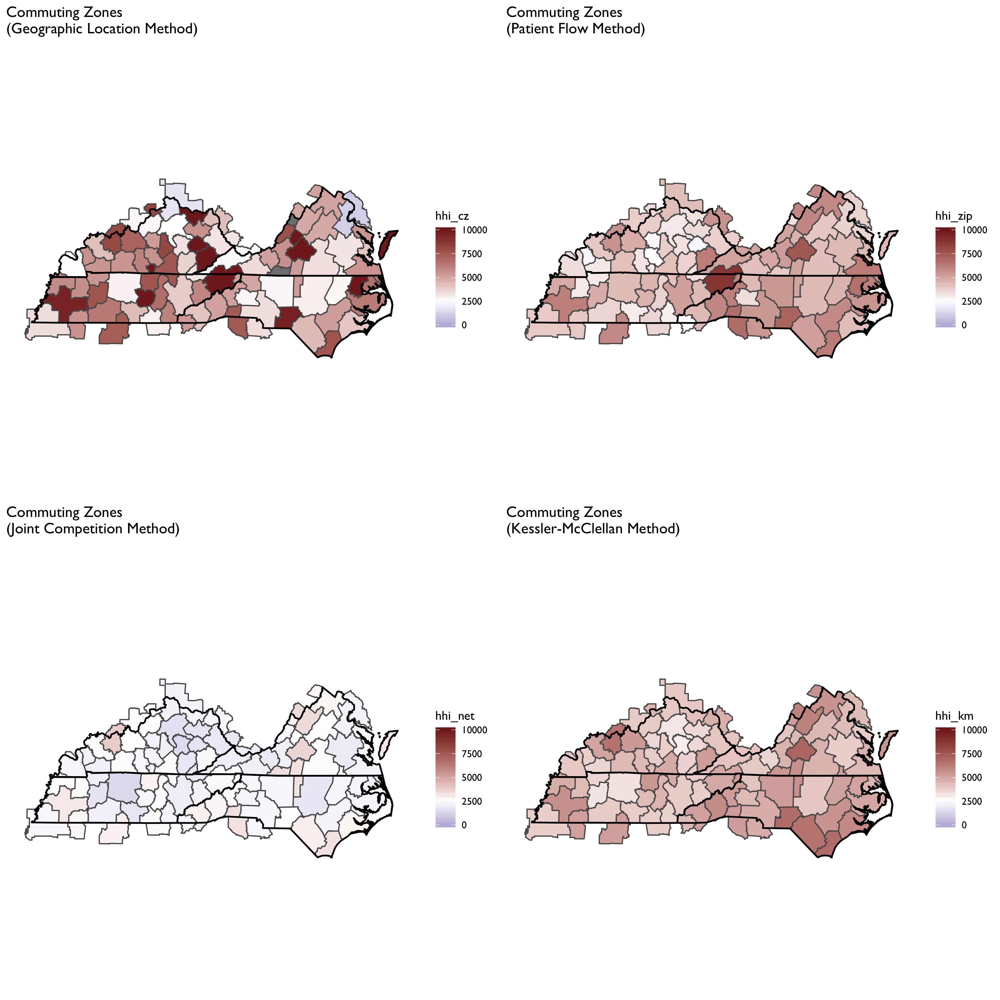

```{r setup, include=FALSE}
knitr::opts_chunk$set(echo = TRUE)
suppressWarnings(suppressMessages(source(here::here("/R/manifest.R"))))
source(here("R/map-theme.R"))
```

# Defining Geographic Markets for Health Care Services 

The objective of this repository is to lay out some thoughts, analytics, and data for defining geographic markets for health care services. In other words, it is a guided tour of a particularly complex rabbit hole. 

Geographic market definitions are important for a wide variety of regulatory and research applications. Therefore, for any given use (e.g., analyses of a health system or hospital merger) or measure (e.g., constructing a Herfindahl-Hirschman index of market concentration) it is important to know whether and how the analytic output varies by alternative market definitions. 

For example, suppose our goal is to characterize insurers, hospitals or other providers by whether they operate in a concentrated market. If we use a market geography definition that is too narrow (e.g., ZIP code) we risk mischaracterizing markets as "concentrated" when they are really not (i.e., Type I error). Alternatively, a market definition that is too broad (e.g., state) risks characterizing markets as competitive when in practice a hypothetical merger or market exit could materially affect prices and competitiveness  (i.e., Type II error). 

Not surprisingly given the above issues, commonly used market geographies have trade-offs. Obviously, whether the strengths outweigh the weaknesses for a given application will depend on the specific research or regulatory question at hand.  

There are other important considerations at play as well. For example, some market definitions (e.g., rating areas) are constrained by geopolitical boundaries (e.g., state borders). While this may be fine for some settings (e.g., rate regulation in insurance markets, since consumers can only purchase a plan offered in their market) it may not be for others (e.g., hospitial markets, in which patients are unconstrained from crossing state boundaries). 

In addition, the underlying population data used to define some commonly used geographic markets is out of date. The latest commuting zone data are derived from commuting patterns ascertained in the 2010 Census. HRRs and HSAs, by comparison, are defined by patient flows to hospitals in 1992 and 1993. 

Clearly, flows of both patients and commuters have changed substantially in many areas in the last 20-30 years. Whether these changes are material to defining geographic boundaries of contemporary health care markets remains an open question we will explore here.

Finally, it is worth mentioning that regulatory and antitrust reviews have drawn on a diverse set of addtional market geography definitions. The history, use and controversies surrounding these definitions are nicely covered in the Department of Justice chapter entitled ["Competition Law: Hospitals."](https://www.justice.gov/atr/chapter-4-competition-law-hospitals) 

More generally, these alternative DOJ market definitions tend to rely on rich longitudinal data on prices in health care markets. While in theory such information could be obtained nationwide, in practice their construction is contigent on the painstaking collection of local data from relevant market participants. I do not profess to have the human capital or funding resources to undertake such an exercise here. So we will focus on more general market geography definitions that can more easily scale--particularly using publicly-available and relatively low-cost data. 

# Commonly Used Geographic Market Definitions 

We begin by simply visualizing several commonly used geographic market definitions. These include HRRs, HSAs, primary care service areas (PCSAs), commuting zones, and health insurance rating areas as defined for the Affordable Care Act's non-group marketplaces.  
These various market geographies are plotted for Tennessee in the figure below.  Note that the colors in each polygon are arbitrary and only intended to further highlight boundaries across geographies. 

What is clear here is that the size of the geographic market varies greatly across these possible definitions. HRRs constitute the largest service area and further, can stretch across state boundaries. HSAs are much smaller -- many in rural areas will contain only one hospital--so by construction, many HSAs will be classified as "concentrated" if HSA is used as the geographic market definition to construct an HHI measure. 

Similarly, we see that PCSAs are quite small, while rating areas in Tennessee are somewhere in-between the broader HRRs and commuting zones. 

```{r,echo = FALSE}

ra_map <- sf::read_sf(here("output/tidy-mapping-files/rating-area/01_rating-area-shape-file.shp"))
p_ra <- ra_map %>% 
  filter(state =="TN") %>% 
  mutate(test = as.factor(sample(1:10,nrow(.),replace=TRUE))) %>% 
  ggplot() + geom_sf(aes(fill=test)) + coord_sf(datum=NA) + 
  remove_all_axes + 
  theme(legend.position = "none")  + 
  ggtitle("Marketplace Rating Area\n(RA)")
 

hrr_map <- sf::read_sf(here("output/tidy-mapping-files/hrr/01_hrr-shape-file.shp"))
p_hrr <- hrr_map %>% 
  filter(hrrstate =="TN") %>% 
  mutate(test = as.factor(sample(1:10,nrow(.),replace=TRUE))) %>% 
  ggplot() + geom_sf(aes(fill=test)) + coord_sf(datum=NA) + 
  remove_all_axes + 
  theme(legend.position = "none")  + 
  ggtitle("Hopsital Referral Region\n(HRR)")
 
hsa_map <- sf::read_sf(here("output/tidy-mapping-files/hsa/01_hsa-shape-file.shp"))
p_hsa <- hsa_map %>% 
  filter(hsastate =="TN") %>% 
  mutate(test = as.factor(sample(1:10,nrow(.),replace=TRUE))) %>% 
  ggplot() + geom_sf(aes(fill=test)) + coord_sf(datum=NA) + 
  remove_all_axes + 
  theme(legend.position = "none")  + 
  ggtitle("Hopsital Service Area\n(HSA)")
 
pcsa_map <- sf::read_sf(here("output/tidy-mapping-files/pcsa/01_pcsa-shape-file.shp"))
p_pcsa <- pcsa_map %>% 
  filter(pcsa_st =="TN") %>% 
  mutate(test = as.factor(sample(1:10,nrow(.),replace=TRUE))) %>% 
  ggplot() + geom_sf(aes(fill=test)) + coord_sf(datum=NA) + 
  remove_all_axes + 
  theme(legend.position = "none")  + 
  ggtitle("Primary Care Service Area\n(PCSA)")
 

df_ra_map <- read_rds(here("output/tidy-mapping-files/rating-area/","df_rating-area.rds"))
p_ra <- df_ra_map  %>%
  filter(grepl("TN",rating_area)) %>% 
  tbl_df() %>%
  mutate(test = factor(sample(1:5,nrow(.),replace=TRUE))) %>%
  ggplot() +
  aes(long,lat,group=group) +
  geom_polygon(aes(fill = test)) +
  geom_path(color="black") +
  coord_equal() +
  ggthemes::theme_tufte(base_family = "Gill Sans") +
  theme(legend.position = "none") +
  remove_all_axes +
  ggtitle("Marketplace Rating Area\n(RA)" ) 

cz_map <- sf::read_sf(here("output/tidy-mapping-files/commuting-zone/01_commuting-zone-shape-file.shp"))

p_cz <- cz_map %>% 
  filter(state_01=="TN" | state_02=="TN"|state_03=="TN") %>% 
  mutate(test = as.factor(sample(1:10,nrow(.),replace=TRUE))) %>% 
  ggplot() + geom_sf(aes(fill=test)) + coord_sf(datum=NA) + 
  remove_all_axes + 
  theme(legend.position = "none")  + 
  ggtitle("Commuting Zone\n(CZ)") 
 
p_hrr + p_hsa + p_pcsa + p_cz + p_ra + plot_layout(nrow=3)
```

# Geographic Market Definitions

Before moving on it is useful to put down, in one place, the specific methods and definitions used to construct each of the aforementioned geographic market definitions. 

## Hospital Service Areas (HSA)

HSAs are defined by the hospital care patterns of fee-for-service Medicare beneficiaries. Specifically, a three-step process is used:

1. Define all general acute care hospitals in the U.S. The town or city of the hospital location becomes the basis for HSA naming. Thus, if a given town has more than one hospital, those hospitals would be considered as part of the same HSA. In practice most HSAs end up with one hospital, however.

2. Aggregate all Medicare visits to the hospital (or hospitals, in cases where towns or cities have > 1 hospital). Using a plurality rule, assign ZIP codes to the HSA name where the most of its residents receive hospital care. 

3. Curate the HSA assignments to assure that only contiguous ZIPs make up the HSA.

In total there are 3,436 HSAs in the United States.

According to the Dartmouth methods appendix, data from 1992-93 were used to construct HSA boundaries. However, crosswalks from ZIP code tabulation area (ZCTA) to HSA are available on the Dartmouth website through 2017. Since 3,436 unique HSAs appear in the latest (2017) crosswalk this suggests that the updates only pertain to ZCTA updates, rather than updates on the geographies of the underlying HSAs.

## Hospital Referral Regions (HRR)

Whereas HSAs are intented to capture the geographic catchment area where residents of a ZIP code receive most of their overall hospital services, HRRs are meant to capture larger teritary referral areas. 

To identify HRRS, Dartmouth researchers aggregated HSAs into contiguous geographies based on where residents of the HSA received the most cardiovascular procedures and neurosurgeries. Thus, HSAs serve as the basic building block of HRRs. HRRs are also constructed to meet the following criteria:

- Population of at least 120,000.
- At least 65% of residents' services occurred within the region.
- Comprised of geographically contiguous HSAs.

In cases where the above criteria were not met, neighboring areas were pooled together until all criteria were satisfied. There are 306 HRRs in the United States.

## Primary Care Service Areas

PCSAs are intented to serve as HSAs for primary care. Thus, a PCSA is defined as a collection of contiguous ZIP codes with at least one primary care provider, and where the plurality of primary care services is obtained among fee-for-service Medicare beneficiaries. 

There are 6,542 PCSAs in the U.S. -- or roughly double the number of HSAs. On average there are 4.9 ZCTAs in a PCTA (median =3, max = 81, min = 1).  61% of primary care services, on average, are obtained within PCSAs.


## Marketplace Rating Areas

Marketplace rating areas are geographically contiguous areas used for the purpopses of insurance plan rate setting in the non-group market. The default geography used to set rating areas is the Metropolitan Statistical Area (MSA) plus the remainder of the state not in an MSA (MSA+1 definition). However, states have the option to define alternative county,  3-digit ZIP, or MSA/non-MSA clusters if they deem some alternative definition more important for regulation and rate setting within the state. 

In practice, only 7 states (AL, NM, ND, OK, TX, VA, WY) went along with the default (MSA+1) standard. The vast majority of the states submitted clusterings of counties as their rating area definitions. Another handful of states (MA, NE, AK) uses clusters of 3-digit ZIP codes, while CA uses a combination of counties and 3-digit ZIPs. Specifically, LA county is split into two rating areas based on 3-digit ZIP. 

What this means is there is signficant heterogeneity across states in the geographic and population size of rating areas. South Carolina, for example, has 46 rating areas -- more than *double* the 19 rating areas that define California!


## Commuting Zones

Commuting zones are comprised of geographically contiguous counties with strong wtihin-area clustering of commuting ties between residental and work county, and weak across-area ties. The [latest official commuting zone geography files](https://www.ers.usda.gov/data-products/commuting-zones-and-labor-market-areas/) are based on patterns observed in the 2000 census. However, more recent county-to-county commuting data are available based on the 2009-2013 American Community Survey (ACS)  [are also available](https://www.census.gov/data/tables/time-series/demo/commuting/commuting-flows.html) and could be used to construct new commuting zone geographies. 

For now, the zones used here will draw on the shapefiles constructed for 2000 at [Penn State](https://sites.psu.edu/psucz/).

This description of the history and methods of commuting zones from the U.S. Department of Agriculture (USDA) is useful:

> The ERS Commuting Zones (CZs) and Labor Market Areas (LMAs) were first developed in the 1980s as ways to better delineate local economies. County boundaries are not always adequate confines for a local economy and often reflect political boundaries rather than an area's local economy. CZs and LMAs are geographic units of analysis intended to more closely reflect the local economy where people live and work. Beginning in 1980 and continuing through 2000, hierarchical cluster analysis was used along with the Census Bureau's journey to work data to group counties into these areas. In 2000, there were 709 CZs delineated for the U.S., 741 in 1990, and 768 in 1980. LMAs are similar to CZs except that they had to have a minimum population of 100,000 persons. LMAs were only estimated in 1980 and 1990. This was done in order for the Census Bureau to create microdata samples using decennial census data (1980 PUMS-D, 1990 PUMS-L) that avoided disclosure. The LMAs were discontinued in 2000 because researchers found them to be too large and not as useful as the CZs. The identical methodology was used to develop CZs for all three decades.


# How Do HHI Measures Compare Across Geographic Market Defintions?

For this exercise we will construct HHI measures of hopsital concentration across the geographic market definitions covered above. Not all of these will make sense (e.g., it seems odd to construct a Hospital HHI measure based on PCSAs) but I will construct the measures anyway for the sake of comparisons.

For these plots the HHI measure is constructed using admission-weighted market shares for hospitals within each geographic market. The hospital data are drawn from the 2017 AHA annual survey. 



```{r out.width="100%",echo=FALSE}
#knitr::include_graphics(here("figs/01_HHI_commuting-zones.png"))
```

```{r out.width="100%",echo=FALSE}
#knitr::include_graphics(here("figs/01_HHI_hrr.png"))
```

```{r out.width="100%",echo=FALSE}
#knitr::include_graphics(here("figs/01_HHI_rating-area.png"))
```

Now let's consider the *difference* between HHI measures in a given county for each geographic market definition. That is, if the HHI value using HRRs in 5,000, while it is 1,000 using commuting zones, the difference would be 4,000.  We plot these differences in the maps below. The maps are useful in demonstrating geographic areas where characterizations of market concentration will be highly dependent on the geographic market definition used. 


# Novel Market Definitions

In this section we will consider several methodological improvements and extensions to the geographic definitions covered above.  These include:

- Updates to HSAs and HRR definitions based on more recent data.

- Geographic market definitions based on community detection algorithms borrowed from social network analytic methods. 

    - Based on hospital-ZIP data from Medicare.
    
    - Based on insurer-county data from DRG.
    
    - Based on shared patient networks from Medicare. 
    
    - Based on updates to commuting flows from 2009-2013. Census data [here](https://www.census.gov/data/tables/time-series/demo/commuting/commuting-flows.html). Based on gravity model or based on Dartmouth method (e.g., greatest fraction).
    
    - Based on hospital-specific HHIs.
    
    

    

<!-- ### Rural-Urban Commuting -->

<!-- [Rural-Urban Commuting Codes](https://www.ers.usda.gov/data-products/rural-urban-commuting-area-codes.aspx) -->

<!-- > The rural-urban commuting area (RUCA) codes classify U.S. census tracts using measures of population density, urbanization, and daily commuting. The most recent RUCA codes are based on data from the 2010 decennial census and the 2006-10 American Community Survey. The classification contains two levels. Whole numbers (1-10) delineate metropolitan, micropolitan, small town, and rural commuting areas based on the size and direction of the primary (largest) commuting flows. These 10 codes are further subdivided based on secondary commuting flows, providing flexibility in combining levels to meet varying definitional needs and preferences.  -->

<!-- 1   Metropolitan area core: primary flow within an urbanized area (UA)	 -->

<!-- 2.  Metropolitan area high commuting: primary flow 30% or more to a UA	 -->

<!-- 3   Metropolitan area low commuting: primary flow 10% to 30% to a UA	 -->

<!-- 4   Micropolitan area core: primary flow within an Urban Cluster of 10,000 to 49,999 (large UC)	 -->

<!-- 5   Micropolitan high commuting: primary flow 30% or more to a large UC -->

<!-- 6   Micropolitan low commuting: primary flow 10% to 30% to a large UC	 -->

<!-- 7   Small town core: primary flow within an Urban Cluster of 2,500 to 9,999 (small UC)	 -->

<!-- 8   Small town high commuting: primary flow 30% or more to a small UC -->

<!-- 9   Small town low commuting: primary flow 10% to 30% to a small UC	 -->

<!-- 10. Rural areas: primary flow to a tract outside a UA or UC	 -->

<!-- 99. Not coded: Census tract has zero population and no rural-urban identifier information	 -->


# File Descriptions

- [R/manifest.R](R/manifest.R) sets up all libraries and settings.
- [R/move-ak-hi.R](R/R/move-ak-hi.R) moves Alaska and Hawaii in a map. 
- [R/map-theme.R](R/map-theme.R) defines plotting and theme parameters for mapping.
- [R/get-geographic-info.R](R/get-geographic-info.R) obtains centroid and contiguous geography data for any underlying shape object. 
- [R/zip-code-crosswalk.R](R/zip-code-crosswalk.R) creates a ZCTA to FIPS code crosswalk from the [MAPLE geographic crosswalking website](http://mcdc.missouri.edu/applications/geocorr2014.html).

## Geographic Mapping Files

- The file [R/construct-county-map-data.R](R/construct-county-map-data.md) constructs ggplot-friendly mapping data for U.S. counties (`output/tidy-mapping-files/county/df_county.rds`). It also extracts contiguous counties and estimates county centroids (`output/tidy-mapping-files/county/df_county_info.rds`).

- The file [R/construct-rating-area-data.R](R/construct-rating-area-data.md) constructs ggplot-friendly rating area map data based on the marketplace rating area definitions as of 2019-01-23 (these have barely changed, if any, over time, however). The sub-program [R/construct-rating-area-file-from-cciio-website.R](construct-rating-area-file-from-cciio-website.R) reads the HTML tables from the CCIIO website, which list either the counties or ZIP3 for each rating area. The program also separately creates 3-digit ZIP rating areas for Los Angeles county--the only county in CA that uses 3-digit ZIPs; however, the 3-digit ZIPs in LA County also span other counties, requiring some further manipulation to get the intersection. 

- The file [R/construct-dartmouth-geography-data.R](R/construct-dartmouth-geography-data.md) constructs ggplot-friendly mapping data for Dartmouth Atlas geographies including Hospital Referral Region (HRR), Hospital Service Region (HSA) and Primary Care Service Region (PCSA). It also constructs a data file listed at the geographic market level, and which contains data on centroids and contiguous markets. Note that the basis for these files is the ZIP to HRR/HSA and PCSA crosswalk files available for download at the [NBER website](https://www.nber.org/data/dartmouth-atlas-geography.html) and in [archived versions of the Dartmouth Atlas webpage](http://archive.dartmouthatlas.org/tools/downloads.aspx?tab=42).  There are also shapefiles already constructed and [available for use on the archived Dartmouth website](http://archive.dartmouthatlas.org/tools/downloads.aspx?tab=39)--though I found these difficult to work with (e.g., I could not easily extract contiguous geographies using them, as I can by building up a HRR/HSA/PCSA shapefile from a ZCTA map)

- The file [R/construct-commuting-zone-data.R](R/construct-commuting-zone-data.md) constructs ggplot-friendly mapping data for Commuting Zones defined using the 2000 census. The underying county-to-commuting zone data can be found on the [USDA website](https://www.ers.usda.gov/data-products/commuting-zones-and-labor-market-areas/). 

## Patient Sharing Files

- The file [R/read-and-tidy-cms-hospital-service-areas.R](R/read-and-tidy-cms-hospital-service-areas.R) reads in the CMS Hospital Service Area file for 2017. Note the source of these data are downloaded csv files from the interactive CMS data explorer available at the links at [this link](https://www.cms.gov/Research-Statistics-Data-and-Systems/Statistics-Trends-and-Reports/Hospital-Service-Area-File/index.html). The final file is rolled up to the FIPS county level and is storeed in `output/hospital-county-patient-data/2017/hospital-county-patient-data.rds`. 


