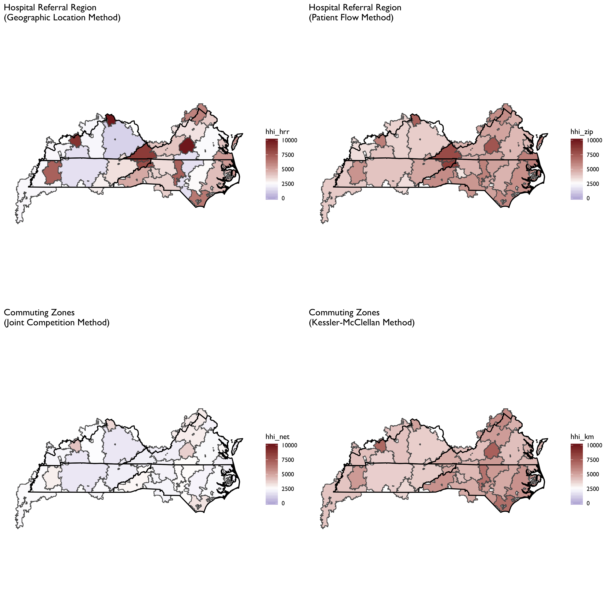

```{r setup, include=FALSE}
knitr::opts_chunk$set(echo = TRUE)
suppressWarnings(suppressMessages(source(here::here("/R/manifest.R"))))
source(here("R/map-theme.R"))
source(here("R/theme-tufte-revised.R"))


```

# Defining Geographic Markets for Health Care Services 

The objective of this repository is to lay out some thoughts, analytics, and data for defining geographic markets for health care services. In other words, it is a guided tour of a particularly complex rabbit hole. 

Geographic market definitions are important for a  variety of regulatory and research applications. Therefore, for any given use (e.g., analyses of a health system or hospital merger) or measure (e.g., constructing a Herfindahl-Hirschman index of market concentration) it is important to know whether and how the analytic output varies by alternative market definitions. 

For example, suppose our goal is to characterize insurers, hospitals or other providers by whether they operate in a concentrated market. If we use a market geography definition that is too narrow (e.g., county) we risk mischaracterizing markets as "concentrated" when they are really not (i.e., Type I error). Alternatively, a market definition that is too broad (e.g., state) risks characterizing markets as competitive when in practice a hypothetical merger or market exit could materially affect prices and competitiveness  (i.e., Type II error). 

Not surprisingly given the above issues, commonly used market geographies have trade-offs. Whether the strengths outweigh the weaknesses for a given application will depend on the specific research or regulatory question at hand.  

There are other important considerations at play as well. For example, some market definitions are constrained by geopolitical boundaries (e.g., state borders). While this may be fine for some settings (e.g., rate regulation in insurance markets, since consumers can only purchase a plan offered in their market) it may not be for others (e.g., hospitial markets, in which patients are unconstrained from crossing state boundaries). 

In addition, the underlying population data used to define commonly used geographic markets is out of date. The latest offical commuting zone boundaries are derived from commuting patterns ascertained in the 2000 Census, though researchers have [updated]( https://sites.psu.edu/psucz/data/) these boundaries based on 2010 data. HRRs and HSAs, by comparison, are defined by patient flows to hospitals in 1992 and 1993. 

Clearly, flows patients and commuters have changed substantially in many areas in the last 20-30 years. Whether these changes are material to defining geographic boundaries of contemporary health care markets remains an open question we will explore here.

Finally, it is worth mentioning that regulatory and antitrust reviews have drawn on a diverse set of addtional market geography definitions. The history, use and controversies surrounding these definitions are nicely covered in the Department of Justice chapter entitled ["Competition Law: Hospitals."](https://www.justice.gov/atr/chapter-4-competition-law-hospitals) 
These alternative DOJ market definitions tend to rely on rich  data on prices in health care markets. While in theory such information could be obtained nationwide, in practice the construction of market definitions using price data is contigent on the painstaking collection of local data from relevant market participants. I do not profess to have the human capital or funding resources to undertake such an exercise here. So we will focus on more general market geography definitions that can more easily scale--particularly using publicly-available and relatively low-cost data. 


# Geographic Market Definitions

Before moving on it is useful to put down, in one place, the specific methods and definitions used to construct each of the aforementioned geographic market definitions. 

## Hospital Service Areas (HSA)

HSAs are defined by the hospital care patterns of fee-for-service Medicare beneficiaries. Specifically, a three-step process is used:

1. Define all general acute care hospitals in the U.S. The town or city of the hospital location becomes the basis for HSA naming. Thus, if a given town has more than one hospital, those hospitals would be considered as part of the same HSA. In practice most HSAs end up with one hospital, however.

2. Aggregate all Medicare visits to the hospital (or hospitals, in cases where towns or cities have > 1 hospital). Using a plurality rule, assign ZIP codes to the HSA name where the most of its residents receive hospital care. 

3. Curate the HSA assignments to assure that only contiguous ZIPs make up the HSA.

In total there are 3,436 HSAs in the United States.

According to the Dartmouth methods appendix, data from 1992-93 were used to construct HSA boundaries. However, crosswalks from ZIP code tabulation area (ZCTA) to HSA are available on the Dartmouth website through 2017. Since 3,436 unique HSAs appear in the latest (2017) crosswalk this suggests that the updates only pertain to ZCTA updates, rather than updates on the geographies of the underlying HSAs.

## Hospital Referral Regions (HRR)

Whereas HSAs are intented to capture the geographic catchment area where residents of a ZIP code receive most of their overall hospital services, HRRs are meant to capture larger teritary referral areas. 

To identify HRRS, Dartmouth researchers aggregated HSAs into contiguous geographies based on where residents of the HSA received the most cardiovascular procedures and neurosurgeries. Thus, HSAs serve as the basic building block of HRRs. HRRs are also constructed to meet the following criteria:

- Population of at least 120,000.
- At least 65% of residents' services occurred within the region.
- Comprised of geographically contiguous HSAs.

In cases where the above criteria were not met, neighboring areas were pooled together until all criteria were satisfied. There are 306 HRRs in the United States.

## Primary Care Service Areas

PCSAs are intented to serve as HSAs for primary care. Thus, a PCSA is defined as a collection of contiguous ZIP codes with at least one primary care provider, and where the plurality of primary care services is obtained among fee-for-service Medicare beneficiaries. 

There are 6,542 PCSAs in the U.S. -- or roughly double the number of HSAs. On average there are 4.9 ZCTAs in a PCTA (median =3, max = 81, min = 1).  61% of primary care services, on average, are obtained within PCSAs.


## Marketplace Rating Areas

Marketplace rating areas are geographically contiguous areas used for the purpopses of insurance plan rate setting in the non-group market. The default geography used to set rating areas is the Metropolitan Statistical Area (MSA) plus the remainder of the state not in an MSA (MSA+1 definition). However, states have the option to define alternative county,  3-digit ZIP, or MSA/non-MSA clusters if they deem some alternative definition more important for regulation and rate setting within the state. 

In practice, only 7 states (AL, NM, ND, OK, TX, VA, WY) went along with the default (MSA+1) standard. The vast majority of the states submitted clusterings of counties as their rating area definitions. Another handful of states (MA, NE, AK) uses clusters of 3-digit ZIP codes, while CA uses a combination of counties and 3-digit ZIPs. Specifically, LA county is split into two rating areas based on 3-digit ZIP. 

What this means is there is signficant heterogeneity across states in the geographic and population size of rating areas. South Carolina, for example, has 46 rating areas -- more than *double* the 19 rating areas that define California!


## Commuting Zones

Commuting zones are comprised of geographically contiguous counties with strong within-area clustering of commuting ties between residental and work county, and weak across-area ties. The [latest official commuting zone geography files](https://www.ers.usda.gov/data-products/commuting-zones-and-labor-market-areas/) are based on patterns observed in the 2000 census. However, more recent county-to-county commuting data are available based on the 2009-2013 American Community Survey (ACS)  [are also available](https://www.census.gov/data/tables/time-series/demo/commuting/commuting-flows.html) and could be used to construct new commuting zone geographies. 

For now, the zones used here will draw on the shapefiles constructed for 2010 at [Penn State](https://sites.psu.edu/psucz/).

This description of the history and methods of commuting zones from the U.S. Department of Agriculture (USDA) is useful:

> The ERS Commuting Zones (CZs) and Labor Market Areas (LMAs) were first developed in the 1980s as ways to better delineate local economies. County boundaries are not always adequate confines for a local economy and often reflect political boundaries rather than an area's local economy. CZs and LMAs are geographic units of analysis intended to more closely reflect the local economy where people live and work. Beginning in 1980 and continuing through 2000, hierarchical cluster analysis was used along with the Census Bureau's journey to work data to group counties into these areas. In 2000, there were 709 CZs delineated for the U.S., 741 in 1990, and 768 in 1980. LMAs are similar to CZs except that they had to have a minimum population of 100,000 persons. LMAs were only estimated in 1980 and 1990. This was done in order for the Census Bureau to create microdata samples using decennial census data (1980 PUMS-D, 1990 PUMS-L) that avoided disclosure. The LMAs were discontinued in 2000 because researchers found them to be too large and not as useful as the CZs. The identical methodology was used to develop CZs for all three decades.

# Visualization of Market Definitions for Tennesee

We will next visualize several commonly used geographic market definitions, including These HRRs, HSAs, primary care service areas (PCSAs), commuting zones, and health insurance rating areas.  These  market geographies are plotted for Tennessee in the figure below (though some will also dip into adjacent states).  Note that the colors in each polygon are arbitrary and only intended to further highlight boundaries across geographies. 

<!-- https://www.ahrq.gov/sites/default/files/wysiwyg/funding/contracts/HCUP_RFP_References/Wong_et_al_2005.pdf -->

```{r,echo = FALSE}

ra_map <- sf::read_sf(here("output/tidy-mapping-files/rating-area/01_rating-area-shape-file.shp"))
p_ra <- ra_map %>% 
  filter(state =="TN") %>% 
  mutate(test = as.factor(sample(1:10,nrow(.),replace=TRUE))) %>% 
  ggplot() + geom_sf(aes(fill=test)) + coord_sf(datum=NA) + 
  remove_all_axes + 
  theme(legend.position = "none")  + 
  ggtitle("Marketplace Rating Area\n(RA)")
 

hrr_map <- sf::read_sf(here("output/tidy-mapping-files/hrr/01_hrr-shape-file.shp"))
p_hrr <- hrr_map %>% 
  filter(hrrstate =="TN") %>% 
  mutate(test = as.factor(sample(1:10,nrow(.),replace=TRUE))) %>% 
  ggplot() + geom_sf(aes(fill=test)) + coord_sf(datum=NA) + 
  remove_all_axes + 
  theme(legend.position = "none")  + 
  ggtitle("Hopsital Referral Region\n(HRR)")
 
hsa_map <- sf::read_sf(here("output/tidy-mapping-files/hsa/01_hsa-shape-file.shp"))
p_hsa <- hsa_map %>% 
  filter(hsastate =="TN") %>% 
  mutate(test = as.factor(sample(1:10,nrow(.),replace=TRUE))) %>% 
  ggplot() + geom_sf(aes(fill=test)) + coord_sf(datum=NA) + 
  remove_all_axes + 
  theme(legend.position = "none")  + 
  ggtitle("Hopsital Service Area\n(HSA)")
 
pcsa_map <- sf::read_sf(here("output/tidy-mapping-files/pcsa/01_pcsa-shape-file.shp"))
p_pcsa <- pcsa_map %>% 
  filter(pcsa_st =="TN") %>% 
  mutate(test = as.factor(sample(1:10,nrow(.),replace=TRUE))) %>% 
  ggplot() + geom_sf(aes(fill=test)) + coord_sf(datum=NA) + 
  remove_all_axes + 
  theme(legend.position = "none")  + 
  ggtitle("Primary Care Service Area\n(PCSA)")
 

df_ra_map <- read_rds(here("output/tidy-mapping-files/rating-area/","df_rating-area.rds"))
p_ra <- df_ra_map  %>%
  filter(grepl("TN",rating_area)) %>% 
  tbl_df() %>%
  mutate(test = factor(sample(1:5,nrow(.),replace=TRUE))) %>%
  ggplot() +
  aes(long,lat,group=group) +
  geom_polygon(aes(fill = test)) +
  geom_path(color="black") +
  coord_equal() +
  ggthemes::theme_tufte(base_family = "Gill Sans") +
  theme(legend.position = "none") +
  remove_all_axes +
  ggtitle("Marketplace Rating Area\n(RA)" ) 

cz_map <- sf::read_sf(here("output/tidy-mapping-files/commuting-zone/01_commuting-zone-shape-file.shp"))

p_cz <- cz_map %>% 
  filter(state_01=="TN" | state_02=="TN"|state_03=="TN") %>% 
  mutate(test = as.factor(sample(1:10,nrow(.),replace=TRUE))) %>% 
  ggplot() + geom_sf(aes(fill=test)) + coord_sf(datum=NA) + 
  remove_all_axes + 
  theme(legend.position = "none")  + 
  ggtitle("Commuting Zone\n(CZ)") 
 
p_hrr + p_hsa + p_pcsa + p_cz + p_ra + plot_layout(nrow=3)
```


# How Do HHI Measures Compare Across Geographic Market Defintions?

Next we will consider HHI measures constructed based on the market geographies defined above. For these examples we'll focus on hospitals, but in principle we could do the same for insurers, or physicians, if sufficient data were available. 

Before we do, however, it is useful to first lay out two different ways this can be done for a given market geography. *These different methods will yield different HHI measures for the same market geography* (e.g., CZ). 

1. **Geographic Location Method**: Under this method we identify all hospitals *located in the geographic market.* The HHI measure is constructed using market shares defined in terms of a head count of the number of hospitals, or in terms of total patients treated at each hospital (e.g, total admissions or total discharges), or possibly some other unit. This is a common method used to construct hospital HHIs. 

2. **Patient Flow Method**: Under this method we identify the set of hospitals that treat patients *who reside in the geographic market* (e.g., the CZ). Unlike the method above, this will bring in hospitals located outside the geographic market boundaries. Note that this can be done at a lower level of aggregation (e.g., at the ZIP code level). Then, those ZIP-level HHIs can be aggregated up to another market geography level (e.g. HRR) by taking a weighted average (with weights defined by population share, or total admission share, etc.). 

It is critical to observe that both of these methods may suffer from endogeneity problems. That is, the choice of geographic location of (new) hospitals, the survival of existing hospitals, and the flow of patients to existing hospitals from the surrounding area, may depend on the relative quality of hospitals in the area market. A high-performing hospital, in other words, may draw in a high volume of patients from the local area--which could drive poorer-quality neighboring hospitals out of business. 

Both of these dynamics would result in HHI measures that indicate the high quality hospital is in a concentrated market. This could severely complicate efforts to, for example, examine the relationship between market concentration and patient outcomes. For this reason, some (e.g., Kessler and McClellan 2000) have relied on predicted patient flows, rather than acutal patient flows, in the construction of HHI measures. This method isn't fully absolved of endogeneity concerns, however, sine  endogenous coding practices may still complicate efforts to construct unbiased predictions of patient flows. 

With that said, it is worth noting that the patient flow method generally lines up better with the underlying economic concept of what an HHI is trying to capture. A simple example below will demonstrate this. 

## A Simple Example

Suppose there are only two geographic areas (A and B) and two hospitals (H1 and H2). Areas A and B each contribute 100 hospital admissions, but admissions from each area flow to specific local hospitals. That is, admissions from area A *only* flow to hospital H1, and admissions from area B *only* flow to hospital H2. Notably, however, both hospitals are located in Area B (H1 is located in B but near the border with area A). This scenario is depicted in the **Scenario 1** panel of the figure below. 

Now suppose that a single new hospital enters the market and locates in area A. This new hospital redirects 50 admissions from H1 after it enters the market. This scenario is depicted in the **Scenario 2** panel of the figure. 

Before we go about constructing HHI measures it is useful to think through how we would *expect* an HHI measure to respond to this market entry change. First, hospital H1 is now in a more competitive market because the new hospital H3 siphoned off *half* of its admissions.  Second, hospital H2 was unaffected by market entry because none of its patients moved to a different hospital 

```{r, echo = FALSE}
hhi_1a_area <- NA
hhi_1b_area <- (100 * 100/200)^2 + (100 * 100/200)^2

hhi_1a_pop <- (100 * 100/100)^2
hhi_1b_pop <- (100 * 100/100)^2

hhi_2a_area <- (100 * 50/50) ^2
hhi_2b_area <- (100 * 50/150)^2 + (100 * 100/150)^2

hhi_2a_pop <- (100 * 50/100)^2 + (100*50/100)^2
hhi_2b_pop <- (100 * 100/100)^2

hhi_area <- data.frame(scenario = c("Scenario 1","Scenario 2 (Market Entry)"),a = c(hhi_1a_area,hhi_2a_area),
                    b = c(hhi_1b_area, hhi_2b_area))

hhi_pop <- data.frame(scenario = c("Scenario 1","Scenario 2 (Market Entry)"), a = c(hhi_1a_pop,hhi_2a_pop),
                    b = c(hhi_1b_pop, hhi_2b_pop))
```


If we used the geographic location method to construct HHI measures we would end up with the following estimates:

```{r, echo = FALSE}
hhi_area %>% mutate_at(2:3,function(x) round(x,0)) %>% knitr::kable(col.names=c("","Area A","Area B"),fig.cap = "HHI Measures Using Geographic Location Method")
```

We can see through this simple example that the geographic location method has done a poor job of capturing the underlying change in the competitivenes of these two areas. In particular,

  1. In Scenario 1 we cannot even define an HHI measure for area A because no hospital happens to be located there; the hospital that all of its residents uses is just over the border in area B. 

  2. In Scenario 2, Area A gets designated as highly concentrated (HHI = 10,000). Again, this is because there is only one hospital located in in Area A. 
  
  3. In Scenario 2, Area B (whose residents' admissions patterns were unaffected by the new hospital) actually gets a slightly higher HHI value. 
  
By comparison, the patient flow method does a better job of capturing the competitive landscape:

```{r, echo = FALSE}
hhi_pop %>% mutate_at(2:3,function(x) round(x,0)) %>% knitr::kable(col.names=c("","Area A","Area B"),fig.cap = "HHI Measures Using Population Flow Method")
```

  1. In Scenario 1 we accurately capture the fact that both hospitals are operating in completely concentrated markets, drawing all patients from each of the respective areas. 
  
  2. In Scenario 2 we accurately capture the change in competitiveness in Area A. The HHI measure drops from 10,000 to 5,000--reflecting the fact that the new hospital has redirected half of the inpatient admissions formerly going to hospital H1. 
  
  3. In Scenario 2 we also accurately capture the fact that Area B had no change in the underlying competitiveness--the introduction of Hospital H3 did not affect admissions at H2, as we correspondingly see no change in our HHI measure. 

It's worth noting that the population flow method is also more robust to alternative geographic market definitions. Suppose that we define a new geographic boundary that includes H1 within area A. We'll also draw (in dotted lines) the previous geographic boundary from above, and assume that 25 admissions from within that boundary area (i.e., the area formerly in B) still go to H2. In other words, the only thing that has changed is the (arbitrary) geographic boundary point delineating area A from B. 


```{r, echo = FALSE}
hhi_1a_area <- (100 * 100/100)^2
hhi_1b_area <-  (100 * 100/100)^2

hhi_1a_pop <- (100 * 100/100)^2
hhi_1b_pop <- (100 * 100/100)^2

hhi_2a_area <- (100 * 50/100) ^2 + (100 * 50/100) ^2
hhi_2b_area <-  (100 * 100/100)^2

hhi_2a_pop <- (100 * 50/100)^2 + (100*50/100)^2
hhi_2b_pop <- (100 * 100/100)^2

hhi_area_alt <- data.frame(scenario = c("Scenario 1","Scenario 2 (Market Entry)"),a = c(hhi_1a_area,hhi_2a_area),
                    b = c(hhi_1b_area, hhi_2b_area))

hhi_pop_alt <- data.frame(scenario = c("Scenario 1","Scenario 2 (Market Entry)"), a = c(hhi_1a_pop,hhi_2a_pop),
                    b = c(hhi_1b_pop, hhi_2b_pop))
```

We can see that both methods now produce the same HHI measures. Moreover, the population flow method results are unchanged with this (arbitrary) change in boundaries. *Thus, it is more robust to the overall geographic market definition used.* 

```{r, echo = FALSE}
hhi_area_alt %>% mutate_at(2:3,function(x) round(x,0)) %>% knitr::kable(col.names=c("","Area A","Area B"),fig.cap = "Alternative Boundaries: HHI Measures Using Geographic Location Method")
```

By comparison, if we used the population flow method we would get the following:
```{r, echo = FALSE}
hhi_pop_alt %>% mutate_at(2:3,function(x) round(x,0)) %>% knitr::kable(col.names=c("","Area A","Area B"),fig.cap = "Alternative Boundaries: HHI Measures Using Population Flow Method")
```

An important takeaway from this exercise is that HHI measures defined using the geographic location method make an important and very strong assumption: **the geographic boundaries used capture all (or nearly all) of the relevant economic activity under consideration (e.g., hospital admissions).**

## Comparison of Geographic Location and Population Flow HHI Measures 

The next set of maps show how these two different HHI construction methods yield different answers for the same geographic market definition. We'll consider both HRRs and CZs for this example, and focus on maps of TN, NC, VA and KY (though the underlying data cover the entire US). The geographic area at the intersection of these states was recently the focus of a major merger of two large health systems (Mountain States Health Alliance and Wellmont Health System) that [drew attention due to antitrust concerns](https://www.modernhealthcare.com/article/20161123/NEWS/161129951). 

To construct these maps the two methods above were used, with the following specific details. 

- Sample is general acute care hospitals identified in the 2017 AHA Annual Survey data.

- We define HHI measures at the system level, not the hospital level. Thus, all HCA hospitals get rolled up into a single HCA row. 

- For the Geographic Location HHI Method, we identify all hospitals within the geographic area. We then then construct HHI measures based on market shares defined by FFS Medicare Patients. Note that this allows us to be consistent with the patient definition used in the patient flow method, as describd below. In practice this yielded nearly identical HHI measures when total admissions were used, as shown in the plot below. 

```{r, echo= FALSE, fig.width = 3, fig.height = 3}
read_rds(here("output/market-comparisons/01_HHI_genacute_hrr.rds")) %>% 
  ggplot(aes(x = hhi_hrr,y = hhi_hrr_admtot)) + 
  geom_point() + 
  ylab("HHI Based on Total Admissions") + 
  xlab("HHI Based on FFS Medicare Admissions") +
  geom_abline(slope = 1, intercept = 0, lty=2) +
  theme_tufte_revised() 
```

- For the patient flow method,  we used  the [CMS Hospital Service Area files for 2017](https://www.cms.gov/Research-Statistics-Data-and-Systems/Statistics-Trends-and-Reports/Hospital-Service-Area-File/index.html) to construct ZIP-level HHI measures. These zip-level HHI measures were based on the hospitals visited among FFS Medicare patients in each ZIP code. We then aggregated these ZIP level measures to the HRR or CZ level using a weighted average (with weights defined by total FFS Medicare patient volume from the ZIP). 

Maps for each geographic market definition (HRR, CZ) and HHI construction method (geographic location, patient flow) are provided below. 


We can see here that the geographic location method produced a more fragmented HRR map, with adjacent HRRs ranging from highly concentrated to not concentrated. With the patient flow method (aggregated to HRR or CZ) we see that the map evens out considerably. Notably, areas tend to become more concentrated, though some areas that appear highly concentrated using the geographic location method become less so when using patient flows. The patient flow method, in other words, appears to even out some rough edges seen in the geographic location maps.  

It is also notable that the patient flow method yielded very similar maps when using HRRs vs. CZs. In part this is by construction, since both rely on the same underlying ZIP-level data. But it is striking to see in the top panels how different HHI measures can be using the geographic location method for CZs and HRRs. In particular, HRRs designate some areas as not concentrated while the same area is highly concentrated under the CZ HHI measure. 

# Endogeneity of HHI Measures

In this section we will consider some fairly basic analyses of the question of endogeneity. As noted above, a key concern of HHI measures may be that both hospital location and patient flows may be endogenously determined with hospital quality: a new hospital may co-locate near a poor performing hospital (or conversely, may locate away from a good hospital). Or patients may be willing to travel farther to a "good" hospital. If that is the case, then high-quality hospitals may attract more patients -- and thus, an HHI measure may indicate that such hospitals are operating in "concentrated" markets. This complicates any kind of analysis we might wish to conduct to, for example, examine the relationship between market concentration and prices or patient outcomes. That is, if a hospital operating in a "concentrated" market has higher prices, it's impossible to tease apart what portion is explained by market concentration as opposed to being able to charge higher prices because they are of higher quality. Alternatively, we might find that hospitals in concentrated markets achieve better patient outcomes -- but this may be more a story of quality than a story of market power. 

## Is there a relationship between distance traveled and market share?

With these issues in mind, let's now  briefly explore the relationship between distance traveled and hospital market share. We will again draw on the 2017 hosptial-zip data from CMS. In particular, using these data we can, for each ZIP-hosptial comparison, calculate the approximate distance traveled (using ZIP centroids and hosptial latitude and longitude data from AHA). We can also use the same data to calculate the market share by hospital system ID, and take a weighted average of the distance traveled (weighted by patient volume from the ZIP) by hospital system ID. 

We plot the relationship between market share and distance traveled below. On the left is the unadjusted relationship, and plotted is a LOESS curve.  We see here that (not surprisingly) as distance traveled increases, market share decreases almost linearly. 

But this isn't very interesting because it likely just reflects the great variation in distances that people must travel from different ZIP codes in the US. What we *really* want is variation in the distance traveled *within* each ZIP to various hospitals in the area. 

We plot this level of variation in the LOESS curve in the rightmost plot. This panel plots residualized distance and market share measures based on a ZIP code fixed effect. Note that these residualized measures are constructed based on demeaning at the ZIP code level, then re-meaning based on the overall sample mean to put them (roughly) back on the original scale. 

We see here some evidence that people from the same ZIP are willing to travel farther. At relatively low distances (e.g., within a few miles of difference) there is a positive relationship between distance traveled at market share. But then, at larger distances between the ZIP and the hosptial,  this relationship attenuates and then becomes negative. So more people from the same ZIP may be willing to travel farther--but not too far--to get to "better" hospitals. We can explore whether these longer-distance hosptials are of higher quality at some point later. 


# Market Concentation in Insurance Markets

We'll now turn our attention to calculating HHI measures on the insurer side of the equation. Data on insurer market shares are drawn from Managed Markets Surveyor (MMS) from Decision Resources Group. The MMS data form the backbone of the HealthLeaders-InterStudy data used in previous research on insurer competition [@fulton_health_2017; @trish_how_2015]. The MMS data provide plan enrollment information at the insurer-county level. Enrollment is provided overall and separately by market type (commercial fully insured, commercial self-insured, Medicare Advantage, Medicaid Managed Care, and ACA-compliant non-group insurance). Enrollment is derived for enrollees' county of residence, not the county of the employer or insurer. MMS data are sourced directly from health plans, and the underlying census survey of plans has an 88% response rate, covering approximately 94% of insured lives in the U.S. (Personal communication with DRG on 8/26/16). The MMS data are routinely used by health plans and pharmaceutical companies for market analytics. 

First let's compare the aggregate HHI measures by different geographic market definitions:


Now let's focus on a county-level measure, and plot HHI measures by market segment:


And total insured:


# Physician-Level HHI

Constructing physician-level HHI measures proves the most challenging because it is difficult to obtain patient-level data on where they obtain physician services. Thus, a geographic location method must be adopted, which will result in considerably more variation in HHI measures across different geographies (e.g., PCSAs vs. CZs vs. HRRs)

The SK&A data are the basis of the HHI measures for office-based physicians, as described in @richards_physician_2017.

From @richards_physician_2017:

> We construct three different measures of a Herfindahl‐Hirschman Index (HHI) for physician markets.... Each measure reflects the allocation and organization of all physician specialists within a given geographic area. In other words, we capture if an insurer would have relatively few or many physician practices to negotiate with in regard to enrollee access and payments (as well as other contractual terms).


<!-- For these plots the HHI measure is constructed using admission-weighted market shares for hospitals within each geographic market. The hospital data are drawn from the 2017 AHA annual survey.  -->

<!--  -->

<!--  -->

<!--  -->

<!--  -->

<!--  -->

<!-- ## Simpson's Paradox and HHIs -->

<!--  -->

```{r, echo = FALSE, eval = FALSE}
zip_market_shares <-   read_rds(here("output/market-comparisons/01_2017_ZIP-market-shares.rds")) %>% 
  ungroup() 

zip_market_shares %>% 
  filter(zip_code=="37203") %>% 
  select(name,market_share, hhi) %>% 
  filter(market_share>0.5) %>% 
  mutate_at(vars(market_share,hhi),function(x) round(x,1)) %>% 
  kable(caption = "Market Shares for FFS Medicare Patietns Residing in the 37203 ZIP Code")
```

<!-- Now let's consider the *difference* between HHI measures in a given county for each geographic market definition. That is, if the HHI value using HRRs in 5,000, while it is 1,000 using commuting zones, the difference would be 4,000.  We plot these differences in the maps below. The maps are useful in demonstrating geographic areas where characterizations of market concentration will be highly dependent on the geographic market definition used.  -->

<!--  -->

<!--  -->

<!--  -->


<!-- # Novel Market Definitions -->

<!-- In this section we will consider several methodological improvements and extensions to the geographic definitions covered above.  These include: -->

<!-- - Updates to HSAs and HRR definitions based on more recent data. -->

<!-- - Geographic market definitions based on community detection algorithms borrowed from social network analytic methods.  -->

<!--     - Based on hospital-ZIP data from Medicare. -->

<!--     - Based on insurer-county data from DRG. -->

<!--     - Based on shared patient networks from Medicare.  -->

<!--     - Based on updates to commuting flows from 2009-2013. Census data [here](https://www.census.gov/data/tables/time-series/demo/commuting/commuting-flows.html). Based on gravity model or based on Dartmouth method (e.g., greatest fraction). -->

<!--     - Based on hospital-specific HHIs. -->


    

<!-- ### Rural-Urban Commuting -->

<!-- [Rural-Urban Commuting Codes](https://www.ers.usda.gov/data-products/rural-urban-commuting-area-codes.aspx) -->

<!-- > The rural-urban commuting area (RUCA) codes classify U.S. census tracts using measures of population density, urbanization, and daily commuting. The most recent RUCA codes are based on data from the 2010 decennial census and the 2006-10 American Community Survey. The classification contains two levels. Whole numbers (1-10) delineate metropolitan, micropolitan, small town, and rural commuting areas based on the size and direction of the primary (largest) commuting flows. These 10 codes are further subdivided based on secondary commuting flows, providing flexibility in combining levels to meet varying definitional needs and preferences.  -->

<!-- 1   Metropolitan area core: primary flow within an urbanized area (UA)	 -->

<!-- 2.  Metropolitan area high commuting: primary flow 30% or more to a UA	 -->

<!-- 3   Metropolitan area low commuting: primary flow 10% to 30% to a UA	 -->

<!-- 4   Micropolitan area core: primary flow within an Urban Cluster of 10,000 to 49,999 (large UC)	 -->

<!-- 5   Micropolitan high commuting: primary flow 30% or more to a large UC -->

<!-- 6   Micropolitan low commuting: primary flow 10% to 30% to a large UC	 -->

<!-- 7   Small town core: primary flow within an Urban Cluster of 2,500 to 9,999 (small UC)	 -->

<!-- 8   Small town high commuting: primary flow 30% or more to a small UC -->

<!-- 9   Small town low commuting: primary flow 10% to 30% to a small UC	 -->

<!-- 10. Rural areas: primary flow to a tract outside a UA or UC	 -->

<!-- 99. Not coded: Census tract has zero population and no rural-urban identifier information	 -->


# File Descriptions

- [R/manifest.R](R/manifest.R) sets up all libraries and settings.
- [R/move-ak-hi.R](R/R/move-ak-hi.R) moves Alaska and Hawaii in a map. 
- [R/map-theme.R](R/map-theme.R) defines plotting and theme parameters for mapping.
- [R/get-geographic-info.R](R/get-geographic-info.R) obtains centroid and contiguous geography data for any underlying shape object. 
- [R/zip-code-crosswalk.R](R/zip-code-crosswalk.R) creates a ZCTA to FIPS code crosswalk from the [MAPLE geographic crosswalking website](http://mcdc.missouri.edu/applications/geocorr2014.html).

## Geographic Mapping Files

- The file [R/construct-county-map-data.R](R/construct-county-map-data.md) constructs ggplot-friendly mapping data for U.S. counties (`output/tidy-mapping-files/county/df_county.rds`). It also extracts contiguous counties and estimates county centroids (`output/tidy-mapping-files/county/df_county_info.rds`).

- The file [R/construct-rating-area-data.R](R/construct-rating-area-data.md) constructs ggplot-friendly rating area map data based on the marketplace rating area definitions as of 2019-01-23 (these have barely changed, if any, over time, however). The sub-program [R/construct-rating-area-file-from-cciio-website.R](construct-rating-area-file-from-cciio-website.R) reads the HTML tables from the CCIIO website, which list either the counties or ZIP3 for each rating area. The program also separately creates 3-digit ZIP rating areas for Los Angeles county--the only county in CA that uses 3-digit ZIPs; however, the 3-digit ZIPs in LA County also span other counties, requiring some further manipulation to get the intersection. 

- The file [R/construct-dartmouth-geography-data.R](R/construct-dartmouth-geography-data.md) constructs ggplot-friendly mapping data for Dartmouth Atlas geographies including Hospital Referral Region (HRR), Hospital Service Region (HSA) and Primary Care Service Region (PCSA). It also constructs a data file listed at the geographic market level, and which contains data on centroids and contiguous markets. Note that the basis for these files is the ZIP to HRR/HSA and PCSA crosswalk files available for download at the [NBER website](https://www.nber.org/data/dartmouth-atlas-geography.html) and in [archived versions of the Dartmouth Atlas webpage](http://archive.dartmouthatlas.org/tools/downloads.aspx?tab=42).  There are also shapefiles already constructed and [available for use on the archived Dartmouth website](http://archive.dartmouthatlas.org/tools/downloads.aspx?tab=39)--though I found these difficult to work with (e.g., I could not easily extract contiguous geographies using them, as I can by building up a HRR/HSA/PCSA shapefile from a ZCTA map)

- The file [R/construct-commuting-zone-data.R](R/construct-commuting-zone-data.md) constructs ggplot-friendly mapping data for Commuting Zones defined using the 2000 census. The underying county-to-commuting zone data can be found on the [USDA website](https://www.ers.usda.gov/data-products/commuting-zones-and-labor-market-areas/). 

## Patient Sharing Files

- The file [R/read-and-tidy-cms-hospital-service-areas.R](R/read-and-tidy-cms-hospital-service-areas.R) reads in the CMS Hospital Service Area file for 2017. Note the source of these data are downloaded csv files from the interactive CMS data explorer available at the links at [this link](https://www.cms.gov/Research-Statistics-Data-and-Systems/Statistics-Trends-and-Reports/Hospital-Service-Area-File/index.html). The final file is rolled up to the FIPS county level and is storeed in `output/hospital-county-patient-data/2017/hospital-county-patient-data.rds`. 


