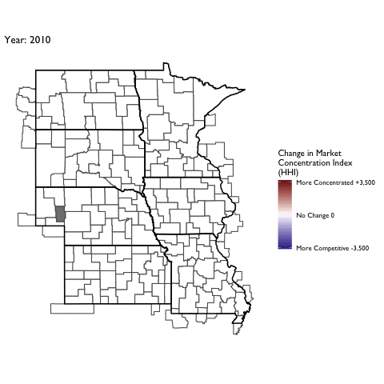
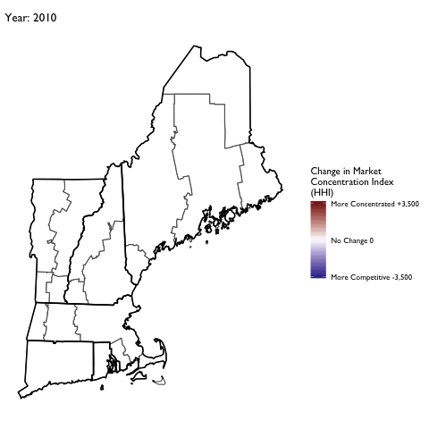
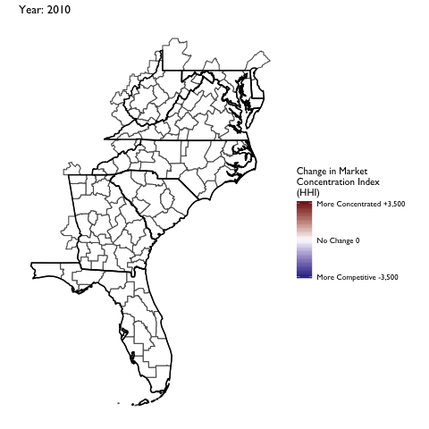
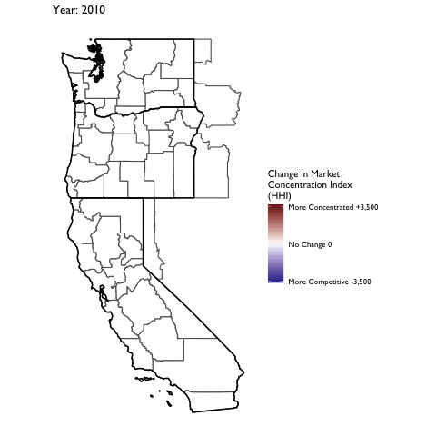

```{r setup, include=FALSE}
knitr::opts_chunk$set(echo = TRUE)
knitr::opts_chunk$set(warning = FALSE)
knitr::opts_chunk$set(message = FALSE)
suppressWarnings(suppressMessages(source(here::here("/R/manifest.R"))))
source(here("R/map-theme.R"))
source(here("R/shared-objects.R"))
source(here("R/theme-tufte-revised.R"))
```

# Defining  Markets for Health Care Services 

The objective of this repository is to lay out some thoughts, analytics, and data for defining geographic markets for health care services. In other words, it is a guided tour of a particularly complex rabbit hole. 

Geographic market definitions are important for a  variety of regulatory and research applications. Therefore, for any given use (e.g., analyses of a health system or hospital merger) or measure (e.g., constructing a Herfindahl-Hirschman index of market concentration) it is important to know whether and how the analytic output varies by alternative market definitions. 

For example, suppose our goal is to characterize insurers, hospitals or other providers by whether they operate in a concentrated market. If we use a market geography definition that is too narrow (e.g., county) we risk mischaracterizing markets as "concentrated" when they are really not (i.e., Type I error). Alternatively, a market definition that is too broad (e.g., state) risks characterizing markets as competitive when in practice a hypothetical merger or market exit could materially affect prices and competitiveness  (i.e., Type II error). 

Not surprisingly given the above issues, commonly used market geographies have trade-offs. Whether the strengths outweigh the weaknesses for a given application will depend on the specific research or regulatory question at hand.  

There are other important considerations at play as well. For example, some market definitions are constrained by geopolitical boundaries (e.g., state borders). While this may be fine for some settings (e.g., rate regulation in insurance markets, since consumers can only purchase a plan offered in their market) it may not be for others (e.g., hospitial markets, in which patients are unconstrained from crossing state boundaries). 

In addition, the underlying population data used to define commonly used geographic markets is out of date. The latest offical commuting zone boundaries are derived from commuting patterns ascertained in the 2000 Census, though researchers have [updated]( https://sites.psu.edu/psucz/data/) these boundaries based on 2010 data. HRRs and HSAs, by comparison, are defined by patient flows to hospitals in 1992 and 1993. 

Clearly, flows of patients and commuters have changed substantially in many areas in the last 20-30 years. Whether these changes are material to defining geographic boundaries of contemporary health care markets remains an open question we will explore here.

Finally, it is worth mentioning that regulatory and antitrust reviews have drawn on a diverse set of additional market geography definitions. The history, use and controversies surrounding these definitions are nicely covered in the Department of Justice chapter entitled ["Competition Law: hospitals."](https://www.justice.gov/atr/chapter-4-competition-law-hospitals) 
These alternative DOJ market definitions tend to rely on rich  data on prices in health care markets. While in theory such information could be obtained nationwide, in practice the construction of market definitions using price data is contigent on the painstaking collection of local data from relevant market participants. I do not profess to have the human capital or funding resources to undertake such an exercise here. So we will focus on more general market geography definitions that can more easily scale--particularly using publicly-available and relatively low-cost data. 


# Geographic Market Definitions

Before moving on it is useful to put down, in one place, common methods and definitions used to define geographic markets. 

## Hospital Service Areas (HSA)

HSAs are defined by the hospital care patterns of fee-for-service Medicare beneficiaries. Specifically, a three-step process is used:

1. Define all general acute care hospitals in the U.S. The town or city of the hospital location becomes the basis for HSA naming. Thus, if a given town has more than one hospital, those hospitals would be considered as part of the same HSA. In practice most HSAs end up with one hospital, however.

2. Aggregate all Medicare visits to the hospital (or hospitals, in cases where towns or cities have > 1 hospital). Using a plurality rule, assign ZIP codes to the HSA name where the most of its residents receive hospital care. 

3. Curate the HSA assignments to assure that only contiguous ZIPs make up the HSA.

In total there are 3,436 HSAs in the United States.

According to the Dartmouth methods appendix, data from 1992-93 were used to construct HSA boundaries. However, crosswalks from ZIP code tabulation area (ZCTA) to HSA are available on the Dartmouth website through 2017. Since 3,436 unique HSAs appear in the latest (2017) crosswalk this suggests that the updates only pertain to ZCTA updates, rather than updates on the geographies of the underlying HSAs.

## Hospital Referral Regions (HRR)

Whereas HSAs are intented to capture the geographic catchment area where residents of a ZIP code receive most of their overall hospital services, HRRs are meant to capture larger teritary referral areas. 

To identify HRRs, Dartmouth researchers aggregated HSAs into contiguous geographies based on where residents of the HSA received the most cardiovascular procedures and neurosurgeries. Thus, HSAs serve as the basic building block of HRRs. HRRs are also constructed to meet the following criteria:

- Population of at least 120,000.
- At least 65% of residents' services occurred within the region.
- Comprised of geographically contiguous HSAs.

In cases where the above criteria were not met, neighboring areas were pooled together until all criteria were satisfied. There are 306 HRRs in the United States.

## Primary Care Service Areas

PCSAs are intented to serve as the analogue of HSAs for primary care services. Thus, a PCSA is defined as a collection of contiguous ZIP codes with at least one primary care provider, and where the plurality of primary care services is obtained among fee-for-service Medicare beneficiaries. 

There are 6,542 PCSAs in the U.S. -- or roughly double the number of HSAs. On average there are 4.9 ZCTAs in a PCTA (median =3, max = 81, min = 1).  61% of primary care services, on average, are obtained within PCSAs.

## Marketplace Rating Areas

Marketplace rating areas are geographically contiguous areas used for the purpopses of insurance plan rate setting in the non-group market. The default geography used to set rating areas is the Metropolitan Statistical Area (MSA) plus the remainder of the state not in an MSA (MSA+1 definition). However, states have the option to define alternative county,  3-digit ZIP, or MSA/non-MSA clusters if they deem some alternative definition more important for regulation and rate setting within the state. 

In practice, only 7 states (AL, NM, ND, OK, TX, VA, WY) went along with the default (MSA+1) standard. The vast majority of the states submitted clusterings of counties as their rating area definitions. Another handful of states (MA, NE, AK) uses clusters of 3-digit ZIP codes, while CA uses a combination of counties and 3-digit ZIPs. Specifically, LA county is split into two rating areas based on 3-digit ZIP, while the remainder of the state is apportioned into rating areas based on county boundaries. 

What this means is there is signficant heterogeneity across states in the geographic and population size of rating areas. South Carolina, for example, has 46 rating areas -- more than *double* the 19 rating areas that define California!


## Commuting Zones

Commuting zones are comprised of geographically contiguous counties with strong within-area clustering of commuting ties between residental and work county, and weak across-area ties. The [latest official commuting zone geography files](https://www.ers.usda.gov/data-products/commuting-zones-and-labor-market-areas/) are based on patterns observed in the 2000 census. However, more recent county-to-county commuting data are available based on the 2009-2013 American Community Survey (ACS)  and could be used to construct new commuting zone geographies. 

For now, the zones used here will draw on the shapefiles constructed based on 2010 Census data by researchers at [Penn State](https://sites.psu.edu/psucz/).

This description of the history and methods of commuting zones from the U.S. Department of Agriculture (USDA) is useful:

> The ERS Commuting Zones (CZs) and Labor Market Areas (LMAs) were first developed in the 1980s as ways to better delineate local economies. County boundaries are not always adequate confines for a local economy and often reflect political boundaries rather than an area's local economy. CZs and LMAs are geographic units of analysis intended to more closely reflect the local economy where people live and work. Beginning in 1980 and continuing through 2000, hierarchical cluster analysis was used along with the Census Bureau's journey to work data to group counties into these areas. In 2000, there were 709 CZs delineated for the U.S., 741 in 1990, and 768 in 1980. LMAs are similar to CZs except that they had to have a minimum population of 100,000 persons. LMAs were only estimated in 1980 and 1990. This was done in order for the Census Bureau to create microdata samples using decennial census data (1980 PUMS-D, 1990 PUMS-L) that avoided disclosure. The LMAs were discontinued in 2000 because researchers found them to be too large and not as useful as the CZs. The identical methodology was used to develop CZs for all three decades.

# Market Definitions Based on Community Detection

Measures of economic activity (e.g., patient flows, predicted demand, prices) among market participants form the essential building blocks for defining health care markets. These linkages can be combined into a "network" summarizing the strength of economic linkages between relevant market units--for example, linkages between individuals / ZIP codes and their health care providers. This network, moreover, can be used to identify commonalities *within* market units. For instance, for defining geographic markets we might be interested in identifying clusters of ZIP codes that draw upon a common set of hospitals. Alternatively, we may be interested in clustering *hospitals* into groups based on economic ties among them (e.g., markets of "competing" hospitals that draw patients from similar ZIP codes). 

Identification of clusters of linked "nodes" in a network is known as **community detection.**  A variety of community detection algorithms have been developed across diverse fields ranging from physics, biology, and sociology. As we discuss below, many common approaches to defining health care markets--including HSAs, HRRs, commuting zones, and even the hypothetical monopolist test used in antitrust reviews--are essentially community detection methods.   

In this section, we outline an [ensemble](https://arxiv.org/abs/1309.0242) network-analytic approach to defining hospital markets based on community detection. This approach fits several different algorithms and then aggregates the information they produce to improve market definitions. 

We focus on a single example of ZIP codes and hospitals within Philadelphia County, Pennsylvania. As we will show later, with appropriate data the methodology is easily scalable nationally and to other geographies and health care service types (e.g., physicians, insurers). An interesting path for future work might also look at how markets differ by patient sub-populations defined by disease/condition, service use type (e.g., emergency care vs. elective surgery), income, or insurance type. 

## Some Caveats and Ideas for Future Research

It is important to emphasize that the approach we articulate is not intended as a substitute for market definitions guided by economic theory. Rather, we provide a novel *analytic framework* for defining markets based on data summarizing economic links among market participants. In other words, just as the multinomial logit provides an analytic framework for estimating consumer demand, our network analytic approach provides  an analytic framework for detecting markets. As noted above, a nice feature of the approach is that common methods for defining markets (e.g., HSA, the hypothetical monopolist test, etc.) can all be seen as special cases of community detection. 

Once understood in that sense, it is straightforward to see that our framework easily accommodates measures of economic linkages motivated by theory, produced via estimation of (exogenous) demand, or both. In our examples below, these "linkages" are summarized as patient counts of the number of fee-for-service Medicare patients from each ZIP code who are treated at local hospitals. We recognize that these linkages are observational and subject to endogeneity concerns, which will affect the market definitions identified in the example. However, it is important to recognize that any economic "linkage" measure (e.g., patient demand estimated using exogenous variation, unit price correlations among competing hospitals) could be plugged in as the relevant measure of an economic connection among market units.  

Finally, as noted above and in a similar vein, our data on patient flows is drawn from [publically-available](https://www.cms.gov/Research-Statistics-Data-and-Systems/Statistics-Trends-and-Reports/Hospital-Service-Area-File/index.html) hospital service data from CMS. These data summarize *overall* patient flows to acute care hospitals among fee-for-service Medicare patients. But in principle, data on other patient populations--defined by service type (e.g., emergency patients, cardiovascular patients, etc.) or population (e.g., low-income patients, commercially-insured patients) could be used. That is, data on patient sub-populations could be used to partition geographies or hospitals into different markets. Future research on how market definitions vary for different patient populations would be quite useful.  


```{r, echo = FALSE}
# St. Joseph's Hospital in Philadelphia closed March 11, 2016. North Philadelphia Health System closed the 146-bed hospital as it consolidated operations to help improve its finances. North Philadelphia Health System filed for bankruptcy Dec. 30.
north_phila <- "390132"
north_phila_zip <- "19130"
zip1  <-19116
zip2 <- 19130
```

```{r, echo = FALSE}
library(ggrepel)

# Load shape files
sf_state <- read_sf(here("output/tidy-mapping-files/state/01_state-shape-file.shp")) %>% 
  st_transform(crs = 4326) 
sf_county <- read_sf(here("output/tidy-mapping-files/county/01_county-shape-file.shp")) %>% 
  st_transform(crs = 4326) 
sf_zip <- read_sf(here("output/tidy-mapping-files/zcta/01_zcta-shape-file.shp")) %>% 
  st_transform(crs = 4326) 

# Centroids of each ZIP
cent_zip <- sf_zip %>% st_centroid()

# Just excounty County, TN
sf_excounty_alone <- 
  sf_county %>% 
  filter(fips_code=="42101")
  #filter(fips_code == "47037")

# Zips with centroids within excounty County, TN
zips_to_show <- cent_zip %>% 
  filter(row_number() %in% unlist(st_intersects(sf_excounty_alone, cent_zip))) %>% 
  pull(zcta5ce10)

# Shapefile of these ZIPS
sf_zip_excounty <- sf_zip %>% 
  filter(zcta5ce10  %in% zips_to_show)

# Centroids of these ZIPs
cent_zip_excounty <- 
  sf_zip_excounty %>% 
    st_centroid() 

# Get the X,Y coordinates of the centroids (bind as extra columns)
cent_zip_excounty <-  
  bind_cols(cent_zip_excounty, cent_zip_excounty %>% st_coordinates() %>% tbl_df() %>% set_names(c("x","y")))  %>% 
  ungroup() %>% data.frame() %>% tbl_df()

```


```{r, cache = TRUE, echo = FALSE}
# Get the hospital x,y coordinates from the AHA Data.
aha_files <- c("2017" = "../Research-AHA_Data/data/aha/annual/raw/2017/FY2017 ASDB/COMMA/ASPUB17.CSV",
               "2016" = "../Research-AHA_Data/data/aha/annual/raw/2016/FY2016 Annual Survey Database/COMMA/ASPUB16.CSV",
                "2015" = "../Research-AHA_Data/data/aha/annual/raw/2015/FY2015 Annual Survey Database/COMMA/ASPUB15.CSV"
)

# Get latitude and longitue of general acute care hospitals in 2017 AHA survey. 
aha <- 
  aha_files %>% 
  map(~(
    data.table::fread(here(.x)) %>% 
      janitor::clean_names() %>% 
      filter(mstate %in% states) %>% 
      filter(mstate !="AK" & mstate!="HI") %>% 
      mutate(system_id = ifelse(!is.na(sysid),paste0("SYS_",sysid),id)) %>% 
      filter(serv==10))) %>% 
  map(~rename_in_list(x = .x, from = "hcfaid", to = "mcrnum")) %>% 
  map(~(.x %>% 
          select(mname, id, mcrnum , latitude = lat, longitude = long, hrrnum = hrrcode, hsanum = hsacode, admtot, system_id, mloczip, sysname,fips_code=fcounty,mloccity ) %>% 
          mutate(hrrnum = paste0(hrrnum)) %>% 
          mutate(hsanum = paste0(hsanum)) %>% 
          mutate(prvnumgrp = str_pad(mcrnum,width = 6, pad="0")) %>% 
          mutate(hosp_zip_code = str_sub(mloczip,1,5)) %>% 
          mutate(longitude = as.numeric(paste0(longitude))) %>% 
          mutate(latitude = as.numeric(paste0(latitude))) %>% 
          filter(!is.na(longitude) & !is.na(latitude))
  )) %>% 
  set_names(names(aha_files)) #%>% 

# Shape file of x,y coordinates of all hospitals
xy_aha <- aha[["2016"]] %>% 
  st_as_sf(coords = c("longitude", "latitude"), crs = 4326)

```


```{r, echo = FALSE}
minimum_market_share_zip <- 0.10
minimum_market_share_hosp <- 0.10

# Load the hospital-county patient sharing file
df_hosp_zip <- read_rds(here("output/hospital-county-patient-data/2015/hospital-zip-patient-data.rds")) %>% 
  group_by(prvnumgrp) %>% 
  mutate(market_share_hosp = total_cases/ sum(total_cases,na.rm=TRUE)) %>% 
  filter(zip_code %in% zips_to_show) %>% 
  group_by(zip_code) %>% 
  mutate(market_share_zip = total_cases / sum(total_cases,na.rm =TRUE))  %>% 
  filter(market_share_zip>minimum_market_share_zip | market_share_hosp>minimum_market_share_zip ) %>% 
  inner_join(aha[["2015"]],"prvnumgrp") %>% 
  rename(hosp_x = longitude,
         hosp_y = latitude) %>% 
  inner_join(cent_zip_excounty %>% select(zip_code = zcta5ce10 , zip_x = x, zip_y = y), "zip_code") %>% 
  group_by(zip_code) %>% 
  mutate(market_share = total_cases / sum(total_cases,na.rm=TRUE)) %>% 
  ungroup() 

# Summarize hopsital market shares from these ZIPs
df_hosp_summ <- 
  df_hosp_zip %>% 
  group_by(prvnumgrp) %>% 
  summarise(total_cases = sum(total_cases)) %>% 
  mutate(total_cases_orig = total_cases) %>% 
  mutate(total_cases = scales::rescale(total_cases,to = c(0,1)))

# Summarise hospital market shares for specific ZIPs to use as examples
df_hosp_zip1 <- 
  df_hosp_zip %>% 
  #filter(zip_code == zip1) %>% 
  filter(zip_code==zip1) %>% 
  group_by(prvnumgrp) %>% 
  summarise(total_cases_zip1 = sum(total_cases)) %>% 
  mutate(total_cases_zip1 = scales::rescale(total_cases_zip1,to = c(0,1)))

df_hosp_zip2 <- 
  df_hosp_zip %>% 
  #filter(zip_code == zip2) %>% 
  filter(zip_code==zip2) %>% 
  group_by(prvnumgrp) %>% 
  summarise(total_cases_zip2 = sum(total_cases)) %>% 
  mutate(total_cases_zip2 = scales::rescale(total_cases_zip2,to = c(0,1)))
```

```{r, echo = FALSE}
# Find the nearby hospitals in the AHA data with X,Y coordinates.
hospitals_to_show <- xy_aha %>% 
  filter(prvnumgrp %in% unique(df_hosp_zip$prvnumgrp))

xy_hosp <- bind_cols(xy_aha %>% filter(prvnumgrp %in% unique(df_hosp_zip$prvnumgrp)) %>% ungroup() %>% data.frame(),
                     xy_aha %>% 
                     filter(prvnumgrp %in% unique(df_hosp_zip$prvnumgrp)) %>% 
                     st_coordinates() %>% tbl_df() %>% set_names(c('x','y'))) %>% 
  left_join(df_hosp_summ,"prvnumgrp") %>% 
  left_join(df_hosp_zip1,"prvnumgrp") %>% 
  left_join(df_hosp_zip2,"prvnumgrp")
```

## ZIP Codes and Hospitals in Philadelphia County, PA

We begin by plotting the ZIP codes with geographic centroids contained within Philadelphia County, PA. In addition, we plot the location and market share (point size) of all hospitals based on the treatment patterns observed among traditional Medicare patients in 2015. In order for a hospital to be included, at least `r 100*minimum_market_share_zip` percent of ZIP patients, or at least `r 100*minimum_market_share_hosp` percent of the hospital's total FFS Medicare patients, must have been treated. These cutoff thresholds are not required for the approach, but aid in visualization for this example because they trim the data to avoid plotting the hundreds of hospitals that treated only a 1 or 2 patients from the example ZIP codes. 

Also note that the hospital plotted in red is St. Joseph's hospital, a 146 bed hospital that [closed on March 11, 2016](https://philadelphia.cbslocal.com/2015/12/29/st-josephs-hospital-in-north-philadelphia-to-close-in-march-2016/). We will (eventually) use this closing in an event study to validate the market classifications--the idea being that hospitals within the market containing St. Joseph's should have been more affected by its closing (i.e., total FFS Medicare patients goes up) than hospitals outside it. 

```{r, fig.cap = "Hospitals and ZIP Codes in Philadelphia County, PA, 2015",fig.align = "center",fig.pos="H", fig.height = 4, fig.width = 4, echo = FALSE, echo = FALSE}
# Map the hospitals
sf_zip_excounty %>% 
  ggplot() + geom_sf() + 
  remove_all_axes + 
  geom_sf(data = sf_excounty_alone, colour = "black",lwd = 1, alpha = 0.1) + 
  coord_sf(datum=NA) +
  geom_text_repel(data = xy_hosp, aes(x=x,y=y,label = mname),cex = 1.5) +
  geom_point(data = xy_hosp, aes(x=x,y=y,size = total_cases)) +
  theme(legend.position = "non") +
  geom_text_repel(data = cent_zip_excounty, aes(x=x,y=y,label = zcta5ce10 ), cex = 1) + 
  geom_point(data = xy_hosp %>% filter(mname=="North Philadelphia Health System"),color="red",aes(x=x,y=y))
```


```{r, echo = FALSE}
# Get a dataset of edges (i.e., share of patients going to each hospital from each ZIP)
df_edges <- df_hosp_zip %>% 
  select(zip_code,prvnumgrp,market_share,hosp_x,hosp_y,zip_x,zip_y) %>% 
  gather(type,value,-zip_code,-prvnumgrp,-market_share) %>% 
  separate(type,into=c("type","coord")) %>% 
  spread(coord,value) %>% 
  unite(id,prvnumgrp,zip_code) 

df_edges_w <- df_edges %>% 
  gather(key,value,-id,-market_share,-type) %>% 
  unite(key,type,key)  %>% 
  spread(key,value)

df_nodes <- df_hosp_zip %>% 
  select(zip_code,prvnumgrp,hosp_x,hosp_y,zip_x,zip_y) %>% 
  unique()
```

In the next plot we show the care use patterns among FFS Medicare patients who reside in two ZIP codes: `r paste0(zip1)` and `r paste0(zip2)`.  Patient flows from the ZIP code to area hospitals is represtened by the "edge line" liking the ZIP centroid to the geographic location of each hospital. 

As seen in the figure, patients from the two example ZIP codes are treated at fundamentally different hospitals. These hospitals, moreover, are within close geographic proximity to each ZIP code. Finally, it is worth noting that many patients from ZIP `r paste0(zip1)` are observed to travel to an out-of-county hospital. 

```{r, fig.cap = "Hospitals Utilized Among FFS Medicare Beneficiaries from Select ZIP Codes", fig.height = 4, fig.width = 4,fig.pos="H", echo = FALSE}
 sf_zip_excounty %>% 
  ggplot() + geom_sf() + 
  remove_all_axes + 
  geom_sf(data = sf_excounty_alone, colour = "black",lwd = 1, alpha = 0.1) + 
  geom_sf(data = sf_zip_excounty %>% filter(zcta5ce10  %in% c(zip1,zip2)), aes(fill = zcta5ce10),alpha = 0.5) +
  coord_sf(datum=NA) +
  geom_text_repel(data = xy_hosp, aes(x=x,y=y,label = mname),cex = 1.5) +
  geom_point(data = xy_hosp, aes(x=x,y=y,size = total_cases_zip1),colour = "darkblue") +
  geom_point(data = xy_hosp, aes(x=x,y=y,size = total_cases_zip2),colour = "darkblue") +
  theme(legend.position = "non") +
  geom_text_repel(data = cent_zip_excounty, aes(x=x,y=y,label = zcta5ce10 ), cex = 1) + 
  #geom_path(data = df_edges_w %>% filter(grepl(zip1,id)), aes(x=zip_x,y = zip_y,xend=hosp_x,yend=hosp_y)) +
  geom_line(data = df_edges %>% filter(grepl(zip1,id)|grepl(zip2,id)),aes(x=x,y=y,group=id),size = 1) +
  scale_size_continuous(range=c(1,10),limits = c(1,10))

```

The next figure plots  "edge links" among all ZIPs and hospitals in Philadelphia County. The plotted line width is also proportional to the total volume of of patients. That is, a thin line connecting a ZIP-hospital pair indicates that only a small fraction of patients from the ZIP code are treated at that particular hospital. 

While things will become more clear in a later plot, a rough sense of distinct markets for hospital services can be seen  in this simple map-based visualization of patient flows. For example, patients residing in the ZIP codes clustered in the southwest corner of the county all flow into hospitals located there, and there are few "shared" connections among these hospitals with other ZIP codes in the county. 

```{r, fig.cap = "Patient Flows Among ZIP Codes and Hospitals in Philadelphia County, PA, 2015",fig.pos="H", echo = FALSE}
sf_zip_excounty %>% 
  ggplot() + geom_sf() + 
  remove_all_axes + 
  geom_sf(data = sf_excounty_alone, colour = "black",lwd = 1, alpha = 0.1) + 
  coord_sf(datum=NA) +
  geom_text_repel(data = xy_hosp, aes(x=x,y=y,label = mname),cex = 1.5) +
  theme(legend.position = "non") +
  geom_text_repel(data = cent_zip_excounty, aes(x=x,y=y,label = zcta5ce10 ), cex = 1) + 
  geom_line(data = df_edges ,aes(x=x,y=y,group=id,size=market_share),colour="darkblue") +
  #geom_path(data = df_edges_w, aes(xend=zip_x,yend=zip_y,x=hosp_x,y=hosp_y,size=market_share),arrow = arrow(length = unit(0.01, "npc")) )+
    geom_point(data = xy_hosp, aes(x=x,y=y,label = mname,size = total_cases)) +
   scale_size_continuous(range=c(0,2))
```

The next plot removes the geographic location layering  and simply plots the bipartite network. That is, we no longer tether each hospital and ZIP to its geographic location and centroid, respectively. Rather, we utilize a large graph layout (LGL) algorithm to improve the visualization of ties between ZIP codes and hospitals. As in the map in figure above, the strength of ties between ZIP codes and hospitals is represented by the width of the line. 


```{r, echo = FALSE}
# Construct Network objects
library(ggraph)
library(tidygraph)

# Create function to convert dataframe to bipartite matrix
convert_to_bipartite <- function(df,id) {
  id <- enquo(id)
  nn <- df %>% pull(!!id)
  foo <- df %>% select(-!!id) %>%
    as.matrix()
  
  rownames(foo) <- nn
  foo
}


bp_zip_hosp_weighted <-
  df_hosp_zip %>%
  filter(prvnumgrp %in% hospitals_to_show$prvnumgrp & zip_code %in% zips_to_show) %>% 
  group_by(zip_code) %>%
  mutate(share_of_patients = total_cases / sum(total_cases, na.rm = TRUE)) %>%
  ungroup() %>% 
  # Two ZIPs are connected if at least XX% of their total patients to the same hospital
  mutate(connected = as.integer(share_of_patients >= minimum_market_share_zip))  %>%
  mutate(share = ifelse(connected==1,share_of_patients,0)) %>% 
  select(zip_code, prvnumgrp, total_cases) %>%
  spread(prvnumgrp, total_cases) %>%
  convert_to_bipartite(id = zip_code)
bp_zip_hosp_weighted[is.na(bp_zip_hosp_weighted)] <- 0

net_bp <- 
  graph_from_incidence_matrix(bp_zip_hosp_weighted,weighted=TRUE) %>% 
  simplify(., remove.loops=TRUE) %>% 
  as_tbl_graph() %>% 
  activate(nodes) %>% 
  left_join(xy_hosp %>% ungroup() %>% 
              as.data.frame() %>% 
              select(name = prvnumgrp,mname),"name") %>% 
  mutate(label = ifelse(!is.na(mname),mname,name))
```


```{r, fig.cap = "Visualization of ZIP-Hospital Patient Flows as a Bipartite Network Object", fig.width = 8, fig.height=8,fig.pos="H", echo = FALSE}
set.seed(1)
net_bp %>% 
  ggraph(layout='lgl') + 
  #scale_x_continuous(limits = c(-15,10)) + 
  #scale_y_continuous(limits = c(-20,6)) +
  geom_edge_link(aes(width = weight,alpha=weight),show.legend = FALSE) + 
  geom_node_point(aes(colour=type), cex = 6) +
  geom_node_text(aes(label = label),cex = 3) +
  remove_all_axes  + 
  theme(legend.position = "none")  
```

The underlying market structure of Philadelphia-area hospitals starts to become a  bit more clear in this representation of the data. Again, we see that ZIP codes tend to cluster around certain sets of hospitals.  For example, Holy Reedeemer, Nazareth, Aria-Jefferson and Jeanes hospital all tend to draw on patients from similar ZIP codes. By comparison, Mercy Fitzgerald, the UPenn hospitals, and Lankeneau Medical Center draw patients from a different cluster of ZIPs. 

```{r, echo = FALSE}
#https://arxiv.org/pdf/1309.0242.pdf
bp_zip_hosp <-
  df_hosp_zip %>%
  filter(prvnumgrp %in% hospitals_to_show$prvnumgrp & zip_code %in% zips_to_show) %>% 
  group_by(zip_code) %>%
  mutate(share_of_patients = total_cases / sum(total_cases, na.rm = TRUE)) %>%
  ungroup() %>% 
  mutate(connected = as.integer(share_of_patients >= minimum_market_share_zip))  %>%
  mutate(share = ifelse(connected==1,share_of_patients,0)) %>% 
  select(zip_code, prvnumgrp, connected) %>%
  spread(prvnumgrp, connected) %>%
  convert_to_bipartite(id = zip_code)
bp_zip_hosp[is.na(bp_zip_hosp)] <- 0
# bp_zip_hosp[1:10,1:10]

up_zip <-bp_zip_hosp %*% t(bp_zip_hosp)

# Get a weighted version (i.e., continuous fraction of patients, rather than using threshold)
up_zip_tmp <- bp_zip_hosp_weighted %*% t(bp_zip_hosp_weighted>0)
up_zip_w <- up_zip_tmp / diag(up_zip_tmp)

# This just uses the binary "connected"
net_ex <- 
  graph_from_adjacency_matrix(up_zip, weighted = TRUE,mode="undirected") %>%
  simplify(., remove.loops = TRUE) 

# This uses the fraction shared
net_ex_weighted <- 
  graph_from_adjacency_matrix(up_zip_w, weighted = TRUE,mode="undirected") %>%
  simplify(., remove.loops = TRUE) 


get_community <- function(gg,method,...) {
  if (method == "walktrap") {
    initial_communities <-
      walktrap.community(gg,...)
  } else if (method == "fast_greedy") {
    initial_communities = 
      cluster_fast_greedy(gg,...)
  } else if (method =="multilevel") {
    initial_communities <- multilevel.community(gg,...)
  } else if (method == "spinglass") {
    initial_communities <- spinglass.community(gg,...)
  } else if (method == "infomap") {
    initial_communities <- infomap.community(gg,...)
  } else if (method == "louvain") {
    initial_communities <- cluster_louvain(gg, weights = NULL)
  } else if (method == "edge_between") {
    initial_communities <- edge.betweenness.community(gg,...)
  } else if (method == "eigen") {
    initial_communities <- leading.eigenvector.community(gg,...)
  } else if (method == "label_prop") {
    initial_communities <- label.propagation.community(gg,...)
  }
  return(list(fit = initial_communities, market = membership(initial_communities)))
}

market_cw <- net_ex_weighted %>% get_community(method = "walktrap", 
                          steps = 5,
                          merges = TRUE,
                          modularity = TRUE,
                          membership = TRUE)

market_fg <- net_ex_weighted %>% get_community(method = "fast_greedy")
market_ml <- net_ex_weighted %>% get_community(method = "multilevel")
market_sg <- net_ex_weighted %>% get_community(method = "spinglass")
market_info <- net_ex_weighted %>% get_community(method = "infomap")
market_louv <- net_ex_weighted %>% get_community(method = "louvain")
market_edge <- net_ex_weighted %>% get_community(method = "edge_between")
market_eigen <- net_ex_weighted %>% get_community(method = "eigen")
market_label <- net_ex_weighted %>% get_community(method = "label_prop")

gf_ex <- tidygraph::as_tbl_graph(net_ex,directed=FALSE) %>% 
  activate(nodes)  %>% 
  mutate(zip_code = name) %>% 
  mutate(market_cw = factor(market_cw$market[name])) %>% 
  mutate(market_fg = factor(market_fg$market[name])) %>% 
  mutate(market_ml = factor(market_ml$market[name])) %>% 
  mutate(market_sg = factor(market_sg$market[name])) %>% 
  mutate(market_info = factor(market_info$market[name])) %>% 
  mutate(market_louv = factor(market_louv$market[name])) %>% 
  mutate(market_edge = factor(market_edge$market[name]))  %>% 
  mutate(market_eigen = factor(market_eigen$market[name]))  %>% 
  mutate(market_label = factor(market_label$market[name]))  

```


Next we will take this bipartite matrix and transform it into a unipartite matrix summarizing the total number of shared hospital connections between ZIP codes. Here, we will define two ZIPs as "connected" if, for one or more hospitals, at least `r 100*minimum_market_share_zip` percent of the  patients from that ZIP are treated at the hospital. Thus, if 15% of patients from ZIP A and 25% of patients from ZIP B go to hospital 1, those two ZIPs would be connected. However if just 1% of patients from ZIP A and 25% of patients from ZIP B go to the hospital, those ZIPs would not be counted as connected.

The plot below provides visualization of the unipartite network of ZIP codes in Philadelphia county. Again, we can see clear "clustering" of ZIPs. That is, these are ZIPs that tend to draw on the same hospitals. In the plot, the weight of the edge lines linking two ZIP codes is proportional to the total number of "connected" hospitals those two ZIPs have. 


```{r, fig.cap = "Visualization of ZIP-Hospital Connections as a Unipartite Network of ZIP Codes", fig.height =5, fig.width = 5,fig.pos="H", echo = FALSE}
set.seed(234)
gf_ex %>% 
  activate(edges) %>% 
  filter(weight>0) %>% 
  ggraph(layout='fr') + 
  geom_edge_link(aes(width = weight, alpha = weight), show.legend = FALSE) + 
  #geom_node_point(aes(colour=market_cw),size = 6) +
  geom_node_point(size=6,colour="lightblue")+
  geom_node_text(aes(label = zip_code)) +
  remove_all_axes  +
  theme(legend.position = "none")
```


## Identifying Markets via Community Detection 

Our next step is to use this network representation of hospital use to "detect" markets for hospital services. A nice feature of this approach is that we can detect markets from two perspectives: the geography (i.e., what ZIP codes tend to send patients to similar hospitals?) or the hospital (i.e., what hospitals tend to draw patients from similar ZIP codes?).

We can see in the representation of Philadelphia that the ZIP code geographies tend to cluster around each other--that is, patients from clusters of geographically-proximate ZIP codes tend to use the same hospitals. There is a clear separation of certain clusters of ZIP codes, while other ZIP codes (e.g., 19134s) straddle different hospital "communities."

Over the years a [variety of community detection algorithms](https://www.nature.com/articles/srep30750)  have been developed. Each takes as its input a network, and returns a community membership attribute to each node in the network. The algorithms are constructed such that hte network is sub-dividied into mutually exclusive communities--though some [more recent work](https://dl.acm.org/citation.cfm?id=2501657) has allowed for nodes to be represented in more than one community. 

We'll begin by delploying the Cluster Walktrap algorithm on the unipartite (ZIP-ZIP) network for Philadelphia county. The output from this algorithm has been added to the plot below. 

```{r, fig.cap = "Visualization of Hospital Markets as Detected by the Cluster Walktrap Algorithm", fig.height =5, fig.width = 5,fig.pos="H", echo = FALSE}
set.seed(234)
gf_ex %>% 
  activate(edges) %>% 
  filter(weight>0) %>% 
  ggraph(layout='fr') + 
  geom_edge_link(aes(width = weight, alpha = weight), show.legend = FALSE) + 
  geom_node_point(aes(colour=market_cw),size = 6) +
  geom_node_text(aes(label = zip_code)) +
  remove_all_axes  +
  theme(legend.position = "none")
```


```{r, echo = FALSE}
# Fit Ensemble 

get_up_market_matrix <- function(foo) {
  foo2 <- foo %>% data.frame() %>% 
    mutate(connected = 1) %>% 
    spread(market,connected) %>% 
    convert_to_bipartite(id=zip_code) 
  foo2[is.na(foo2)] <- 0
  foo2 %*% t(foo2)
}


up_market <- 
  gf_ex %>% 
    activate(nodes) %>% 
    data.frame() %>% 
    select(-name) %>% 
    gather(algorithm,market,-zip_code) %>% 
    group_by(algorithm) %>% 
    nest() %>% 
    mutate(bp =map(data,~(
      get_up_market_matrix(.x)
    )))

#https://arxiv.org/pdf/1309.0242.pdf , pp5
# "Firstly, a complete graph, G = (V, F), is constructed using the
# data from candidate communities, which are the output
# from some community detection algorithm(s). The set
# of nodes, V , is the original set of nodes in the network,
# and the set of edges F now indicate that two nodes have
# been found in the same community. The matrix, F =
# [Fij ], where the element in row i and column j, Fij is the
# frequency of the event that nodes i and j has been found
# in the same candidate community."

gf_F <- up_market$bp[[1]]
for (i in 2:length(up_market$bp)) {
 gf_F  <- gf_F + up_market$bp[[i]]
}

# Agglomorative Hierarchical Clustering
ensemble.clust <- hclust(dist(gf_F))
# Dendrogram of the Clustering 
ensemble_dendro <- as.dendrogram(ensemble.clust) 
# GGplot of the dendrogram
ensemble_dendro_plot <- ensemble_dendro %>% ggdendrogram(rotate = TRUE)

# Get the modularity at each height
ensemble_modularity_all <- 
  1:100 %>% 
  map_dbl(~(modularity(net_ex, cutree(ensemble.clust , h = .x)))) 
ensemble_modularity_max_which <- min(which(ensemble_modularity_all == max(ensemble_modularity_all)))
ensemble_modularity_max <- ensemble_modularity_all[ensemble_modularity_max_which]
ensemble_membership <- cutree(ensemble.clust , h = ensemble_modularity_max_which)
gf_ex <- 
  gf_ex %>% 
  activate(nodes) %>% 
  mutate(market_ensemble = factor(ensemble_membership[name]))


df_modularity <- 
  data.frame(ensemble = modularity(net_ex,ensemble_membership),
             walktrap = modularity(net_ex,market_cw$market),
             fast_greedy = modularity(net_ex, market_fg$market), 
             multilevel = modularity(net_ex,market_ml$market),
             spinglass = modularity(net_ex,market_sg$market),
             infomap = modularity(net_ex,market_info$market),
             louvain = modularity(net_ex,market_louv$market),
             eigen = modularity(net_ex,market_eigen$market),
             label_prop = modularity(net_ex,market_label$market),
             edge_between = modularity(net_ex,market_edge$market))
```


```{r, echo = FALSE}
df_markets_ensemble <- 
  cbind.data.frame(zip_code = names(market_cw$market), market_cw = market_cw$market %>% unname() %>% as.vector()) %>% 
  mutate(market_fg = market_fg$market[zip_code]) %>% 
  mutate(market_ml = market_ml$market[zip_code]) %>% 
  mutate(market_sg = market_sg$market[zip_code]) %>% 
  mutate(market_info = market_info$market[zip_code]) %>% 
    mutate(market_edge =  market_edge$market[zip_code]) %>% 
    mutate(market_eigen =  market_eigen$market[zip_code]) %>% 
    mutate(market_label =  market_label$market[zip_code]) %>% 
  mutate(market_ensemble = ensemble_membership[zip_code]) 

# HSA, HRR, CZ Markets for Comparisons Later

zcta_to_hrr_hsa <- read_csv(here("public-data/shape-files/nber-hrr-hsa-pcsa/ziphsahrr2014.csv")) %>% 
  janitor::clean_names() %>% 
  rename(zip_code = zipcode ) %>% 
  filter( zip_code %in% zips_to_show)

market_hsa <- zcta_to_hrr_hsa %>% pull(hsanum) %>% as.numeric()
names(market_hsa) <- paste0(zcta_to_hrr_hsa$zip_code)

market_hrr <- zcta_to_hrr_hsa %>% pull(hrrnum) %>% as.numeric()
names(market_hrr) <- paste0(zcta_to_hrr_hsa$zip_code)

county_to_cz <- data.table::fread(here("public-data/shape-files/commuting-zones/counties10-zqvz0r.csv")) %>% 
  janitor::clean_names() %>% 
  rename(fips_code = fips) %>% 
  group_by(out10) %>% 
  mutate(commuting_zone_population_2010 = sum(pop10, na.rm=TRUE)) %>% 
  mutate(fips_code = str_pad(paste0(fips_code),width = 5, pad="0")) %>% 
  select(fips_code,
         commuting_zone_id_2010 = out10,
         commuting_zone_population_2010 ) %>% 
  filter(fips_code=="42101")

market_cz <- rep(county_to_cz$commuting_zone_id_2010,length(market_hsa))
names(market_cz) <- paste0(zcta_to_hrr_hsa$zip_code)

# Final Hospital Markets Data Frame

df_hosp_markets <- 
  df_hosp_zip %>% 
  left_join(df_markets_ensemble %>% 
              mutate(market_hrr = market_hrr[zip_code],
                     market_hsa = market_hsa[zip_code],
                     market_cz = market_cz[zip_code]) %>% 
              gather(type,market,-zip_code),"zip_code")  %>% 
  group_by(type,market,prvnumgrp) %>% 
  summarise(total_cases = sum(total_cases)) %>% 
  ungroup() %>% 
  mutate(type2 = gsub("market_","total_cases_",type)) %>% 
  gather(key,value,-type,-type2,-prvnumgrp,-market) %>% 
  group_by(prvnumgrp) %>%  
  mutate(foo = row_number()) %>% 
  unique() %>% 
  #filter(row_number() %in% c(67,80))
  spread(type,market) %>% 
  select(-key) %>% 
  spread(type2,value) %>% 
  select(-foo)
#df_hosp_markets$[is.na(df_hosp_markets)] <- 0

xy_hosp_market <-
  xy_hosp %>% 
  left_join(df_hosp_markets,"prvnumgrp")

sf_markets <- sf_zip_excounty %>% 
  mutate(zip_code = zcta5ce10) %>% 
  left_join(df_markets_ensemble, "zip_code") %>% 
  mutate(market_hrr = market_hrr[zip_code],
                     market_hsa = market_hsa[zip_code],
                     market_cz = market_cz[zip_code]) 
```

The algorithm has identified four distinct communities. In the plot below, we map out each of these communities. Each panel of this plot shows the ZIP codes included in a detected market. The dots again correspond to the geographic location of hospitals visited by individuals from that market. The dot sizes are furthermore scaled to be proportional to patient volume / market share. 


```{r,fig.cap = "Geographic Markets Identified by Cluster Walktrap Algorithm",fig.height = 8, fig.width =8,fig.pos="H", echo = FALSE}
sf_zip_excounty %>% 
  filter(zcta5ce10 != "19112") %>% 
  ggplot() + geom_sf(alpha = 0.1)  + 
  remove_all_axes + 
  geom_sf(data = sf_excounty_alone, colour = "black",lwd = 1, alpha = 0.1) + 
  geom_text_repel(data = xy_hosp, aes(x=x,y=y,label = mname),cex = 1.5) + 
  theme(legend.position = "none") +
  geom_sf(data = sf_markets %>% filter(zcta5ce10 != "19112") , aes(fill = "grey"),fill ="lightgrey") + 
  geom_point(data = xy_hosp_market %>% filter(!is.na(market_cw)), aes(x=x,y=y,size = total_cases_cw)) + 
 # scale_fill_distiller(palette=3) + 
  facet_wrap(~market_cw) +
  coord_sf(datum=NA) 
```

Because the cluster walktrap algorithm is hierarchical, it's useful to plot out a heatmap and dendrogram of the unipartite (ZIP-ZIP) matrix. This allows us to visualize not only the strengh of hospital connections between two ZIPs, but also the specific clustering process that gives rise to the detected communities. 

```{r,fig.width = 8, fig.height=8, eval = TRUE, echo = FALSE}
fit <- market_cw$fit
market.dendro <- as.dendrogram(fit)
dendro.plot <- ggdendrogram(data = market.dendro, rotate = TRUE)  + theme(axis.text.y = element_text(size = 6))


heatmap.plot <- 
  up_zip_w %>% data.frame() %>% rownames_to_column() %>% 
  rename(zip_code = rowname) %>% 
  gather(zip2,share,-zip_code) %>% 

  tbl_df() %>% 
  mutate(market = membership(fit)[zip_code]) %>% 
  mutate(zip_code = factor(zip_code, levels = names(membership(fit))[order.dendrogram(market.dendro)])) %>% 
  mutate(zip2 = gsub("X","",zip2))  %>% 
  mutate(zip2 = factor(zip2, levels = names(membership(fit))[order.dendrogram(market.dendro)])) %>% 
  mutate(share = share*100) %>% 
  ggplot(aes(x = zip2,y=zip_code)) + 
  # geom_tile(aes(color = as.factor(market)),alpha = 0.1) +
  geom_tile(aes(fill = share, colour = as.factor(market))) +
  scale_fill_gradient2(low="white",high="darkred") +
  theme(axis.text.y = element_text(size = 6)) + 
  theme(axis.text.y = element_blank(),
        axis.title.y = element_blank(),
        axis.ticks.y = element_blank(),
        legend.position = "none") +
  theme(axis.text.x=element_text(angle = -90, hjust = 0,size =6))  +
  labs(fill = "",x ="ZIP Code") +
  scale_colour_manual(guide=FALSE,values = c("purple","brown","darkblue","green"))


postscript(file = here("output/figures/dendrogram-cluster-walktrap.eps"), horiz = FALSE, onefile = FALSE, width = 8, height = 8, fonts=c("serif"))
grid::grid.newpage()
 print(heatmap.plot, vp = grid::viewport(x = 0.4, y = 0.5, width = 0.8, height = .93))
 print(dendro.plot, vp = grid::viewport(x = 0.9, y = 0.51, width = 0.2, height = .97))
 x<- dev.off()

 png(file = here("output/figures/dendrogram-cluster-walktrap.png"),  width = 6*100 ,height = 6*100,res=100)
grid::grid.newpage()
 print(heatmap.plot, vp = grid::viewport(x = 0.4, y = 0.5, width = 0.8, height = .93))
 print(dendro.plot, vp = grid::viewport(x = 0.9, y = 0.51, width = 0.2, height = .97))
 x <- dev.off()
 
```


In the plot above, the rows have been subdivided (by cell line color) into the four total markets identified via community detection. That is, these are the ZIP codes corresponding to each of the four markets. The cell shadings are scaled to visualize the strength of connections between ZIPs. 

When parsing this visulation it helps to keep in mind the intuition for the objective of community detection. The community detection algorithm is designed to detect densely-connected groups of nodes (in this case ZIP codes) with many connections within the groups, and fewer connections outside of the groups. The heatmap plots the strength of shared hospital "connections" between each ZIP pair, while the dendrogram plots a hierarchy of these connections starting with the most densely connected ZIPs at the bottom.

A specific example is also useful. In total, 1,182 patients from ZIP 19128 are treated at 2 hospitals, 29% at Chestnut Hill hospital (390026) and 71% at Roxborough Memorial hospital (390304). By comparison, the 1,807 patients from ZIP 19144 are treated at Chestnut Hill (21%), Einstein Medical Center (63%; ID = 390142) and Roxborough Memorial (16%). 

```{r, echo = FALSE}
bp_zip_hosp_weighted %>% t() %>% data.frame() %>% rownames_to_column() %>% 
  filter(X19128>0|X19144>0) %>% 
  select(rowname,X19128,X19144) %>% 
  mutate_at(vars(2:3),function(x) paste0(x," (",round(100*x/sum(x),0),"%)")) %>% 
  kable(col.names = c("Hospital ID","ZIP 19128","ZIP 19144")) 

```

From this table we can see that 100% of ZIP 19128's hospital use is in "shared" hospitals when paired with 19144, while 37% of ZIP 19144's hospital use is in "shared" hospitals when compared with 19128. 

This is precisely the information portrayed in the cell shadings in the heatmap: the full red shading for row 19128, column 19144 (near the top right of the plot) indicates that 100% of 19128's patients are treated in similar hospitals as used by patients in 19144. By comparison, the shading for row 19144, column 19128 is shaded a lighter red, reflecting the fact that as noted above, only 37% of 19144's patients go to similar hospitals as used by those in 19128. 

With this correlation (shading) in mind, we can now focus on the dendrogram on the righthand side of the plot. For example, heatmap cells shaded bright red indicate clusters of ZIPs where patients essentially go the same hospitals. This results in a pairing of ZIPs far down the tree diagram represented in the dendrogram. In other words, sets of ZIP codes that essentially use the same hospitals will get paired together far down the hierarchy. 

With these tightly connected ZIP pairs connected we can then start to work up the tree, bringing in new ZIP codes that share a subtantial, but not 100% share, of hospital overlap. Eventually, the four distinct markets emerge: this is apparent by the four redish "blocks" running diagonal from southwest to northeast in the heatmap. But within each market are sub-markets of densely connected ZIPs, and the dendrogram / heatmap is designed such that we can identify these as well.

We can also see in both the network plot and the heatmap plot that there are some ZIP codes that straddle markets. That is, these are ZIPs that could just possibly be classified in one market vs. another. In the network reprsentation plot, these ZIP codes (e.g., 19140, 19134) as in-between the clusters of ZIP codes. In the heatmap, we see this in the isloated pockets of "clustering" off the diagnoal (e.g., in the rows for 19141 and 19134).

## An Ensemble-Based Approach to Market Detection

The example above was shown for a single community detection algorithm (the cluster walktrap). But there are many candidate algorithms we can draw from. These community detection methods have been developed in diverse fields (physics, sociology, biology, etc.), and each method may result in a slightly different partitioning of the network. The natural question, then, is which method should we use? Or, can we improve market detection by deploying an ensemble of approaches, then identifying the final market boundaries based on a consensus among this ensemble? That is the approach we will lay out here.

### Modularity

Before we proceed, it is useful to define a measure to asesss the relative performance of community detection algorithms in partitioning our network into geographic markets. **Modularity** is a widely used measure for this purpose. 

[Modularity is](https://www.ncbi.nlm.nih.gov/pmc/articles/PMC1482622/) the fraction of *observed* edges that fall within defined groups in a network minus the expected fraction of edges within the group if the edges were placed at random. Modularity measures between -1 and 1, and will be positive when the number of edges within the groups exceeds the expected number based on random allocation of edges. 

In most applications, the randomization of edges is done while preserving the observed **degree** of each node. Degree is a count of the total number of connections a node has. In an unweighted network, degree is simply the number of edge (connection) lines coming from the node; in a weighted network (as used here) it the sum of the weights attached to each of these edges. 

In the case of the cluster walktrap method in our example above, we achieve a modularity score of `r round(df_modularity["walktrap"],4)`. We also ran ``r length(df_modularity)-1`` alternative community detection algorithms, and their modularity scores are summarized in the table below:

```{r, echo = FALSE}
df_modularity %>% t() %>% data.frame() %>% 
  rownames_to_column() %>% 
  mutate_at(vars(2),round,4) %>% 
  filter(rowname!="ensemble") %>% 
  set_names("Algorithm","Modularity") %>% 
  kable()
```

The table shows that some other community detection approaches (e.g., the Multilevel algorithm, the Spinglass algorithm, and the [Louvain modularity approach](https://en.wikipedia.org/wiki/Louvain_Modularity)) achieve higher modularity values, indicating that they have done a better job at partitioning the network. 


### Frequency Matrix

We'll next construct a **frequency matrix** which summarizes the total frequency that ZIPs *i* and *j* are assigned to the same market across the ``r length(df_modularity)-1`` detection algorithms we will use in the ensemble. 

\[
\mathbf{F} = [F_{ij}]
\]

This frequency matrix is visualized in the heatmap below. What is clear from this matrix is that each of the community detection methods groups ZIPs into similar markets. This is apparent from the diagonal black blocks running from southwest to northeast in the figure. These blocks are mostly shaded black--indicating that the ZIP combination was classified into the same market in all community detection approaches. 

Again, as under the single detection approach considered above, we see examples of a few ZIP codes that are classified in different markets--for example, 19133 an 19132 are not consistently categoried in the same market.

```{r, echo = FALSE}
gf_F %>% 
  data.frame() %>% 
  rownames_to_column() %>% 
  rename(zip_code = rowname) %>% tbl_df() %>% 
  gather(zip2, frequency, -zip_code) %>% 
  mutate(zip_code = as.numeric(paste0(zip_code))) %>% 
  mutate(zip2 = gsub("X","",zip2))  %>% 
  mutate(zip2 = as.numeric(paste0(zip2))) %>% 
  mutate(zip_code = factor(zip_code, levels = names(membership(fit))[order.dendrogram(market.dendro)])) %>% 
  mutate(zip2 = factor(zip2, levels = names(membership(fit))[order.dendrogram(market.dendro)])) %>% 
  ggplot(aes(x = zip_code,y=zip2)) + 
  geom_tile(aes(fill = frequency)) + 
  theme(axis.text.x=element_text(angle = -90, hjust = 0,size =6),
        axis.text.y= element_text(size =6)) + 
  scale_fill_gradient(low = "white", high = "black", breaks = c(0,3,6,9)) + 
  labs(fill = "Frequency", x = "ZIP Code", y= "ZIP Code")+
  theme(legend.position ="right")
```

### Ensemble Clustering

We next fit an agglomerative hierarchical clustering algorithm to the frequency matrix to, in essense, find the clusterings of ZIP codes with the strongest ties across the various community detection methods. 

This clustering method begins by assigning each ZIP to its own cluster (market). For the first iteration, it groups the clusters that are the most similar on some measure (in this case, that measure is the frequency at which they are assigned to the same market). This same procedure then iterates by grouping in additional ZIPs until eventually, there is just a single cluster that contains all ZIP codes. After this step, the algorithm stops. 

For this example we will use the `hclust()` function default, which draws on the ["complete linkage" method](https://en.wikipedia.org/wiki/Complete-linkage_clustering).  In principle, however, any clustering method could be used.

First we will plot the dendrogram produced by the clustering algorithm. Here we can see that even early on (e.g., at iteration 0), ZIP codes naturally start to sort into markets. In addition, note that at iteration 5 the "marginal" ZIPs identified above (19133 and 19132) get assigned to their own small market. Then, as we iterate forward (e.g., around iteration 20), these ZIPs get folded in to markets they are more similar with.

```{r, echo = FALSE}
ensemble_dendro_plot + ggtitle("Dendrogram from Ensemble Clustering")  + theme_tufte_revised() + 
  labs(x = "ZIP Code", y = "Clustering Iteration")
```

The step is to define our final markets. We could define them based on the clusterings of ZIP codes at any point along the X axis in the dendrogram. On the extreme ends, we could use the 10 markets defined at iteration 0, or we could assign all ZIPs to the same market (i.e., ZIP clusters as defined at iteration 50). 

The modularity score, again, is useful here. That is, we can work our way up the dendrogram--at each step calculating a modularity score--and use the level that maximizes modularity as our final market definitions. 

Modularity values as a function of iteration are plotted below. For the sake of comparison, we also plot (using horizontal lines) the modularity scores from each of the individal market detection algorithms. 

```{r, echo = FALSE}
data.frame(iteration = 1:length(ensemble_modularity_all), modularity = ensemble_modularity_all) %>%
  filter(modularity>0) %>% 
  mutate(rowname = "ensemble") %>% 
  ggplot(aes(x = iteration, y = modularity, colour  = rowname)) + 
  geom_line(size=1) + 
  theme_tufte_revised() + 
  ggtitle("Modularity Scores ") +
  scale_y_continuous(breaks = c(0,.25,0.5,round(max(ensemble_modularity_all),4))) + 
  geom_hline(data = as.data.frame(df_modularity %>% t()) %>% rownames_to_column() ,
             aes(yintercept = V1, colour = rowname),lty=2) + 
  labs(colour = "Market Detection Method",y = "Modularity Value",x = "Clustering Iteration")
```

We see that modularity is maximized at 0.592, or at about iteration 22. Coincidentally, this is the modularity score for several of the individual algorithms--indicating that these algorithms did as good of a job at identifying the markets as the ensemble method did (but there was no guarantee this would be the case).

Taking the ZIP market definitions at this iteration and plotting them, we arrive at the following **final** map of hospital markets for Philadelphia county:

```{r,fig.cap = "Geographic Markets Identified by Ensemble-Based Approach",fig.height = 8, fig.width =8,fig.pos="H", echo = FALSE}
sf_zip_excounty %>% 
  filter(zcta5ce10 != "19112") %>% 
  ggplot() + geom_sf(alpha = 0.1)  + 
  remove_all_axes + 
  geom_sf(data = sf_excounty_alone, colour = "black",lwd = 1, alpha = 0.1) + 
  geom_text_repel(data = xy_hosp, aes(x=x,y=y,label = mname),cex = 1.5) + 
  theme(legend.position = "none") +
  geom_sf(data = sf_markets %>% filter(zcta5ce10 != "19112") , aes(fill = "grey"),fill ="lightgrey") + 
  geom_point(data = xy_hosp_market %>% filter(!is.na(market_ensemble)), aes(x=x,y=y,size = total_cases_ensemble)) + 
 # scale_fill_distiller(palette=3) + 
  facet_wrap(~market_ensemble) +
  coord_sf(datum=NA) 
```


## Relationship Between Community Detection and Other Common Market Definition Approaches 

A useful exercise is to think through how other common market definitions (HSAs, HRRs, commuting zones) compare and tie into the network analytic approach articulated above. These market definitions as applied to Philadelphia can be seen in the maps below. 

```{r,fig.cap = "Geographic Markets Identified by HSA, HRR, and Commuting Zone",fig.height = 8, fig.width =8,fig.pos="H", echo = FALSE}
p_ensemble <- sf_zip_excounty %>% 
  filter(zcta5ce10 != "19112") %>% 
  ggplot() + geom_sf(alpha = 0.1)  + 
  remove_all_axes + 
  geom_sf(data = sf_excounty_alone, colour = "black",lwd = 1, alpha = 0.1) + 
  geom_text_repel(data = xy_hosp, aes(x=x,y=y,label = mname),cex = 1.5) + 
  theme(legend.position = "none") +
  geom_sf(data = sf_markets %>% filter(zcta5ce10 != "19112") , aes(fill = "grey"),fill ="lightgrey") + 
  geom_point(data = xy_hosp_market %>% filter(!is.na(market_ensemble)), aes(x=x,y=y,size = total_cases_ensemble)) + 
 # scale_fill_distiller(palette=3) + 
  facet_wrap(~market_ensemble) +
  coord_sf(datum=NA)  + #ggtitle("Ensemble Community Detection") +
theme(plot.title = element_text(hjust = 0.5)) + 
  ggtitle("Ensemble-Based Approach")
  
  
p_hsa <- sf_zip_excounty %>% 
  filter(zcta5ce10 != "19112") %>% 
  ggplot() + geom_sf(alpha = 0.1)  + 
  remove_all_axes + 
  geom_sf(data = sf_excounty_alone, colour = "black",lwd = 1, alpha = 0.1) + 
  geom_text_repel(data = xy_hosp, aes(x=x,y=y,label = mname),cex = 1.5) + 
  theme(legend.position = "none") +
  geom_sf(data = sf_markets %>% filter(zcta5ce10 != "19112") , aes(fill = "grey"),fill ="lightgrey") + 
  geom_point(data = xy_hosp_market %>% filter(!is.na(market_hsa)), aes(x=x,y=y,size = total_cases_hsa)) + 
 # scale_fill_distiller(palette=3) + 
  facet_wrap(~market_hsa) +
  coord_sf(datum=NA)  + ggtitle("Hospital Service Area") +
theme(plot.title = element_text(hjust = 0.5))

p_hrr <- sf_zip_excounty %>% 
  filter(zcta5ce10 != "19112") %>% 
  ggplot() + geom_sf(alpha = 0.1)  + 
  remove_all_axes + 
  geom_sf(data = sf_excounty_alone, colour = "black",lwd = 1, alpha = 0.1) + 
  geom_text_repel(data = xy_hosp, aes(x=x,y=y,label = mname),cex = 1.5) + 
  theme(legend.position = "none") +
  geom_sf(data = sf_markets %>% filter(zcta5ce10 != "19112") , aes(fill = "grey"),fill ="lightgrey") + 
  geom_point(data = xy_hosp_market %>% filter(!is.na(market_hrr)), aes(x=x,y=y,size = total_cases_hrr)) + 
 # scale_fill_distiller(palette=3) + 
  facet_wrap(~market_hrr) +
  coord_sf(datum=NA) + ggtitle("Hospital Referral Region") +
  theme(plot.title = element_text(hjust = 0.5))

p_cz <- sf_zip_excounty %>% 
  filter(zcta5ce10 != "19112") %>% 
  ggplot() + geom_sf(alpha = 0.1)  + 
  remove_all_axes + 
  geom_sf(data = sf_excounty_alone, colour = "black",lwd = 1, alpha = 0.1) + 
  geom_text_repel(data = xy_hosp, aes(x=x,y=y,label = mname),cex = 1.5) + 
  theme(legend.position = "none") +
  geom_sf(data = sf_markets %>% filter(zcta5ce10 != "19112") , aes(fill = "grey"),fill ="lightgrey") + 
  geom_point(data = xy_hosp_market %>% filter(!is.na(market_cz)), aes(x=x,y=y,size = total_cases_cz)) + 
 # scale_fill_distiller(palette=3) + 
  facet_wrap(~market_cz) +
  coord_sf(datum=NA) + ggtitle("Commuting Zone") +
  theme(plot.title = element_text(hjust = 0.5))

p_hsa + {p_hrr + p_cz} + plot_layout(ncol=1)
```

As seen in the map, only two HSAs are represented in Philadelphia county, while only a single HRR and commuting zone is represented. Thus, measures of hospital concentration that draw on these measures will include *all* hospitals in the county (plus in neighboring areas also inclued in the HSA, HRR, or CZ). 

### Community Detection vs. Health Service Areas (HSAs)

HSAs are constructed via what is essentially a community detection algorithm. This algorithm takes as its input a bipartite matrix summarizing patient flows from ZIPs to hospitals. Notably, this bipartite matrix is the same one as used to input into the community detection algorithms above. A key difference is the network analytic method above converts the bipartite (ZIP-Hospital) matrix into a unipartite matrix (ZIP-ZIP) summarizing the total number of hospital connections among ZIP codes. 

Rather than construct the unipartite (ZIP-ZIP) matrix, the HSA method selects, for each row of the bipartite matrix (ZIPs), the column (hospital) with the highest value; this procedure effectively implements the plurality rule used to construct HSAs. Each hospital is mapped to its city/town name, and all ZIPs linked (via the hospital with the plurality of patients) to the same town/city name are grouped into the same HSA. Additional edits are then made by hand to ensure that the ZIPs that comprise the HSA are geographically contiguous. 

A major diffrence between HSA detection and community detection as outlined here is that for HSA definitions there is only a single "connection" allowed: the hospital with the plurality of patients from the ZIP. By comparison, under our approach we allow for multiple ZIP-hospital connections, so long as at least 10% of the ZIP's patients are treated at the hospital, or 10% of the hospital's overall volume derives from the ZIP. 

### Community Detection vs. Hospital Referral Regions (HRRs)

Hospital Referral Regions (HRRs) are constructed in a similar way. A primary difference is the bipartite matrix used to construct HRRs utilizes patient counts from HSAs to define the rows, rather than patient counts from ZIP codes. Moreover, the patient counts are further restricted to cardiovascular and neurosurgeries to capture procedures that are more elective in nature. Further adjustments are made (by pooling candidate HRRs together) to ensure minimum population sizes (120,000 or above) and to ensure that only contiguous HSAs are used. 

### Community Detection vs. Commuting Zones

In many important ways, the [method used to construct commuting zones](https://usa.ipums.org/usa/resources/volii/cmz90.pdf) echoes the network analytic method outlined above. Commuting zones are defined based on measures of "linkages" between geographies. In this case, those linkages defined in terms of commuting patterns between residental and work county as ascertained in the U.S. Census and American Community Survey (ACS). These linkages are fed through a hierarchical clustering algorithm--much like some of the community detection algorithms use, and that we used in the ensemble approach above.  This process partitions the US into "clusters" of counties where the within county commuting ties are stronger than the between county ties. These clusters are then relabeled as commuting zones, and some are pooled together to meet minimum population targets. 

A key difference with relevance here is the smallest geographic unit used to construct Commuting Zones is the county, rather than the ZIP code. Thus, by construction the entirety of Philadelphia county is included in the same geographic market.

### Community Detection vs. Hypothetical Monopolist Test

As noted in the introduction to this document, antitrust reviews often draw on different market definition methods based on detailed pricing data. A [widely used methodology](https://www.justice.gov/atr/operationalizing-hypothetical-monopolist-test) is the so-called "hypothetical monopolist" or SSNIP (Small but Significant and Nontransitory Increase in Price) test to define markets. Interestingly, this approach, too, has strong echoes with the network analytic approach discussed above. 

From [Gaynor, Kleiner and Vogt](https://onlinelibrary.wiley.com/doi/full/10.1111/joie.12015), the SSNIP test process is as follows:

>The SSNIP (Small but Significant and Nontransitory Increase in Price) test begins by defining a narrow market and asking whether a hypothetical monopolist in the defined market could profitably implement a SSNIP (usually a 5% price increase for one year). If sufficient numbers of consumers are likely to switch to alternative products so that the price increase is unprofitable, then the firm or cartel lacks the power to raise price. The relevant market therefore needs to be expanded. The next closest substitute is added and the process is repeated until the point is reached where a hypothetical cartel or monopolist could profitably impose a 5% price increase. The set of products/locations so defined constitutes the relevant market.

This process is essentially another version of hierarchical clustering--again, as employed by several community detection algorithms and in our ensemble-based approach. In this case, the "network" object could be a unipartite network summarizing non-transitory price correlations among hospitals, or possibly predicted patient flows in response to price increases. The SSNIP clustering algorithm begins with the narrowest possible market, and then iterates by folding in additional hospitals until the point where the hypothetical monopolist could profitably impose a 5% price increase.  One could imagine this process tracing out a dendrogram, with stopping points defined by the hypothetical monopolist test criteria rather than a maximum modularity score as we used above. 


<!-- ### Modularity Comparisons -->

<!-- Since HSAs, HRRs, commuting zones and the SSNIP test all fall under the community detection umbrella it is useful to calculate modularity scores for them and compare to the modularity  -->

```{r, eval =  FALSE, echo = FALSE}
df_modularity %>% 
  mutate(HSA = modularity(net_ex,market_hsa)) %>% 
  mutate(HRR = modularity(net_ex,market_hrr)) %>% 
  mutate(commuting_zone = modularity(net_ex,market_cz)) %>% 
  t() %>% data.frame() %>% 
  rownames_to_column() %>% 
  mutate_at(vars(2),round,4) %>% 
  set_names("Algorithm","Modularity") %>% 
  kable()
```

# Visualization of Market Definitions for Tennesee

We will next visualize several commonly used geographic market definitions including HRRs, HSAs, primary care service areas (PCSAs), commuting zones, and health insurance rating areas.  These  market geographies are plotted for Tennessee in the figure below (though some will also dip into adjacent states).  Note that the colors in each polygon are arbitrary and only intended to further highlight boundaries across geographies. 

<!-- https://www.ahrq.gov/sites/default/files/wysiwyg/funding/contracts/HCUP_RFP_References/Wong_et_al_2005.pdf -->

```{r}
modularity(net_ex,market_cz)

```


```{r,echo = FALSE}

ra_map <- sf::read_sf(here("output/tidy-mapping-files/rating-area/01_rating-area-shape-file.shp"))
p_ra <- ra_map %>% 
  filter(state =="TN") %>% 
  mutate(test = as.factor(sample(1:10,nrow(.),replace=TRUE))) %>% 
  ggplot() + geom_sf(aes(fill=test)) + coord_sf(datum=NA) + 
  remove_all_axes + 
  theme(legend.position = "none")  + 
  ggtitle("Marketplace Rating Area\n(RA)")
 

hrr_map <- sf::read_sf(here("output/tidy-mapping-files/hrr/01_hrr-shape-file.shp"))
p_hrr <- hrr_map %>% 
  filter(hrrstate =="TN") %>% 
  mutate(test = as.factor(sample(1:10,nrow(.),replace=TRUE))) %>% 
  ggplot() + geom_sf(aes(fill=test)) + coord_sf(datum=NA) + 
  remove_all_axes + 
  theme(legend.position = "none")  + 
  ggtitle("Hopsital Referral Region\n(HRR)")
 
hsa_map <- sf::read_sf(here("output/tidy-mapping-files/hsa/01_hsa-shape-file.shp"))
p_hsa <- hsa_map %>% 
  filter(hsastate =="TN") %>% 
  mutate(test = as.factor(sample(1:10,nrow(.),replace=TRUE))) %>% 
  ggplot() + geom_sf(aes(fill=test)) + coord_sf(datum=NA) + 
  remove_all_axes + 
  theme(legend.position = "none")  + 
  ggtitle("Hopsital Service Area\n(HSA)")
 
pcsa_map <- sf::read_sf(here("output/tidy-mapping-files/pcsa/01_pcsa-shape-file.shp"))
p_pcsa <- pcsa_map %>% 
  filter(pcsa_st =="TN") %>% 
  mutate(test = as.factor(sample(1:10,nrow(.),replace=TRUE))) %>% 
  ggplot() + geom_sf(aes(fill=test)) + coord_sf(datum=NA) + 
  remove_all_axes + 
  theme(legend.position = "none")  + 
  ggtitle("Primary Care Service Area\n(PCSA)")
 

df_ra_map <- read_rds(here("output/tidy-mapping-files/rating-area/","df_rating-area.rds"))
p_ra <- df_ra_map  %>%
  filter(grepl("TN",rating_area)) %>% 
  tbl_df() %>%
  mutate(test = factor(sample(1:5,nrow(.),replace=TRUE))) %>%
  ggplot() +
  aes(long,lat,group=group) +
  geom_polygon(aes(fill = test)) +
  geom_path(color="black") +
  coord_equal() +
  ggthemes::theme_tufte(base_family = "Gill Sans") +
  theme(legend.position = "none") +
  remove_all_axes +
  ggtitle("Marketplace Rating Area\n(RA)" ) 

cz_map <- sf::read_sf(here("output/tidy-mapping-files/commuting-zone/01_commuting-zone-shape-file.shp"))

p_cz <- cz_map %>% 
  filter(state_01=="TN" | state_02=="TN"|state_03=="TN") %>% 
  mutate(test = as.factor(sample(1:10,nrow(.),replace=TRUE))) %>% 
  ggplot() + geom_sf(aes(fill=test)) + coord_sf(datum=NA) + 
  remove_all_axes + 
  theme(legend.position = "none")  + 
  ggtitle("Commuting Zone\n(CZ)") 
 
p_hrr + p_hsa + p_pcsa + p_cz + p_ra + plot_layout(nrow=3)
```

# How Do HHI Measures Compare Across Geographic Market Defintions?

Next we will consider HHI measures constructed based on the market geographies defined above. For these examples we'll focus on hospitals. 

Before we do, however, it is useful to first lay out a variety different ways this can be done for a given market geography. *These different methods will yield different HHI measures for the same market geography* (e.g., CZ). 

1. **Geographic Location Method**: Under this method we identify all hospitals *located in the geographic market.* The HHI measure is constructed using market shares defined in terms of a head count of the number of hospitals, or in terms of total patients treated at each hospital (e.g, total admissions or total discharges), or possibly some other unit. This is a common method used to construct hospital HHIs. 

2. **Patient Flow Method**: Under this method we identify the set of hospitals that treat patients *who reside in the geographic market* (e.g., the CZ). Unlike the method above, this will bring in hospitals located outside the geographic market boundaries. Note that this can be done at a lower level of aggregation (e.g., at the ZIP code level). Then, those ZIP-level HHIs can be aggregated up to another market geography level (e.g. HRR) by taking a weighted average (with weights defined by population share, or total admission share, etc.). 

3. **Hospital HHI Based on a Weighted Average of Geographic HHIs**: This method was pioneered in Kessler and McClellan (QJE 2000). Essentially, this method draws on data on hospital demand (e.g., total number of patients, or some exogenous prediction of demand) from a given geographic unit (e.g., a ZIP code). HHI measures are then constructed for each geographic unit and then the hospital's-specific HHI measure is calculated as a weighted average of these HHIs based on the share of the hospital's patients that come from each market geography. One can then aggregate these hospital-level HHIs to the market geography level by taking another weighted average (again, with weights equivalent to the share of patients going to each hospital)

4. **Hospital HHI Based on Jointly Competitive Geographies**: This is an alternative method to construct hospital-level HHIs that we develop here. The method essentially boils down to identifying the total number of patients in geographies (e.g., ZIP codes) in which a given hospital "competes" with other hospitals. The HHI measure is the sum of the total market shares calculated from these jointly-competitive geographies. The difference between this approach and the Kessler-McClellan (KM) method essentially boils down to the difference between calculating a weighted sum of geographic HHIs (KM) and a single HHI based on total market shares from jointly competitive geographies. Some examples below will flesh this difference out further. 

## Endogeneity Concerns

It is critical to observe that when using observed patient flows or market shares, these methods likely suffer from endogeneity problems. That is, the choice of geographic location of (new) hospitals, the survival of existing hospitals, and the flow of patients to existing hospitals from the surrounding area, may depend on the relative quality of hospitals in the area market. A high-performing hospital, in other words, may draw in a high volume of patients from the local area--which could drive poorer-quality neighboring hospitals out of business. Indeed, we have [good evidence](https://pubs.aeaweb.org/doi/pdfplus/10.1257/aer.20151080) that is is the case: higher-quality hospitals both have a larger market share at a point in time, and growing market share over time. 

Both of these dynamics would result in HHI measures that indicate the high quality hospital is in a concentrated market. This could severely complicate efforts to, for example, examine the relationship between market concentration and patient outcomes. For this reason, some (e.g., Kessler and McClellan 2000) have relied on predicted patient flows, rather than acutal patient flows, in the construction of HHI measures. This method isn't fully absolved of endogeneity concerns, however, since  endogenous coding practices may still complicate efforts to construct unbiased predictions of patient flows. But the more general point is that predicted market shares can easily be swapped in for actual market shares in any of the HHI calculation equations below. 

Finally, it is worth noting that the patient flow method generally lines up better with the underlying economic concept of what an HHI is trying to capture. A simple example below will demonstrate this. 

## A Simple Example

Suppose there are only two geographic areas (A and B) and two hospitals (H1 and H2). Areas A and B each contribute 100 hospital admissions, but admissions from each area flow to specific local hospitals. That is, admissions from area A *only* flow to hospital H1, and admissions from area B *only* flow to hospital H2. Notably, however, both hospitals are located in Area B (H1 is located in B but near the border with area A). This scenario is depicted in the **Scenario 1** panel of the figure below. 

Now suppose that a single new hospital enters the market and locates in area A. This new hospital redirects 50 admissions from H1 after it enters the market. This scenario is depicted in the **Scenario 2** panel of the figure. 

Before we go about constructing HHI measures it is useful to think through how we would *expect* an HHI measure to respond to this market entry change. First, hospital H1 is now in a more competitive market because the new hospital H3 siphoned off *half* of its admissions.  Second, hospital H2 was unaffected by market entry because none of its patients moved to a different hospital 

```{r, echo = FALSE}
hhi_1a_area <- NA
hhi_1b_area <- (100 * 100/200)^2 + (100 * 100/200)^2

hhi_1a_pop <- (100 * 100/100)^2
hhi_1b_pop <- (100 * 100/100)^2

hhi_2a_area <- (100 * 50/50) ^2
hhi_2b_area <- (100 * 50/150)^2 + (100 * 100/150)^2

hhi_2a_pop <- (100 * 50/100)^2 + (100*50/100)^2
hhi_2b_pop <- (100 * 100/100)^2

hhi_area <- data.frame(scenario = c("Scenario 1","Scenario 2 (Market Entry)"),a = c(hhi_1a_area,hhi_2a_area),
                    b = c(hhi_1b_area, hhi_2b_area))

hhi_pop <- data.frame(scenario = c("Scenario 1","Scenario 2 (Market Entry)"), a = c(hhi_1a_pop,hhi_2a_pop),
                    b = c(hhi_1b_pop, hhi_2b_pop))
```


If we used the geographic location method to construct HHI measures we would end up with the following estimates:

```{r, echo = FALSE}
hhi_area %>% mutate_at(2:3,function(x) round(x,0)) %>% knitr::kable(col.names=c("","Area A","Area B"),fig.cap = "HHI Measures Using Geographic Location Method")
```

We can see through this simple example that the geographic location method has done a poor job of capturing the underlying change in the competitivenes of these two areas. In particular,

  1. In Scenario 1 we cannot even define an HHI measure for area A because no hospital happens to be located there; the hospital that all of its residents uses is just over the border in area B. 

  2. In Scenario 2, Area A gets designated as highly concentrated (HHI = 10,000). Again, this is because there is only one hospital located in in Area A. 
  
  3. In Scenario 2, Area B (whose residents' admissions patterns were unaffected by the new hospital) actually gets a slightly higher HHI value. 
  
By comparison, the patient flow method does a better job of capturing the competitive landscape:

```{r, echo = FALSE}
hhi_pop %>% mutate_at(2:3,function(x) round(x,0)) %>% knitr::kable(col.names=c("","Area A","Area B"),fig.cap = "HHI Measures Using Population Flow Method")
```

  1. In Scenario 1 we accurately capture the fact that both hospitals are operating in completely concentrated markets, drawing all patients from each of the respective areas. 
  
  2. In Scenario 2 we accurately capture the change in competitiveness in Area A. The HHI measure drops from 10,000 to 5,000--reflecting the fact that the new hospital has redirected half of the inpatient admissions formerly going to hospital H1. 
  
  3. In Scenario 2 we also accurately capture the fact that Area B had no change in the underlying competitiveness--the introduction of hospital H3 did not affect admissions at H2, as we correspondingly see no change in our HHI measure. 

It's worth noting that the population flow method is also more robust to alternative geographic market definitions. Suppose that we define a new geographic boundary that includes H1 within area A. We'll also draw (in dotted lines) the previous geographic boundary from above, and assume that 25 admissions from within that boundary area (i.e., the area formerly in B) still go to H2. In other words, the only thing that has changed is the (arbitrary) geographic boundary point delineating area A from B. 


```{r, echo = FALSE}
hhi_1a_area <- (100 * 100/100)^2
hhi_1b_area <-  (100 * 100/100)^2

hhi_1a_pop <- (100 * 100/100)^2
hhi_1b_pop <- (100 * 100/100)^2

hhi_2a_area <- (100 * 50/100) ^2 + (100 * 50/100) ^2
hhi_2b_area <-  (100 * 100/100)^2

hhi_2a_pop <- (100 * 50/100)^2 + (100*50/100)^2
hhi_2b_pop <- (100 * 100/100)^2

hhi_area_alt <- data.frame(scenario = c("Scenario 1","Scenario 2 (Market Entry)"),a = c(hhi_1a_area,hhi_2a_area),
                    b = c(hhi_1b_area, hhi_2b_area))

hhi_pop_alt <- data.frame(scenario = c("Scenario 1","Scenario 2 (Market Entry)"), a = c(hhi_1a_pop,hhi_2a_pop),
                    b = c(hhi_1b_pop, hhi_2b_pop))
```

We can see that both methods now produce the same HHI measures. Moreover, the population flow method results are unchanged with this (arbitrary) change in boundaries. *Thus, it is more robust to the overall geographic market definition used.* 

```{r, echo = FALSE}
hhi_area_alt %>% mutate_at(2:3,function(x) round(x,0)) %>% knitr::kable(col.names=c("","Area A","Area B"),fig.cap = "Alternative Boundaries: HHI Measures Using Geographic Location Method")
```

By comparison, if we used the population flow method we would get the following:
```{r, echo = FALSE}
hhi_pop_alt %>% mutate_at(2:3,function(x) round(x,0)) %>% knitr::kable(col.names=c("","Area A","Area B"),fig.cap = "Alternative Boundaries: HHI Measures Using Population Flow Method")
```

An important takeaway from this exercise is that HHI measures defined using the geographic location method make an important and very strong assumption: **the geographic boundaries used capture all (or nearly all) of the relevant economic activity under consideration (e.g., hospital admissions).**

## Calculating Hospital-Specific HHIs

An alternative to directly calculating geographic HHIs is to first calculate hospital-specific HHIs and then aggregate these hospital HHIs to the geographic market level. This aggregation is based on a weighted average of hospital HHIs, with weights defined by the share of patients from the geography that are treated at each hospital. 

As noted above there are two ways one can construct hospital-specific HHIs. To demonstrate these methods it is useful to draw on some example data summarizing patient flows among ZIP codes and different hospitals. These data are represented in the matrix below. This matrix is representative of a **bipartite** network in which ZIP codes are linked with hospitals. The cells of this (hypothetical) bipartite matrix summarize the total number of patients traveling to four hospitals (columns) from 10 different ZIP codes (rows). 

```{r, echo = FALSE}
bp <- matrix(0, nrow=10,ncol=4)
  bp[1,] <- c(10,20,5,0)
  bp[2,] <- c(15,10,2,0)
  bp[3,] <- c(20,0,0,15)
  bp[4,] <- c(0,10,0,30)
  bp[5,] <- c(0,0,0,50) 
  bp[6,] <- c(10,5,5,0)
  bp[7,] <- c(2,3,3,0)
  bp[8,] <- c(10,0,0,3)
  bp[9,] <- c(5,10,15,0)
  bp[10,] <- c(0,0,0,30)
  
  rownames(bp) <- paste0("ZIP_",LETTERS[1:10])
  colnames(bp) <- paste0("HOSP_",LETTERS[1:4])
bp
```

### Kessler-McClellan Approach

The Kessler-McClellan approach to hospital-specific HHI measures proceeds in two steps:

1. Calculate ZIP-specific HHI measures for k = 1, ... , K ZIP codes.
2. For each hospital J, construct a weighted average of these ZIP-specific ZIP codes, with weights defined as the proportion of the hospital's patients coming from that ZIP code. 

More formally, the total demand from ZIP *k* to hospital *j* is given by the sum of (predicted or otherwise exogenous) a measure ofpatients/admissions (indexed by *i*) from ZIP *k* who are treated in hospital *j*. 
<!-- \[ -->
<!-- \pi_{kj}  = \sum_{\textrm{i in k}} \pi_{ij} -->
<!-- \] -->

```{r, echo = FALSE, out.width = "100px"}

```

The HHI for hospital $j$ is therefore equal to:

<!-- \[ -->
<!-- HHI_j^{KM} = \sum_{k=1}^K \overbrace{\bigg( \frac{\pi_{kj}}{\sum_{k=1}^K \pi_{kj}} \bigg )}^{\textrm{Share of patients from }k} \overbrace{\bigg [ \sum_{j=1}^J \bigg (100 \cdot  \frac{\pi_{kj}}{\sum_{j=1}^J \pi_{kj}}\bigg)^2 \bigg ]}^{\textrm{HHI for ZIP }k}  -->
<!-- \] -->

```{r, echo = FALSE, out.width = "400px"}

```

### Joint Competition Approach

The KM approach to constructing hospital-specific HHIs essentially boils down to asking: what is the average geographic HHI among patients treated by a given hospital?

Another way to approach this is to ask a slightly different question: among geographies where a given hospital "competes" with other hospitals for patients, what is the total market share of each hospital? We can then use *those* market shares to construct a hospital-specific HHI measure for that hospital. We will call this the **joint competition** approach to a hospital HHI. 

(Note that I am using the terms "competes" and "competition" somewhat loosely here, as all we know is that two hospitals draw in patients from the same ZIP; we do not know for certain whether they actually compete for these patients. As an extreme example, a children's hospital and an adult general acute care hospital may both draw in patients from the same ZIP, but it is unlikely that they are actually competing for patients. In the data used here, however, we are drawing on FFS Medicare patients--so it may be more realistic to assume two hospitals are competing for these patients.)

More formally, the competition faced by a given hospital (*z*) across all j = 1, ..., J hospitals can be expressed as 

<!-- \gamma_{zj} = \sum_{j=1}^J \pi_{kj} \cdot 1(\pi_{kz}>0) -->
```{r, echo = FALSE, out.width = "250px"}

```

The HHI for hospital *z* is therefore given by the following equation:

<!-- HHI^{JC}_{z} = \sum_{j=1}^J \bigg [ \bigg ( 100 \cdot \frac{\gamma_{zj}}{\sum_{j=1}^J \gamma_{zj}}\bigg )^2 \bigg ] -->
```{r, echo = FALSE, out.width = "250px"}

```

The hospital-specific HHIs for the example above, and based on these two methods, is provided in the table below. 

```{r, echo = FALSE}
hhi_km <- function(bp) apply(apply(((100*t(apply(bp,1,function(x) x/sum(x))))^2),1,sum)*apply(bp,2,function(x) x/sum(x)),2,sum)
hhi_net <- function(bp) apply((100*apply(t(bp>0) %*% bp,1,function(x) x/sum(x)) %>% t())^2,1,sum)

data.frame(hospital = names(hhi_km(bp)), km = hhi_km(bp), unipartite = hhi_net(bp)) %>% 
  tbl_df() %>% 
  mutate_at(vars(2:3),round,0) %>% 
  knitr::kable(col.names = c("Hospital","KM","JC"))
```


### How do these approaches compare? 

The obvious first question to ask is: *why do these approaches yield different HHI measures*? One reason essentially boils down to the difference between a sum of squares (KM) and a square of sums (JC). That is, the KM approach calculates the HHI at the ZIP level (i.e., sum of squared market shares in each ZIP), then constructs hospital-specific HHIs based on a weighted sum. The JC approach, by comparison, first sums up the ZIP-level market shares, and then squares those market shares to construct the hospital-specific HHI. 

Another simple example can help further differentiate among the two methods. Suppose hospital A draws 50% of its 20 patients from a ZIP in which hospital A, B and C each draw 1/3 market shares (10 each). The other 50% of its 20 patients are drawn from a ZIP code in which A and B draw 50% market shares (i.e., hospital C doesn't draw in any patients from ZIP 2).

A simple representation of this scenario is depicted in the bipartite matrix below:

```{r, echo = FALSE}
bp3 <- matrix(nrow=2,ncol=3) 
bp3[1,] <- c(10,10,10)
bp3[2,] <- c(10,10,0)
colnames(bp3) <- c("HOSP_A","HOSP_B","HOSP_C")
rownames(bp3) <- c("ZIP_1","ZIP_2")
bp3
```

hospital A's HHI under the KM approach would be 4,167 (i.e., 50% of its patients come from a ZIP with HHI of 3,333 and 50% from a ZIP with an HHI of 5,000). 

Overall, however, hospital A draws in a total of 20 patients and "competes" with B and C in areas where it could potentially draw in an additional 20 of hospital B's patients (10 from each ZIP) and  10 of hospital C's (only from ZIP 1).

Among these "jointly competitive" geographies here are the total number of patients:

```{r, echo = FALSE}
tmp <- (t(bp3>0) %*% bp3)[,1]
tmp
```


This translates into the following "jointly competitive" market shares (row percentages):

```{r, echo = FALSE}
100 * tmp/sum(tmp)
```

This translates into an HHI measure of 3,600, which is considerably lower than the HHI of 4,167 under the KM approach.

A key difference stems from the treatment of the fact that Hopsital C does not draw in patients from ZIP 2, and thus ZIP 2 is more concentrated.  **The KM method essentially assumes that hospitals differentiate among patients based on the competitiveness of their residential geography. That is, ZIP 2 is more concentrated, so hospital A receives a higher HHI value under the KM method owing to this fact. By comparison, the JC method does not reflect this assumption; it is agnostic as to a specific geographic area's concentration level.** I do not profess to have sufficient knowledge on hopsital strategy to say definitively whether one method is superior to the other--but it is important to understand the assumptions each method makes. 

## Comparison of Geographic Location and Population Flow HHI Measures 

The next set of maps show how these various different HHI construction methods yield different answers for the same geographic market definition. We'll consider both HRRs and CZs for this example, and focus on maps of TN, NC, VA and KY (though the underlying data cover the entire US). The geographic area at the intersection of these states was recently the focus of a major merger of two large health systems (Mountain States Health Alliance and Wellmont Health System) that [drew attention due to antitrust concerns](https://www.modernhealthcare.com/article/20161123/NEWS/161129951). 

To construct these maps the two methods above were used, with the following specific details. 

- Sample is general acute care hospitals identified in the 2017 AHA Annual Survey data.

- We define HHI measures at the system level, not the hospital level. Thus, all HCA hospitals get rolled up into a single HCA row. 

- For the Geographic Location HHI Method, we identify all hospitals within the geographic area. We then then construct HHI measures based on market shares defined by FFS Medicare Patients. Note that this allows us to be consistent with the patient definition used in the patient flow method, as describd below. In practice this yielded nearly identical HHI measures when total admissions were used, as shown in the plot below. 

- For the hospital HHI methods we first construct hospital-specific HHIs and then construct a weighted mean of these HHIs, with weights defined based on the fraction of geography-level patients who go to each hospital. 

```{r, echo= FALSE, fig.width = 3, fig.height = 3}
read_rds(here("output/market-comparisons/01_HHI_genacute_hrr.rds")) %>% 
  ggplot(aes(x = hhi_hrr,y = hhi_hrr_admtot)) + 
  geom_point() + 
  ylab("HHI Based on Total Admissions") + 
  xlab("HHI Based on FFS Medicare Admissions") +
  geom_abline(slope = 1, intercept = 0, lty=2) +
  theme_tufte_revised() 
```

- For the patient flow method,  we used  the [CMS Hospital Service Area files for 2017](https://www.cms.gov/Research-Statistics-Data-and-Systems/Statistics-Trends-and-Reports/hospital-Service-Area-File/index.html) to construct ZIP-level HHI measures. These zip-level HHI measures were based on the hospitals visited among FFS Medicare patients in each ZIP code. We then aggregated these ZIP level measures to the HRR or CZ level using a weighted average (with weights defined by total FFS Medicare patient volume from the ZIP). 

Maps for each geographic market definition (HRR, CZ) and HHI construction method (geographic location, patient flow) are provided below. 


We can see here that the geographic location method produced a more fragmented HRR map, with adjacent HRRs ranging from highly concentrated to not concentrated. With the patient flow method (aggregated to HRR or CZ) we see that the map evens out considerably. Notably, areas tend to become more concentrated, though some areas that appear highly concentrated using the geographic location method become less so when using patient flows. The patient flow method, in other words, appears to even out some rough edges seen in the geographic location maps.  

It is also notable that the patient flow method yielded very similar maps when using HRRs vs. CZs. In part this is by construction, since both rely on the same underlying ZIP-level data. But it is striking to see in the top panels how different HHI measures can be using the geographic location method for CZs and HRRs. In particular, HRRs designate some areas as not concentrated while the same area is highly concentrated under the CZ HHI measure. 

# Endogeneity of HHI Measures

In this section we will consider some fairly basic analyses of the question of endogeneity. As noted above, a key concern of HHI measures may be that both hospital location and patient flows may be endogenously determined with hospital quality: a new hospital may co-locate near a poor performing hospital (or conversely, may locate away from a good hospital). Or patients may be willing to travel farther to a "good" hospital. If that is the case, then high-quality hospitals may attract more patients -- and thus, an HHI measure may indicate that such hospitals are operating in "concentrated" markets. This complicates any kind of analysis we might wish to conduct to, for example, examine the relationship between market concentration and prices or patient outcomes. That is, if a hospital operating in a "concentrated" market has higher prices, it's impossible to tease apart what portion is explained by market concentration as opposed to being able to charge higher prices because they are of higher quality. Alternatively, we might find that hospitals in concentrated markets achieve better patient outcomes -- but this may be more a story of quality than a story of market power. 

## Is there a relationship between distance traveled and market share?

With these issues in mind, let's now  briefly explore the relationship between distance traveled and hospital market share. We will again draw on the 2017 hospital-zip data from CMS. In particular, using these data we can, for each ZIP-hospital comparison, calculate the approximate distance traveled (using ZIP centroids and hospital latitude and longitude data from AHA). We can also use the same data to calculate the market share by hospital system ID, and take a weighted average of the distance traveled (weighted by patient volume from the ZIP) by hospital system ID. 

We plot the relationship between market share and distance traveled below. On the left is the unadjusted relationship, and plotted is a LOESS curve.  We see here that (not surprisingly) as distance traveled increases, market share decreases almost linearly. 

But this isn't very interesting because it likely just reflects the great variation in distances that people must travel from different ZIP codes in the US. What we *really* want is variation in the distance traveled *within* each ZIP to various hospitals in the area. 

We plot this level of variation in the LOESS curve in the rightmost plot. This panel plots residualized distance and market share measures based on a ZIP code fixed effect. Note that these residualized measures are constructed based on demeaning at the ZIP code level, then re-meaning based on the overall sample mean to put them (roughly) back on the original scale. 

We see here some evidence that people from the same ZIP are willing to travel farther. At relatively low distances (e.g., within a few miles of difference) there is a positive relationship between distance traveled at market share. But then, at larger distances between the ZIP and the hospital,  this relationship attenuates and then becomes negative. So more people from the same ZIP may be willing to travel farther--but not too far--to get to "better" hospitals. We can explore whether these longer-distance hospitals are of higher quality at some point later. 


## Market Concentration Over Time

The file [R/animate-hospital-hhi.R](R/animate-hospital-hhi.R) reads in the panel data set for HHI measures bassed on ZIP hospital flows aggregated to commuting zone and animates the change in HHI for each commuting zone since 2010. Note that in principle earlier years could be evaluated, however the [CMS service area files](https://www.cms.gov/Research-Statistics-Data-and-Systems/Statistics-Trends-and-Reports/hospital-Service-Area-File/index.html) are only available dating back to 2010. 

       
        


      
       
          
       
 

# Market Concentation in Insurance Markets

We'll now turn our attention to calculating HHI measures on the insurer side of the equation. Data on insurer market shares are drawn from Managed Markets Surveyor (MMS) from Decision Resources Group. The MMS data form the backbone of the HealthLeaders-InterStudy data used in previous research on insurer competition [@fulton_health_2017; @trish_how_2015]. The MMS data provide plan enrollment information at the insurer-county level. Enrollment is provided overall and separately by market type (commercial fully insured, commercial self-insured, Medicare Advantage, Medicaid Managed Care, and ACA-compliant non-group insurance). Enrollment is derived for enrollees' county of residence, not the county of the employer or insurer. MMS data are sourced directly from health plans, and the underlying census survey of plans has an 88% response rate, covering approximately 94% of insured lives in the U.S. (Personal communication with DRG on 8/26/16). The MMS data are routinely used by health plans and pharmaceutical companies for market analytics. 

First let's compare the aggregate HHI measures by different geographic market definitions:


Now let's focus on a county-level measure, and plot HHI measures by market segment:


And total insured:


# Physician-Level HHI

Constructing physician-level HHI measures proves the most challenging because it is difficult to obtain patient-level data on where they obtain physician services. Thus, a geographic location method must be adopted, which will result in considerably more variation in HHI measures across different geographies (e.g., PCSAs vs. CZs vs. HRRs)

The SK&A data are the basis of the HHI measures for office-based physicians, as described in @richards_physician_2017.

From @richards_physician_2017:

> We construct three different measures of a HerfindahlHirschman Index (HHI) for physician markets.... Each measure reflects the allocation and organization of all physician specialists within a given geographic area. In other words, we capture if an insurer would have relatively few or many physician practices to negotiate with in regard to enrollee access and payments (as well as other contractual terms).


<!-- For these plots the HHI measure is constructed using admission-weighted market shares for hospitals within each geographic market. The hospital data are drawn from the 2017 AHA annual survey.  -->

<!--  -->

<!--  -->

<!--  -->

<!--  -->

<!--  -->

<!-- ## Simpson's Paradox and HHIs -->

<!--  -->

```{r, echo = FALSE, eval = FALSE}
zip_market_shares <-   read_rds(here("output/market-comparisons/01_2017_ZIP-market-shares.rds")) %>% 
  ungroup() 

zip_market_shares %>% 
  filter(zip_code=="37203") %>% 
  select(name,market_share, hhi) %>% 
  filter(market_share>0.5) %>% 
  mutate_at(vars(market_share,hhi),function(x) round(x,1)) %>% 
  kable(caption = "Market Shares for FFS Medicare Patietns Residing in the 37203 ZIP Code")
```

<!-- Now let's consider the *difference* between HHI measures in a given county for each geographic market definition. That is, if the HHI value using HRRs in 5,000, while it is 1,000 using commuting zones, the difference would be 4,000.  We plot these differences in the maps below. The maps are useful in demonstrating geographic areas where characterizations of market concentration will be highly dependent on the geographic market definition used.  -->

<!--  -->

<!--  -->

<!--  -->


<!-- # Novel Market Definitions -->

<!-- In this section we will consider several methodological improvements and extensions to the geographic definitions covered above.  These include: -->

<!-- - Updates to HSAs and HRR definitions based on more recent data. -->

<!-- - Geographic market definitions based on community detection algorithms borrowed from social network analytic methods.  -->

<!--     - Based on hospital-ZIP data from Medicare. -->

<!--     - Based on insurer-county data from DRG. -->

<!--     - Based on shared patient networks from Medicare.  -->

<!--     - Based on updates to commuting flows from 2009-2013. Census data [here](https://www.census.gov/data/tables/time-series/demo/commuting/commuting-flows.html). Based on gravity model or based on Dartmouth method (e.g., greatest fraction). -->

<!--     - Based on hospital-specific HHIs. -->


    

<!-- ### Rural-Urban Commuting -->

<!-- [Rural-Urban Commuting Codes](https://www.ers.usda.gov/data-products/rural-urban-commuting-area-codes.aspx) -->

<!-- > The rural-urban commuting area (RUCA) codes classify U.S. census tracts using measures of population density, urbanization, and daily commuting. The most recent RUCA codes are based on data from the 2010 decennial census and the 2006-10 American Community Survey. The classification contains two levels. Whole numbers (1-10) delineate metropolitan, micropolitan, small town, and rural commuting areas based on the size and direction of the primary (largest) commuting flows. These 10 codes are further subdivided based on secondary commuting flows, providing flexibility in combining levels to meet varying definitional needs and preferences.  -->

<!-- 1  Metropolitan area core: primary flow within an urbanized area (UA)	 -->

<!-- 2.  Metropolitan area high commuting: primary flow 30% or more to a UA	 -->

<!-- 3  Metropolitan area low commuting: primary flow 10% to 30% to a UA	 -->

<!-- 4   Micropolitan area core: primary flow within an Urban Cluster of 10,000 to 49,999 (large UC)	 -->

<!-- 5   Micropolitan high commuting: primary flow 30% or more to a large UC -->

<!-- 6   Micropolitan low commuting: primary flow 10% to 30% to a large UC	 -->

<!-- 7   Small town core: primary flow within an Urban Cluster of 2,500 to 9,999 (small UC)	 -->

<!-- 8   Small town high commuting: primary flow 30% or more to a small UC -->

<!-- 9   Small town low commuting: primary flow 10% to 30% to a small UC	 -->

<!-- 10. Rural areas: primary flow to a tract outside a UA or UC	 -->

<!-- 99. Not coded: Census tract has zero population and no rural-urban identifier information	 -->


# File Descriptions

- [R/manifest.R](R/manifest.R) sets up all libraries and settings.
- [R/move-ak-hi.R](R/R/move-ak-hi.R) moves Alaska and Hawaii in a map. 
- [R/map-theme.R](R/map-theme.R) defines plotting and theme parameters for mapping.
- [R/get-geographic-info.R](R/get-geographic-info.R) obtains centroid and contiguous geography data for any underlying shape object. 
- [R/zip-code-crosswalk.R](R/zip-code-crosswalk.R) creates a ZCTA to FIPS code crosswalk from the [MAPLE geographic crosswalking website](http://mcdc.missouri.edu/applications/geocorr2014.html).

## Geographic Mapping Files

- The file [R/construct-county-map-data.R](R/construct-county-map-data.md) constructs ggplot-friendly mapping data for U.S. counties (`output/tidy-mapping-files/county/df_county.rds`). It also extracts contiguous counties and estimates county centroids (`output/tidy-mapping-files/county/df_county_info.rds`).

- The file [R/construct-rating-area-data.R](R/construct-rating-area-data.md) constructs ggplot-friendly rating area map data based on the marketplace rating area definitions as of 2019-01-23 (these have barely changed, if any, over time, however). The sub-program [R/construct-rating-area-file-from-cciio-website.R](construct-rating-area-file-from-cciio-website.R) reads the HTML tables from the CCIIO website, which list either the counties or ZIP3 for each rating area. The program also separately creates 3-digit ZIP rating areas for Los Angeles county--the only county in CA that uses 3-digit ZIPs; however, the 3-digit ZIPs in LA County also span other counties, requiring some further manipulation to get the intersection. 

- The file [R/construct-dartmouth-geography-data.R](R/construct-dartmouth-geography-data.md) constructs ggplot-friendly mapping data for Dartmouth Atlas geographies including hospital Referral Region (HRR), hospital Service Region (HSA) and Primary Care Service Region (PCSA). It also constructs a data file listed at the geographic market level, and which contains data on centroids and contiguous markets. Note that the basis for these files is the ZIP to HRR/HSA and PCSA crosswalk files available for download at the [NBER website](https://www.nber.org/data/dartmouth-atlas-geography.html) and in [archived versions of the Dartmouth Atlas webpage](http://archive.dartmouthatlas.org/tools/downloads.aspx?tab=42).  There are also shapefiles already constructed and [available for use on the archived Dartmouth website](http://archive.dartmouthatlas.org/tools/downloads.aspx?tab=39)--though I found these difficult to work with (e.g., I could not easily extract contiguous geographies using them, as I can by building up a HRR/HSA/PCSA shapefile from a ZCTA map)

- The file [R/construct-commuting-zone-data.R](R/construct-commuting-zone-data.md) constructs ggplot-friendly mapping data for Commuting Zones defined using the 2000 census. The underying county-to-commuting zone data can be found on the [USDA website](https://www.ers.usda.gov/data-products/commuting-zones-and-labor-market-areas/). 

## Patient Sharing Files

- The file [R/read-and-tidy-cms-hospital-service-areas.R](R/read-and-tidy-cms-hospital-service-areas.R) reads in the CMS hospital Service Area file for 2017. Note the source of these data are downloaded csv files from the interactive CMS data explorer available at the links at [this link](https://www.cms.gov/Research-Statistics-Data-and-Systems/Statistics-Trends-and-Reports/hospital-Service-Area-File/index.html). The final file is rolled up to the FIPS county level and is storeed in `output/hospital-county-patient-data/2017/hospital-county-patient-data.rds`. 


## References to Incorporate

- [The accuracy of hospital merger screening methods](https://onlinelibrary.wiley.com/doi/full/10.1111/1756-2171.12215)

- [hospital Consolidation And Negotiated PPO Prices](https://www.healthaffairs.org/doi/10.1377/hlthaff.23.2.175)

- [hospital interdependence in a competitive institutional environment: Evidence from Italy HEDG HEALTH, ECONOMETRICS AND DATA GROUP hospital interdependence in a competitive institutional environment: Evidence from Italy](https://www.researchgate.net/publication/315653564_hospital_interdependence_in_a_competitive_institutional_environment_Evidence_from_Italy_HEDG_HEALTH_ECONOMETRICS_AND_DATA_GROUP_hospital_interdependence_in_a_competitive_institutional_environment_Evid)

- [Techniques for defining markets for private healthcare in the UK: literature review](https://www.oxera.com/publications/techniques-for-defining-markets-for-private-healthcare-in-the-uk-literature-review/)

- [Health Care Market Concentration Trends In The United States: Evidence And Policy Responses](https://www.healthaffairs.org/doi/10.1377/hlthaff.2017.0556)

- [A Structural Approach to Market Definition With an Application to the hospital Industry](https://onlinelibrary.wiley.com/doi/abs/10.1111/joie.12015)

- [Getting Market Defintiion Right: hospital Merger Cases and Beyond](https://www.competitionpolicyinternational.com/wp-content/uploads/2017/07/CPI-Gaynor-Pflum.pdf)

- [Competition and market power in option demand markets](https://pdfs.semanticscholar.org/868f/28b7b1f33c170f2f5e3fbeff6d3a4b1ecd7c.pdf)

